# 第一章：计算机系统漫游

通过执行hello程序，管中窥豹。沿着程序的生命周期，简要介绍出现的关键概念，专业术语和组成部分

## 1.1 信息就是位+上下文

hello程序的声明周期是从一个源文件开始，而源文件以字节序列方式存储在文件中

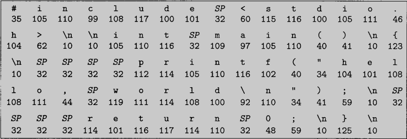

linux下文件分为两种，只由ASCII字符构成的文件称为文本文件，其他的所有文件都称为二进制文件

源文件的表示方法说明了一个基本思想：系统中的所有信息——包括磁盘文件，内存中的程序，内存中的存放的用户数据以及网络上传送机的数据，都是由一串比特表示的。而区分这些不同数据对象的唯一方法就是我们读到这些数据对象时的上下文

## 1.2 程序被其他程序翻译成不同的格式

为了在内存中运行hello.c，每条c语句都必须转换成一系列的低级机器语言。然后这些指令按照一种可执行目标程序的格式打包，并以二进制磁盘文件的形式存放起来

linux系统中，从源文件到目标文件的转化是由编译器驱动程序完成的

~~~shell
ComputerSystem/01$ gcc -o hello hello.c 
~~~

这个翻译过程分为四个阶段

* 预处理：修改源程序，展开include的内容，define等
* 编译阶段：将高级语言编译为汇编语言，汇编语言为不同高级语言的不同编译器提供了通用的输出语言
* 汇编阶段：汇编器将汇编语言翻译成机器语言，并打包成一种可重定位目标程序的格式
* 链接阶段：printf函数存在于一个名为printf.o的单独的预编译好了的目标文件中，这个文件必须以某种方式合并到我们的hello.o中

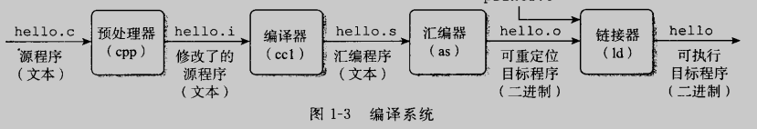

## 1.3 了解编译系统是如何工作大有益处

* 优化程序性能
* 理解链接时出现的错误
* 避免安全漏洞

## 1.4 处理器读并解释存储在内存中的指令

如果命令行的第一个单词不是一个内置的shell命令，那么shelliu会假设这是一个可执行文件的名字，他将加载并运行这个文件，然后等待这个程序的终止。

### 1.4.1 系统的硬件组成

典型系统的硬件组织

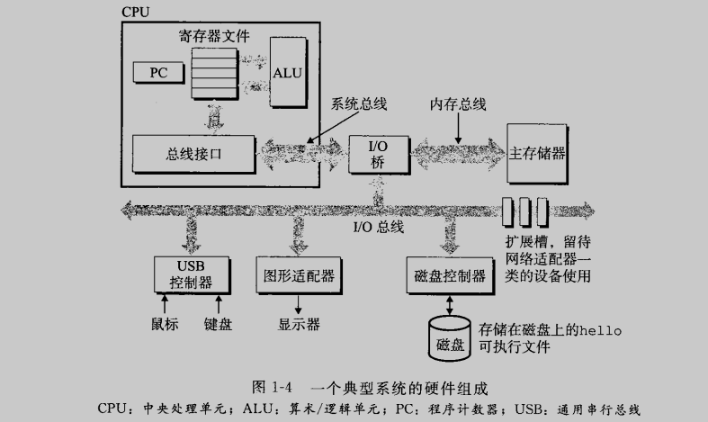

* 总线：

贯穿整个系统的一组电子管道，他携带信息字节并负责在各个部件之间传递。通常总线被设计成传送定长字节的字节块，也就是字。现在大多数及其字长为4个字节（32位系统），或者8个字节（64位系统）

* IO设备

IO设备是系统与外部世界的联系通道，最开始，可执行程序hello就放在磁盘上，每个IO设备都通过一个控制器或适配器与IO总线相连。他们的功能都是在IO总线与IO设备之间传递信息

* 主存

主存是一个临时存储设备，在处理器执行程序时，用来存放程序和程序处理的数据。从物理上来说，主存是由一组动态随机存取存储器（DRAM）芯片组成。从逻辑上说，存储器的一个线性的字节数组，每个字节都有一个唯一的地址（数组索引），这些地址从零开始。

* 处理器

中央处理单元（CPU），简称处理器，是解释（或执行）存储在主存中明亮的引擎。处理器的核心是一个大小为一个字的存储设备（或寄存器），程位程序计数器PC，在任何时刻，PC都指向主存中的某条机器语言指令（即含有该条指令的地址），处理器从PC指向的内存出读取指令，解释指令中的位，指向该指令指示的简单操作，然后更新PC，使其指向下一条命令。这样的简单操作并不多，他们围绕着主存，寄存器文件和算数/逻辑单元ALU进行。寄存器文件是一个小的存储设备，由一些单个字长的寄存器组成，每个寄存器都有唯一的名字。ALU计算新的数据和地址值

下面是CPU在指令的要求下可能执行的操作

* 加载：从主存复制一个字节或者一个字到寄存器，以覆盖寄存器原来的内容
* 存储：从寄存器复制一个字节或者一个字到主存的某个位置
* 操作：把两个寄存器的内容复制到ALU，ALU对这两个字做算数运算，并将结果存放在一个寄存器中
* 跳转：从指令本身中抽取一个字，并将这个字复制到程序计数器PC中，以覆盖PC中原来的值

### 1.4.2 运行hello程序

shell执行一系列指令来加载可执行的hello文件，这些指令将hello目标文件中的代码和数据从磁盘复制到主存

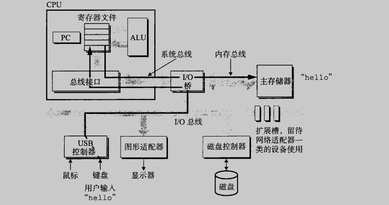

接着，处理器就开始执行hello程序的main程序中的机器语言指令。这些指令将“hello\n”字符串中的字节从主存复制到寄存器文件，再从寄存器文件中复制到显示设备，最终在屏幕上显示

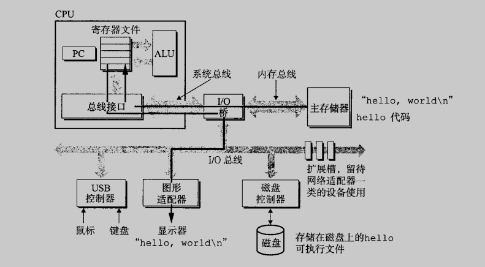

## 1.5 高速缓存至关重要

我们发现系统花费了大量时间把信息从一个地方挪到另一个地方。这些复制就是开销。

加快处理器的运行速度比加快主存的运行速度要容易和便宜的多

针对这种处理器与主存之间的差异，系统设计者采用了更小更快的存储设备，称为高速缓存存储器（cache），作为暂时的集结区域，存放处理器近期可能会需要的信息，进程访问L2高速缓存的时间要比访问L1高速缓存的时间长5倍，但仍比访问主存的时间快5~10倍。L1和L2高速缓存是用一种叫做静态随机访问存储器的硬件技术实现的，其原理是利用了高速缓存的局部性原理：程序具有访问局部区域里的数据和代码的趋势。通过让高速缓存里存放可能经常访问的数据，大部分的内存操作都能在快速的高速缓存中完成

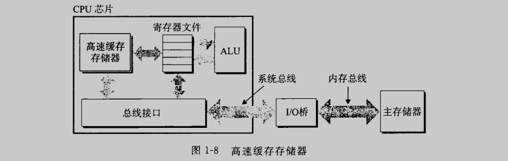

## 1.6 存储设备形成层次结构

处理器和较大较慢的设备之间插入一个更小更快的存储设备的想法已经是一个普遍的概念

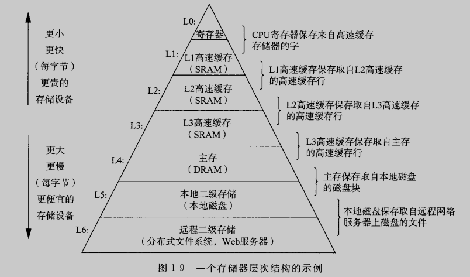

存储器层次结构的主要思想是上一层的存储器作为第一层存储设备的高速缓存

## 1.7 操作系统管理硬件

当shell加载和运行hello程序时，以及hello程序输出自己的消息时，shell和hello程序都没有直接访问键盘，显示器，磁盘或者主存。而是依靠操作系统提供的服务。我们可以把操作系统看作是应用程序和硬件之间插入的一层软件

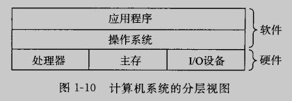

操作系统有两个基本功能：一是防止硬件被失控的应用程序滥用；二是向应用程序提供简单一致的机制来控制复杂而又通常大不相同的低级硬件设备。操作系统通过几个抽象的概念来实现这俩个功能。

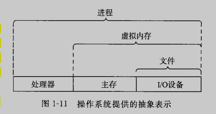

文件是对IO设备的抽象表示，虚拟内存是对主存和磁盘IO设备的抽象表示，进程则是对处理器，主存和IO设备的抽象表示。我们要一次讨论每种抽象表示

### 1.7.1 进程

操作系统会提供一种假象，就好像系统上只有一个hello在运行，似乎程序的代码和数据是系统内存中唯一的对象。

进程是操作系统对一个正在运行的程序的一种抽象。一个系统上可以同时运行多个进程，而每个进程都好像在独占地使用硬件。而并发运行，则是说一个进程的指令和另一个进程的指令是交错执行的。无论是在单核还是多核系统中，一个CPU看上去就像是在并发地执行多个进程，这是通过处理器在进程间切换来实现的。操作系统实现这种交错执行的机制称为上下文切换。为了简化讨论，我们只考虑包含一个CPU的单处理器系统的情况

操作系统保持跟踪进程运行时所需要的所有状态信息——上下文，包括许多信息，比如PC和寄存器文件的当前值，以及主存的内容。在任何一个时刻，单处理器系统都只能执行一个进程的代码。当操作系统决定要把控制权从当前进程转移到某个新进程时，就会进行上下文切换，即保存当前进程的上下文，恢复新进程的上下文，然后将控制权传递到新进程。进程就会从他上次停止的地方开始

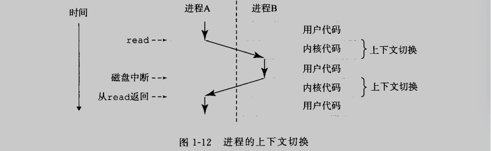

示例中有两个并发进程，shell和hello。最开始，只有shell进程运行，等待命令行的输入。当我们运行hello时，shell通过一个专门的函数，即系统调用，来执行我们的请求，系统调用会将控制权传递给操作系统。操作系统保存shell进程的上下文，创建一个新的hello进程及其上下文，然后将控制权限传给新的hello进程。hello进程终止后，操作系统恢复shell进程的上下文，并将控制权传回shell，shell进程会继续等待下一个明亮的输入

一个进程到另一个进程的转换时由操作系统内核管理的。内核是操作系统代码常驻主存的部分。当应用程序需要操作系统的某些操作时，比如读写文件，他就执行一条特殊的系统调用（system call），将控制权限传递给内核。然后内核执行被请求的操作并返回应用程序。注意，内核不是一个独立的进程。相反，他是系统管理全部进程所用代码和数据结构的集合

### 1.7.2 线程

尽管通常我们认为一个进程只有单一的控制流，但是在现代系统中，一个进程实际上可以有多个称为线程的执行单元组成，每个线程都运行在进程的上下文中，并共享同样的代码和全局数据。后续会细聊

### 1.7.3 虚拟内存

虚拟内存是一个抽象概念，他为每个进程提供了一个假象，即每个进程都在独占地使用主存。每个进程看到的内存都是一致的，称为虚拟地址空间

在linux中，地址空间最上面的区域就是保留给操作系统中的代码和数据，这对所有进程都一样。地址空间的底部存放用户进程定义的代码和数据。图中的地址是从下往上增大的

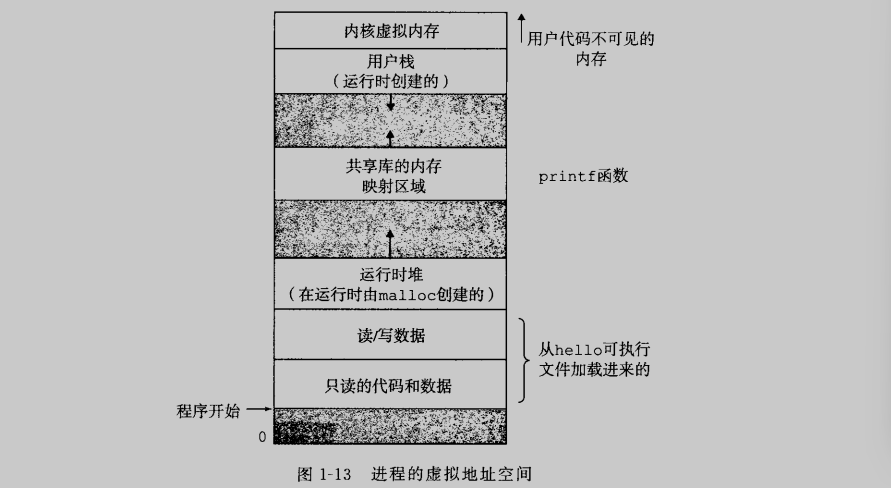

虚拟内存的运作需要硬件和操作系统软件之间精密复杂的交互方式，包括对处理器生成的每个地址的硬件翻译。基本思想是把一个进程虚拟内存的内容存储在磁盘上，然后用主存作为磁盘的高速缓存。

### 1.7.4 文件

文件就是字节序列，仅此而已。每个IO设备都可以看作文件。系统中的所有输入输出都是通过使用一小组称为Unix IO的系统函数调用读写文件来实现的。

## 1.8 系统之间利用网络通信

现代系统经常通过网络和其他系统连接到一起。从一个单独的系统来看，网络可视为一个IO设备

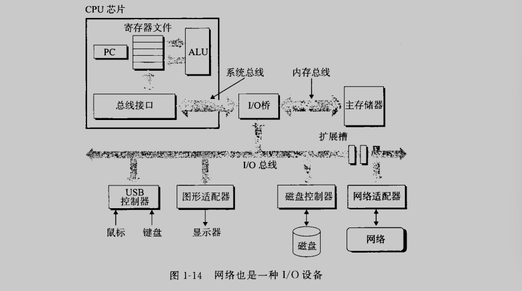

回到hello，在我们登录到远程主机并运行shell后，远端的shell就在等待接受输入命令。此后在远端运行hello，shell将hello的运行结果发送给telnet，telnet服务器向客户端发送字符串“hello”，客户端在显示器上打印hello字符串

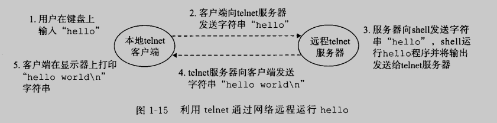

## 1.9 重要主题

系统是硬件和系统软件互相交织的集合体

### 1.9.1 Amdalh定律

当我们对系统的某个部分加速时，其对系统整体性能的影响，取决于该部分的重要性和加速程度。所谓的重要性就是系统执行占应用程序执行的时间比α，所谓加速程度就是该加速部分的性能提升比例k

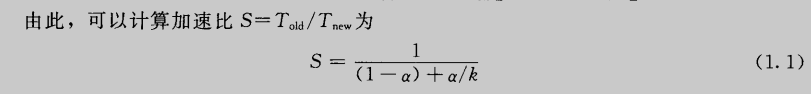

如果系统的某个部分初始耗时比例为α=0.6，其加速比例因子k=3，计算所得加速比为1.67，可见，虽然我们对系统的一个主要部分做出了重大改进，但是获得的系统加速比却明显小于这部分的加速比。这意味着——想要显著加速整个系统，必须全面提升系统中相当大的部分的速度

### 1.9.2 并发和并行

驱动进步的持续动力：想要计算机做的更多，想要计算机运行得更快

术语并发是一个通用的概念，指一个同时具有多个活动的系统；而术语并行指的是用并发来使一个系统运行得更快。并行可以运用在计算机系统的多个抽象层次上

#### 1.线程级并发

构建在进程这个抽象层次上，传统意义上说，并发只是模拟出来的，是通过使一台计算机在它正在执行的进程间快速切换来实现的。当构建一个由但操作系统内核控制的多处理器组成的系统时，我们就得到了一个多处理器系统。

多处理器是将多个CPU集成在一个电路芯片上，这些核共享更高层次的高速缓存以及到主存的接口

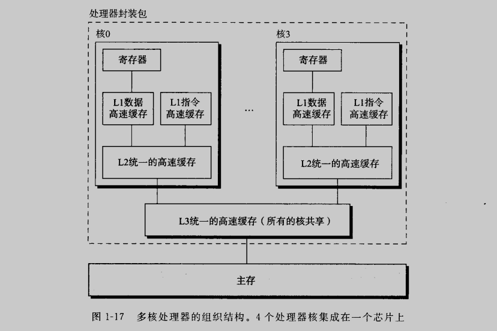

超线程，又称同时多线程。一项允许一个CPU执行多个控制流的技术。比如，假设一个线程必须等到某些数据被装载到高速缓存中，那CPU就可以继续去执行另一个线程

多处理器的使用从两个方面提高系统性能。首先他减少了执行多个任务时模拟并发的需要。其次，它可以使应用程序运行的更快（必须要求程序时以多线程方式书写的）

#### 2.指令级并发

最近的处理器可以保持每个时钟周期2~4条指令的执行效率。其实每条指令从开始时间到结束时间需要长得更多，大约20个或者更多周期，但是处理器使用了非常多的聪明技巧来同时处理多大100条指令。

#### 3.单指令，多数据并行

在最低层次上，许多现代处理器拥有特殊的硬件，允许一条指令产生多个可并行执行的操作，这种方式称为单指令，多数据，即SIMD并行。

### 1.9.3 计算机系统中抽象的重要性

在处理器中，指令集架构提供了对实际处理器硬件的抽象。使用这个抽象，机器代码程序表现得就像运行在一个一次只执行一条指令的处理器上。之前提到了文件是对IO设备的抽象，虚拟内存是对程序存储器的抽象，进程是对一个正在运行的程序的抽象，虚拟机是对整个计算机的抽象，包括操作系统，处理器和程序
