# 第二章.信息的表示和处理

现代计算机存储和处理的信息以二值信号表示——位。

我们研究三种最重要的数字表示。无符号编码，补码编码，浮点数编码，本章中，我们描述这些编码，并教我们如何推出数字表示。

建议反复阅读原理描述和它的示例与讨论，直到对该属性的说明内容及其重要性有了牢固的直觉。首次看到一些数学证明，也可以选择跳过

## 2.1 信息存储

大多数计算机使用8位的块，或字节作为最小的可寻址的内存单位。内存中的每个字节都由一个唯一的数字来标识，称为她的地址，所有可能地址的集合就称为虚拟地址空间。顾名思义，这个虚拟地址空间只是一个展现给机器级程序的概念性映像。

接下来的几章中，我们将讲述编译器和运行时系统是如何将存储器空间划分为更可管理的单元，在存放不同的程序对象，即程序数据，指令和控制信息

C语言中一个指针的值都是某个存储块的第一个字节的虚拟地址。，与变量类似，指针有两个方面：值和类型。它的值表示某个对象的位置，而他的类型表示那个位置上所存储对象的类型

### 2.1.1 十六进程表示法

以16为基数，来表示的位模式。十六进制数以0x或者0X开头，不区分大小写

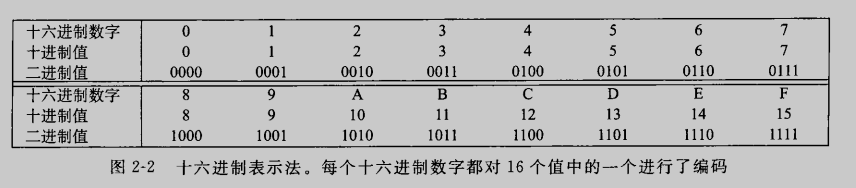

进制间的转换比较简单，这里就不再赘述

### 2.1.2 字数据大小

每台计算机都有一个字长，指明指针数据的标称大小。因为虚拟地址是以这样的一个字来编码的，所以字长决定的最重要的系统参数就是虚拟地址空间的最大大小。32位字长限制虚拟地址空间为4千兆字节（4GB），单扩展到64位字长使得虚拟地址的空间可以又16EB。

我们将程序称为“32位程序”或“64位程序”时，区别在于该程序是如何编译的，而不是其运行的机器类型。下图展示了为C语言各种数据类型分配的字节数

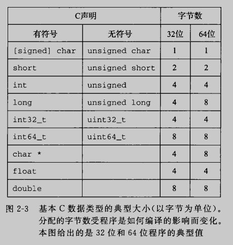

为了避免由于依赖“典型”大小和不同编译器设置带来的奇怪行为，ISO C99引入了一种数据类型，其数据大小是固定的，不随编译器和机器设置而变化。int32_t和int64_t分别表示为4个字节和8个字节。

程序员应该力图使他们的程序在不同的机器和编译器上可移植。可移植的一个方面就是使程序对不同数据类型的确切大小不敏感

### 2.1.3 寻址和字节顺序

对于跨越多字节的程序对象，我们需要建立两个规则：这个对象的地址是什么，以及在内存中如何排列这些字节

多字节对象都被存储为连续的字节序列，对象的地址为所使用字节中最小的地址

排列表示一个对象的字节有两个通用规则

* 大端法：最高有效字节在最前面
* 小端法：最低有效字节在最前面

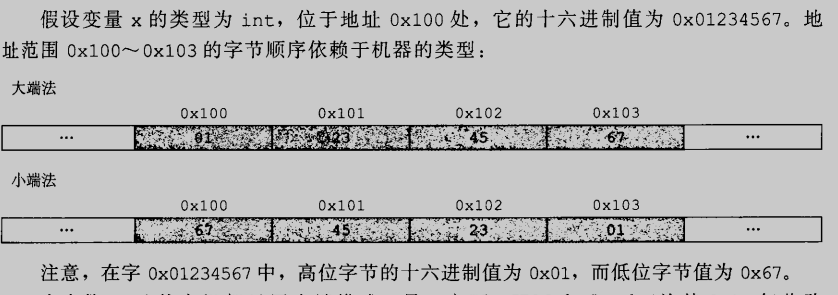

展示一段C代码，他使用强制类型转换来访问和打印不同程序对象的字节表示

~~~c
#include <stdio.h>

typedef unsigned char *byte_pointer;

void show_bytes(byte_pointer start, size_t len)
{
	size_t i;
	for(i = 0; i < len; ++i)
		printf(" %.2x", start[i]);
	printf("\n");
}

void show_int(int x)
{
	show_bytes((byte_pointer)&x, sizeof(int));
}

void show_float(float x)
{
	show_bytes((byte_pointer)&x, sizeof(float));
}

void show_pointer(void *x)
{
	show_bytes((byte_pointer)&x, sizeof(void *));
}

void test_show_bytes(int val)
{
	int ival = val;
	float fval = (float)ival;
	int *pval = &ival;
	show_int(ival);
	show_float(fval);
	show_pointer(pval);
}

int main()
{
	test_show_bytes(12345);
	show_bytes("12345", 6);

	return 0;
}

~~~

~~~shell
zrf@ubuntu:~/opensource/demo/ComputerSystem/02$ ./a.out 
 39 30 00 00
 00 e4 40 46
 a8 f9 eb 98 fd 7f 00 00
 31 32 33 34 35 00
~~~

### 2.1.4 表示字符串

如上文，一个字符串的末尾都有一个0x00表示字符串的终止

### 2.1.5 表示代码

在不同机器上编译的相同源文件对应的指令编码是不同的。不同的机器类型使用不同的且不兼容就的指令和编码方式

### 2.1.6 布尔代数简介

最简单得布尔代数是在二元集合{0,1}基础上得定义

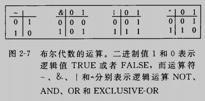

位向量一个很有用得以用就是表示一个集合

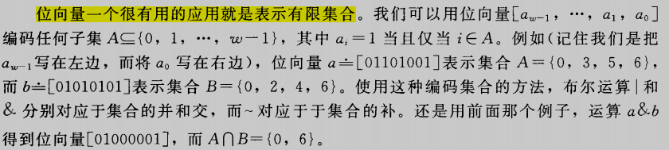

在大量实际应用中，我们都能看到用位向量来对集合编码。例如第八章，我们会看到很多不同得信号会中断程序执行。我们通过指定一个位向量掩码，有选择地使能或者屏蔽一些信号，其中某一位位置上为1，就表明信号i是有效地，0表示该信号是屏蔽的

### 2.1.7 C语言中地位级运算

C语言中一个很有用地特性就是它支持按位布尔运算。确定一个位级表达式地结果最好的方法就是将十六进制参数扩展成二进制表示并执行二进制运算，然后再转回十六进制

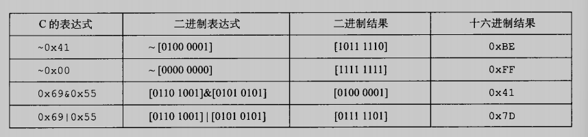

### 2.1.8 C语言中的逻辑运算

逻辑运算认为所有非零的参数都表示TRUE，而参数0表示FALSE。他们返回1或者0，分别表示结果为TRUE或者为FALSE

逻辑运算符&&和||与他们对应的位级运算&和|之间的第二个重要区别是，如果第一个参数求值就能确定表达式的结果，则不会对第二个参数求值（逻辑运算符是有运算顺序的），p && *p++不会导致间接引用空指针

### 2.1.9 C语言中的移位运算

C语言提供了一组移位运算，向左或向右移动位模式。x向左移动k位，丢弃最高的k位，并在右端补k个0.

而右移运算的行为是微妙的，逻辑右移和算术右移是不同的。逻辑右移在左端补k个0，算数右移在左端补k个最高有效位的值

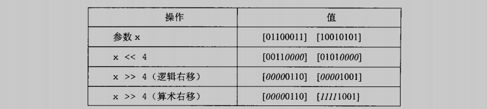

几乎所有的编译器/机器组合都会对有符号数使用算数右移，并且程序员也假设机器会使用算数右移。另一方面，对于无符号数，右移必须是逻辑的

## 2.2 整数表示

我们描述用位来编码的整数的两种不同的方式：一种只能表示非负数，另一种可以表示负数零和正数

### 2.2.1 整形数据类型

C语言支持多种整形数据类型——表示有限范围的整数

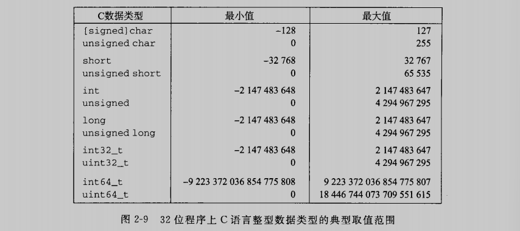

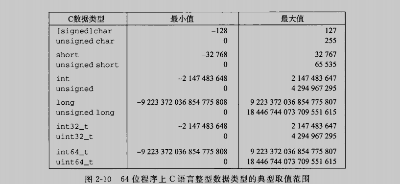

一个值得注意的特点是取值范围不对称——负数的范围比整数的范围大1

### 2.2.2 无符号数的编码

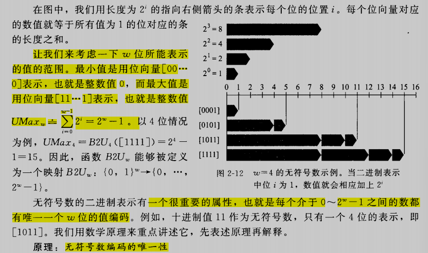

### 2.2.3 补码编码

补码定义中，将字的最高有效位解释为负权

图中，用向左指的条表示符号位具有负权重

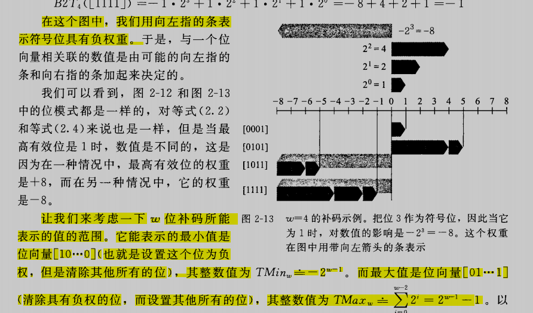

C语言并没有要求要使用补码来表示所有符号整数，但是几乎所有的机器都是这么做的

### 2.2.4 有符号数和无符号数之间的转换

C语言允许在各个不同的数字数据类型之间做强制转换

~~~c
	short int v = -12345;
	unsigned short uv = (unsigned short)v;
	printf("v = %d, uv = %u\n", v, uv);
	show_bytes((byte_pointer)&v, sizeof(short int));
	show_bytes((byte_pointer)&uv, sizeof(unsigned short));
~~~

在一台采用补码的机器上，会有以下输出

~~~shell
v = -12345, uv = 53191
 c7 cf
 c7 cf
~~~

可见强制类型转换的结果保持位值不变，只是改变了解释这些位的方式

### 2.2.5 C语言中的有符号数与无符号数

当执行一个运算时，如果他的一个运算数是有符号而另一个是无符号的，那么C语言会隐式地将有符号的类型转换为无符号类型，并假设这两个数都是非负。所以要十分注意-1 < 0u的这种运算总是错误的

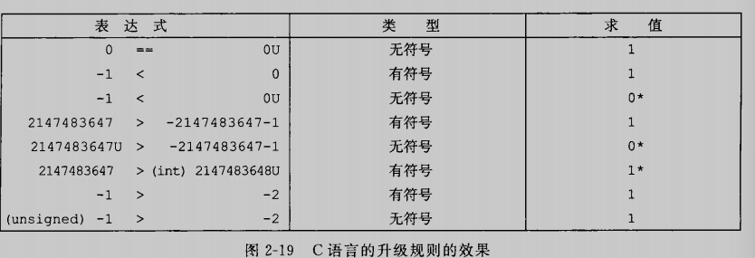
