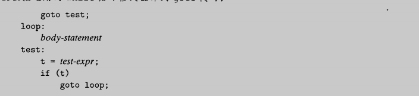
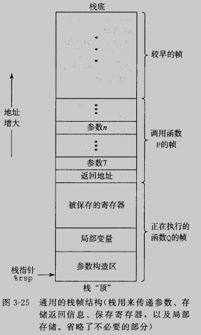

# 程序的机器级表示

本章，将近距离观察机器代码，以及人类可读的表示——汇编代码。高级语言提供的抽象层会隐藏我们想要了解的程序的运行时行为

## 3.1 历史观点

8086，他是第一代单芯片，16位微处理器之一

i386，将体系结构扩展到32位

Core i7

## 3.2 程序编码

编译选项-Og告诉编译器使用会生成符和原始C代码整体结构的机器代码的优化等级。实际中，从得到的程序的性能考虑，较高级别的优化（例如编译选项-O1或者-O2）是更好选择

### 3.2.1 机器级代码

机器级编程的两种抽象：

* 由指令集系统结构或指令集架构来定义机器级程序的格式和行为，将程序的行为描述成好像每条指令都按序执行
* 机器级程序使用的内存地址是虚拟地址，提供的内存模型看上去像一个非常大的数组

### 3.2.2 代码示例

假设有这么一个C语言代码文件

~~~c
long mult2(long, long);

void multstore(long x, long y, long *dest)
{
        long t = mult2(x, y);
        *dest = t;
}
~~~

在命令行上使用-S选项，就可以看到C编译器产生的汇编代码

~~~shell
zrf@ubuntu:~/opensource/demo/ComputerSystem/03$ gcc -Og -S mstore.c 
zrf@ubuntu:~/opensource/demo/ComputerSystem/03$ cat mstore.s 
        .file   "mstore.c"
        .text
        .globl  multstore
        .type   multstore, @function
multstore:
.LFB0:
        .cfi_startproc
        pushq   %rbx
        .cfi_def_cfa_offset 16
        .cfi_offset 3, -16
        movq    %rdx, %rbx
        call    mult2@PLT
        movq    %rax, (%rbx)
        popq    %rbx
        .cfi_def_cfa_offset 8
        ret
        .cfi_endproc
.LFE0:
        .size   multstore, .-multstore
        .ident  "GCC: (Ubuntu 7.5.0-3ubuntu1~18.04) 7.5.0"
        .section        .note.GNU-stack,"",@progbits
zrf@ubuntu:~/opensource/demo/ComputerSystem/03$ 
~~~

如果使用-c命令，GCC会编译并汇编该代码

要查看机器代码文件的内容，有一类称为反汇编器的程序非常有用。带-d命令行标志的程序OBJDUMP可以实现反汇编

~~~shell
zrf@ubuntu:~/opensource/demo/ComputerSystem/03$ gcc -Og -c mstore.c 
zrf@ubuntu:~/opensource/demo/ComputerSystem/03$ 
zrf@ubuntu:~/opensource/demo/ComputerSystem/03$ objdump -d mstore.o

mstore.o:     file format elf64-x86-64

Disassembly of section .text:

0000000000000000 <multstore>:
   0:   53                      push   %rbx
   1:   48 89 d3                mov    %rdx,%rbx
   4:   e8 00 00 00 00          callq  9 <multstore+0x9>
   9:   48 89 03                mov    %rax,(%rbx)
   c:   5b                      pop    %rbx
   d:   c3                      retq   
zrf@ubuntu:~/opensource/demo/ComputerSystem/03$ 
~~~

生成实际可执行的代码需要对一组目标代码文件运行链接器，而这一组目标代码文件中必须有一个main函数，假设我们的main.c中有如下代码

~~~c
#include <stdio.h>

void multstore(long, long, long *);

int main()
{
        long d;
        multstore(2, 3, &d);
        printf("2 * 3 --> %ld\n", d);

        return 0;
}

long mult2(long a, long b)
{
        long s = a * b;
        return s;
}
~~~

我们使用gcc -Og -o prog main.c mstore.c可以生成可执行文件prog，再使用反汇编看下汇编代码

~~~shell
zrf@ubuntu:~/opensource/demo/ComputerSystem/03$ objdump -d prog 

prog:     file format elf64-x86-64

Disassembly of section .init:

0000000000000570 <_init>:
 570:   48 83 ec 08             sub    $0x8,%rsp
 574:   48 8b 05 6d 0a 20 00    mov    0x200a6d(%rip),%rax        # 200fe8 <__gmon_start__>
 57b:   48 85 c0                test   %rax,%rax
 57e:   74 02                   je     582 <_init+0x12>
 580:   ff d0                   callq  *%rax
 582:   48 83 c4 08             add    $0x8,%rsp
 586:   c3                      retq   

Disassembly of section .plt:

0000000000000590 <.plt>:
 590:   ff 35 22 0a 20 00       pushq  0x200a22(%rip)        # 200fb8 <_GLOBAL_OFFSET_TABLE_+0x8>
 596:   ff 25 24 0a 20 00       jmpq   *0x200a24(%rip)        # 200fc0 <_GLOBAL_OFFSET_TABLE_+0x10>
 59c:   0f 1f 40 00             nopl   0x0(%rax)

00000000000005a0 <__stack_chk_fail@plt>:
 5a0:   ff 25 22 0a 20 00       jmpq   *0x200a22(%rip)        # 200fc8 <__stack_chk_fail@GLIBC_2.4>
 5a6:   68 00 00 00 00          pushq  $0x0
 5ab:   e9 e0 ff ff ff          jmpq   590 <.plt>

00000000000005b0 <__printf_chk@plt>:
 5b0:   ff 25 1a 0a 20 00       jmpq   *0x200a1a(%rip)        # 200fd0 <__printf_chk@GLIBC_2.3.4>
 5b6:   68 01 00 00 00          pushq  $0x1
 5bb:   e9 d0 ff ff ff          jmpq   590 <.plt>

Disassembly of section .plt.got:

00000000000005c0 <__cxa_finalize@plt>:
 5c0:   ff 25 32 0a 20 00       jmpq   *0x200a32(%rip)        # 200ff8 <__cxa_finalize@GLIBC_2.2.5>
 5c6:   66 90                   xchg   %ax,%ax

Disassembly of section .text:

00000000000005d0 <_start>:
 5d0:   31 ed                   xor    %ebp,%ebp
 5d2:   49 89 d1                mov    %rdx,%r9
 5d5:   5e                      pop    %rsi
 5d6:   48 89 e2                mov    %rsp,%rdx
 5d9:   48 83 e4 f0             and    $0xfffffffffffffff0,%rsp
 5dd:   50                      push   %rax
 5de:   54                      push   %rsp
 5df:   4c 8d 05 da 01 00 00    lea    0x1da(%rip),%r8        # 7c0 <__libc_csu_fini>
 5e6:   48 8d 0d 63 01 00 00    lea    0x163(%rip),%rcx        # 750 <__libc_csu_init>
 5ed:   48 8d 3d e6 00 00 00    lea    0xe6(%rip),%rdi        # 6da <main>
 5f4:   ff 15 e6 09 20 00       callq  *0x2009e6(%rip)        # 200fe0 <__libc_start_main@GLIBC_2.2.5>
 5fa:   f4                      hlt    
 5fb:   0f 1f 44 00 00          nopl   0x0(%rax,%rax,1)

0000000000000600 <deregister_tm_clones>:
 600:   48 8d 3d 09 0a 20 00    lea    0x200a09(%rip),%rdi        # 201010 <__TMC_END__>
 607:   55                      push   %rbp
 608:   48 8d 05 01 0a 20 00    lea    0x200a01(%rip),%rax        # 201010 <__TMC_END__>
 60f:   48 39 f8                cmp    %rdi,%rax
 612:   48 89 e5                mov    %rsp,%rbp
 615:   74 19                   je     630 <deregister_tm_clones+0x30>
 617:   48 8b 05 ba 09 20 00    mov    0x2009ba(%rip),%rax        # 200fd8 <_ITM_deregisterTMCloneTable>
 61e:   48 85 c0                test   %rax,%rax
 621:   74 0d                   je     630 <deregister_tm_clones+0x30>
 623:   5d                      pop    %rbp
 624:   ff e0                   jmpq   *%rax
 626:   66 2e 0f 1f 84 00 00    nopw   %cs:0x0(%rax,%rax,1)
 62d:   00 00 00 
 630:   5d                      pop    %rbp
 631:   c3                      retq   
 632:   0f 1f 40 00             nopl   0x0(%rax)
 636:   66 2e 0f 1f 84 00 00    nopw   %cs:0x0(%rax,%rax,1)
 63d:   00 00 00 

0000000000000640 <register_tm_clones>:
 640:   48 8d 3d c9 09 20 00    lea    0x2009c9(%rip),%rdi        # 201010 <__TMC_END__>
 647:   48 8d 35 c2 09 20 00    lea    0x2009c2(%rip),%rsi        # 201010 <__TMC_END__>
 64e:   55                      push   %rbp
 64f:   48 29 fe                sub    %rdi,%rsi
 652:   48 89 e5                mov    %rsp,%rbp
 655:   48 c1 fe 03             sar    $0x3,%rsi
 659:   48 89 f0                mov    %rsi,%rax
 65c:   48 c1 e8 3f             shr    $0x3f,%rax
 660:   48 01 c6                add    %rax,%rsi
 663:   48 d1 fe                sar    %rsi
 666:   74 18                   je     680 <register_tm_clones+0x40>
 668:   48 8b 05 81 09 20 00    mov    0x200981(%rip),%rax        # 200ff0 <_ITM_registerTMCloneTable>
 66f:   48 85 c0                test   %rax,%rax
 672:   74 0c                   je     680 <register_tm_clones+0x40>
 674:   5d                      pop    %rbp
 675:   ff e0                   jmpq   *%rax
 677:   66 0f 1f 84 00 00 00    nopw   0x0(%rax,%rax,1)
 67e:   00 00 
 680:   5d                      pop    %rbp
 681:   c3                      retq   
 682:   0f 1f 40 00             nopl   0x0(%rax)
 686:   66 2e 0f 1f 84 00 00    nopw   %cs:0x0(%rax,%rax,1)
 68d:   00 00 00 

0000000000000690 <__do_global_dtors_aux>:
 690:   80 3d 79 09 20 00 00    cmpb   $0x0,0x200979(%rip)        # 201010 <__TMC_END__>
 697:   75 2f                   jne    6c8 <__do_global_dtors_aux+0x38>
 699:   48 83 3d 57 09 20 00    cmpq   $0x0,0x200957(%rip)        # 200ff8 <__cxa_finalize@GLIBC_2.2.5>
 6a0:   00 
 6a1:   55                      push   %rbp
 6a2:   48 89 e5                mov    %rsp,%rbp
 6a5:   74 0c                   je     6b3 <__do_global_dtors_aux+0x23>
 6a7:   48 8b 3d 5a 09 20 00    mov    0x20095a(%rip),%rdi        # 201008 <__dso_handle>
 6ae:   e8 0d ff ff ff          callq  5c0 <__cxa_finalize@plt>
 6b3:   e8 48 ff ff ff          callq  600 <deregister_tm_clones>
 6b8:   c6 05 51 09 20 00 01    movb   $0x1,0x200951(%rip)        # 201010 <__TMC_END__>
 6bf:   5d                      pop    %rbp
 6c0:   c3                      retq   
 6c1:   0f 1f 80 00 00 00 00    nopl   0x0(%rax)
 6c8:   f3 c3                   repz retq 
 6ca:   66 0f 1f 44 00 00       nopw   0x0(%rax,%rax,1)

00000000000006d0 <frame_dummy>:
 6d0:   55                      push   %rbp
 6d1:   48 89 e5                mov    %rsp,%rbp
 6d4:   5d                      pop    %rbp
 6d5:   e9 66 ff ff ff          jmpq   640 <register_tm_clones>

00000000000006da <main>:
 6da:   48 83 ec 18             sub    $0x18,%rsp
 6de:   64 48 8b 04 25 28 00    mov    %fs:0x28,%rax
 6e5:   00 00 
 6e7:   48 89 44 24 08          mov    %rax,0x8(%rsp)
 6ec:   31 c0                   xor    %eax,%eax
 6ee:   48 89 e2                mov    %rsp,%rdx
 6f1:   be 03 00 00 00          mov    $0x3,%esi
 6f6:   bf 02 00 00 00          mov    $0x2,%edi
 6fb:   e8 41 00 00 00          callq  741 <multstore>
 700:   48 8b 14 24             mov    (%rsp),%rdx
 704:   48 8d 35 c9 00 00 00    lea    0xc9(%rip),%rsi        # 7d4 <_IO_stdin_used+0x4>
 70b:   bf 01 00 00 00          mov    $0x1,%edi
 710:   b8 00 00 00 00          mov    $0x0,%eax
 715:   e8 96 fe ff ff          callq  5b0 <__printf_chk@plt>
 71a:   48 8b 4c 24 08          mov    0x8(%rsp),%rcx
 71f:   64 48 33 0c 25 28 00    xor    %fs:0x28,%rcx
 726:   00 00 
 728:   75 0a                   jne    734 <main+0x5a>
 72a:   b8 00 00 00 00          mov    $0x0,%eax
 72f:   48 83 c4 18             add    $0x18,%rsp
 733:   c3                      retq   
 734:   e8 67 fe ff ff          callq  5a0 <__stack_chk_fail@plt>

0000000000000739 <mult2>:
 739:   48 89 f8                mov    %rdi,%rax
 73c:   48 0f af c6             imul   %rsi,%rax
 740:   c3                      retq   

0000000000000741 <multstore>:
 741:   53                      push   %rbx
 742:   48 89 d3                mov    %rdx,%rbx
 745:   e8 ef ff ff ff          callq  739 <mult2>
 74a:   48 89 03                mov    %rax,(%rbx)
 74d:   5b                      pop    %rbx
 74e:   c3                      retq   
 74f:   90                      nop

0000000000000750 <__libc_csu_init>:
 750:   41 57                   push   %r15
 752:   41 56                   push   %r14
 754:   49 89 d7                mov    %rdx,%r15
 757:   41 55                   push   %r13
 759:   41 54                   push   %r12
 75b:   4c 8d 25 4e 06 20 00    lea    0x20064e(%rip),%r12        # 200db0 <__frame_dummy_init_array_entry>
 762:   55                      push   %rbp
 763:   48 8d 2d 4e 06 20 00    lea    0x20064e(%rip),%rbp        # 200db8 <__init_array_end>
 76a:   53                      push   %rbx
 76b:   41 89 fd                mov    %edi,%r13d
 76e:   49 89 f6                mov    %rsi,%r14
 771:   4c 29 e5                sub    %r12,%rbp
 774:   48 83 ec 08             sub    $0x8,%rsp
 778:   48 c1 fd 03             sar    $0x3,%rbp
 77c:   e8 ef fd ff ff          callq  570 <_init>
 781:   48 85 ed                test   %rbp,%rbp
 784:   74 20                   je     7a6 <__libc_csu_init+0x56>
 786:   31 db                   xor    %ebx,%ebx
 788:   0f 1f 84 00 00 00 00    nopl   0x0(%rax,%rax,1)
 78f:   00 
 790:   4c 89 fa                mov    %r15,%rdx
 793:   4c 89 f6                mov    %r14,%rsi
 796:   44 89 ef                mov    %r13d,%edi
 799:   41 ff 14 dc             callq  *(%r12,%rbx,8)
 79d:   48 83 c3 01             add    $0x1,%rbx
 7a1:   48 39 dd                cmp    %rbx,%rbp
 7a4:   75 ea                   jne    790 <__libc_csu_init+0x40>
 7a6:   48 83 c4 08             add    $0x8,%rsp
 7aa:   5b                      pop    %rbx
 7ab:   5d                      pop    %rbp
 7ac:   41 5c                   pop    %r12
 7ae:   41 5d                   pop    %r13
 7b0:   41 5e                   pop    %r14
 7b2:   41 5f                   pop    %r15
 7b4:   c3                      retq   
 7b5:   90                      nop
 7b6:   66 2e 0f 1f 84 00 00    nopw   %cs:0x0(%rax,%rax,1)
 7bd:   00 00 00 

00000000000007c0 <__libc_csu_fini>:
 7c0:   f3 c3                   repz retq 

Disassembly of section .fini:

00000000000007c4 <_fini>:
 7c4:   48 83 ec 08             sub    $0x8,%rsp
 7c8:   48 83 c4 08             add    $0x8,%rsp
 7cc:   c3                      retq   
zrf@ubuntu:~/opensource/demo/ComputerSystem/03$ 
~~~

### 3.2.3 关于格式的注解

.s结尾的文件中，所有以'.'开头的行都是指导汇编器和链接器工作的伪指令，通常可以忽略

## 3.3 数据格式

由于是从16位体系结构扩展到32位的，Intel用术语“字”表示16位数据类型

## 3.4 访问信息

一个x86-64的中央处理单元CPU包含一组由16个存储64位值的通用目的寄存器，这些寄存器用来存储整数数据和指针

### 3.4.1 操作数指示符

不同的操作数可以被分为三种类型：

* 立即数
* 寄存器
* 内存引用

### 3.4.2 数据传送指令

在后续的讲述中，把许多不同的指令划分为指令类，每一类中的指令执行相同的操作，只不过是操作数的大小不同

* MOV类

源操作数指令的值是一个立即数。目的操作数指定一个位置，要么是一个寄存器，要么是一个内存地址

将一个值从一个内存位置复制到另一个内存位置需要两条指令——第一条指令将源值加载到寄存器中，第二条指令将该寄存器值写入目的位置

* MOVZ类

在将较小的源值复制到较大的目的时使用，MOVZ类中的指令把目的中剩余的字节填充为0，每条指令命令的最后两个字符都是大小指示符：第一个字符指定源的大小，第二个指明目的的大小

* MOVS类

在将较小的源值复制到较大的目的时使用，MOVS类中的指令通过符号扩展来填充,每条指令命令的最后两个字符都是大小指示符：第一个字符指定源的大小，第二个指明目的的大小

### 3.4.3 数据传输示例

我们考虑如下代码

~~~c
long exchange(long *xp, long y)
{
        long x = *xp;
        *xp = y;
        return x;
}
~~~

编译并反汇编，汇编代码如下

~~~shell
zrf@ubuntu:~/opensource/demo/ComputerSystem/03$ gcc -Og -c exchange.c 
zrf@ubuntu:~/opensource/demo/ComputerSystem/03$ objdump -d exchange.o 

exchange.o:     file format elf64-x86-64

Disassembly of section .text:

0000000000000000 <exchange>:
   0:   48 8b 07                mov    (%rdi),%rax
   3:   48 89 37                mov    %rsi,(%rdi)
   6:   c3                      retq   
~~~

可以看出exchange由三条指令实现：两个mov，一个ret，我们会在3.7节中详细讲述函数调用和返回的细节，目前，知道参数通过寄存器传递给函数就足够了

当过程开始执行时，过程参数xp和y分别存储在寄存器%rdi和%rsi中。然后，第一条指令从内存中读出x，把它存放在寄存器&rax中，直接实现了x = \*xp，稍后用寄存器%rax从这个函数返回一个值，因而返回的值就是x。第二条指令将y写入到寄存器%rdi中的xp指向的内存位置，直接实现了\*xp = y

可以看到，c语言中的指针就是地址，间接引用指针就是将该指针放在一个寄存器中，然后在内存引用中使用这个寄存器，其次，像x这样的局部变量通常是保存在寄存器中，而不是内存中

### 3.4.4 压入和弹出栈数据

栈遵循“后进先出”原则，且具有一个属性，弹出的值永远是最近被压入而且仍在栈中的值。在x86-64中，程序栈存放在内存中的某个区域。栈向下增长（向低地址增长），栈指针%rsp保存着栈顶元素的地址

## 3.5 算术和逻辑操作

算术和逻辑操作数被分为四组

* 加载有效地址
* 一元操作数
* 二元操作数
* 移位

### 3.5.1 加载有效地址

编译如下代码，并进行反汇编

~~~c
long scale(long x, long y, long z)
{
        long t = x + 4 * y + 12 * z;
        return t;
}
~~~

反汇编如下

~~~shell
zrf@ubuntu:~/opensource/demo/ComputerSystem/03$ objdump -d scale.o 

scale.o:     file format elf64-x86-64

Disassembly of section .text:

0000000000000000 <scale>:
   0:   48 8d 04 b7             lea    (%rdi,%rsi,4),%rax
   4:   48 8d 0c 52             lea    (%rdx,%rdx,2),%rcx
   8:   48 8d 14 8d 00 00 00    lea    0x0(,%rcx,4),%rdx
   f:   00 
  10:   48 01 d0                add    %rdx,%rax
  13:   c3                      retq   
zrf@ubuntu:~/opensource/demo/ComputerSystem/03$ 
~~~

可以看到，函数的的算数运算以三条lea指令实现

### 3.5.2 一元和二元操作

一元操作既是源也是目的，这个操作数可以是一个寄存器，也可以是一个内存位置。比如incq(%rsp)会使栈顶的8字节元素加1

二元操作，其中，第二个操作数即使源又是目的。这种语法有些类似x -= y;不过要注意，源操作数是第一个，目的操作数是第二个

### 3.5.3 移位操作

移位操作，先给出移位量，然后第二项给出的是要移位的数

## 3.6 控制

### 3.6.1 条件码

除了整数寄存器，CPU还维护着一组单个位的条件码寄存器，他们描述了最近的算数或逻辑操作的属性

### 3.6.2 访问条件码

条件码通常不会直接读取，常用的方法有三种：

* 根据条件码的组合，将一个字节设置为0或者1
* 可以条件跳转到程序的某个其他部分
* 可以有条件的传送数据

我们将这一类指令称为SET，他们之间的区别在于他们考虑的条件码组合是什么，这些指令名字的不同后缀指明了他们所考虑的条件码的组合

### 3.6.3 跳转指令

跳转指令会导致执行切换到程序中的一个全新位置

表中所示的其他跳转指令都是有条件的——他们根据条件码的某种组合，或者跳转，或者继续执行代码序列中下一条 指令

### 3.6.4 跳转指令的编码

理解跳转指令的目标如何编码对第七章研究链接非常重要，在汇编代码中，跳转目标用符号标号书写

这些例子说明，当执行PC相对寻址时，程序计数器的值是跳转指令后面的那条指令的地址，而非跳转指令本身地址

### 3.6.5 用条件控制来实现条件分支

反汇编absdiff_se.o ，并按照汇编语言写成c语言格式，我们会发现编译器会将if else改为一种goto的形式

absdiff_se.c的代码如下

~~~c
long lt_cnt = 0;
long ge_cnt = 0;

long absdiff_se(long x, long y)
{
        long result;
        if(x < y)
        {
                lt_cnt++;
                result = y - x;
        }
        else
        {
                ge_cnt++;
                result = x - y;
        }

        return result;
}
~~~

反汇编如下

~~~shell
zrf@ubuntu:~/opensource/demo/ComputerSystem/03$ objdump -d absdiff_se.o 

absdiff_se.o:     file format elf64-x86-64

Disassembly of section .text:

0000000000000000 <absdiff_se>:
   0:   48 39 f7                cmp    %rsi,%rdi
   3:   7c 0f                   jl     14 <absdiff_se+0x14>
   5:   48 83 05 00 00 00 00    addq   $0x1,0x0(%rip)        # d <absdiff_se+0xd>
   c:   01 
   d:   48 89 f8                mov    %rdi,%rax
  10:   48 29 f0                sub    %rsi,%rax
  13:   c3                      retq   
  14:   48 83 05 00 00 00 00    addq   $0x1,0x0(%rip)        # 1c <absdiff_se+0x1c>
  1b:   01 
  1c:   48 89 f0                mov    %rsi,%rax
  1f:   48 29 f8                sub    %rdi,%rax
  22:   c3                      retq   
~~~

按照汇编代码写成c代码

~~~c
long lt_cnt = 0;
long ge_cnt = 0;

long gotodiff_se(long x, long y)
{
        long result;
        if(x >= y)
                goto x_ge_y;
        lt_cnt++;
        result = y - x;
        return result;
x_ge_y:
        ge_cnt++;
        result = x - y;
        return result;
}
~~~

汇编会将if else转化成一种if goto的形式

### 3.6.6 用条件传送来实现条件分支

实现条件操作的传统方法是通过使用控制的条件转移。但是这种机制非常低效，一种替代的策略是使用数据的条件转移：这种方法计算一个条件操作的两种结果，然后再根据条件是否满足从中选取一个

我们观察absdiff.c生产的汇编代码以及使用汇编代码写出他的c格式代码（emmm，我实际反汇编后，发现汇编代码依旧使用的goto进行的实现，这里我贴一下书上的汇编代码吧）

处理器采用非常精密的分支预测逻辑来猜测每条跳转指令是否会执行。只要他的猜测比较可靠，指令流水线中就充满着指令。然后，错误预测一个跳转，要求处理器丢掉它为跳转指令后所有指令已做的工作，然后再开始从正确位置起始的指令去填充流水线

### 3.6.7 循环

#### 1.do-while

fact_do.c代码如下

~~~c
long fact_do(long n)
{
        long result = 1;
        do{
                return *= n;
                n = n -1;
        }while(n > 1)

        return result;
}
~~~

反汇编代码如下

~~~shell
zrf@ubuntu:~/opensource/demo/ComputerSystem/03$ objdump -d fact_do.o 

fact_do.o:     file format elf64-x86-64

Disassembly of section .text:

0000000000000000 <fact_do>:
   0:   b8 01 00 00 00          mov    $0x1,%eax
   5:   48 0f af c7             imul   %rdi,%rax
   9:   48 83 ef 01             sub    $0x1,%rdi
   d:   48 83 ff 01             cmp    $0x1,%rdi
  11:   7f f2                   jg     5 <fact_do+0x5>
  13:   f3 c3                   repz retq 
~~~

反汇编代码的c格式如下

~~~c
long fact_do_goto(long n)
{
  long result = 1;
loop:
  result *= n;
  n = n - 1;
  if(n > 1)
    goto loop;

  return result;
}
~~~

#### 2. while

汇编器会有两种翻译方法

* 跳转到中间

* guarded-do

首先使用条件分支，如果初始条件不成立就跳过循环，把代码变换为do-while循环

#### 3.for循环

### 3.6.8 switch语句

switch可以根据一个整数索引值进行多重分支。它不仅仅提高了代码的可读性，而且通过使用跳转表这种数据结构使得实现更加高效。

跳转表是一个数组，表项i是一个代码段的地址，这个代码段实现当开关索引等于i时程序应该采取的动作

## 3.7 过程

过程是软件中一种很重要的抽象，他提供了一种封装代码的方式，用一组指定的参数和一个可选的返回值实现了某功能

* 传递控制
* 传递数据
* 分配和释放内存

### 3.7.1 运行时栈

程序可以用栈来管理它的过程所需要的存储空间，栈和程序寄存器存放着传递控制和数据，分配内存所需要的信息

当前正在执行的过程的帧总是在栈顶

### 3.7.2 转移控制

将控制从函数P转移到Q只需要简单的把程序计数器设置为Q的代码的起始位置，不过，当稍后从Q返回的时候，处理器必须记录好它需要继续P的执行的代码位置。

在x86-64机器中，这个信息是用指令call Q调用过程来记录的

call会将P函数的下一条指令的位置压入栈中，然后进入Q函数执行，当执行到Q的ret出，会弹出之前压入栈中的P函数需要执行的指令地址

### 3.7.3 数据传送

当调用一个过程时，除了要把控制传递给它并在过程返回时再传递回来之外，过程调用还可能包括把数据作为参数传递，而从过程返回可能还包括一个返回值

系统不同，寄存器保存的参数个数不同，但如果超过寄存器个数后，参数就会被压入栈中，最后再压入函数P的下一条指令所在的地址

通过栈传递参数时，所有的数据大小都向8的倍数对齐，且存放在一个名叫“参数构造区”中

### 3.7.4 栈上的局部存储

有些时候，局部数据必须存放在内存中，常见情况如下：

* 寄存器不足够存放所有的本地数据
* 对一个局部变量使用地址运算符&，因此必须能够为他产生一个地址
* 数组或结构

一般来说，过程通过减小栈指针在栈上分配空间，分配的结果作为栈帧的一部分，标号为局部变量

### 3.7.5 寄存器中的局部存储空间

### 3.7.6 递归过程

## 3.8 数组分配和访问

C语言中的数组是一种将标量数据聚集成更大数据类型的方式，优化编译器非常善于简化数组索引所使用的地址计算

### 3.8.1 基本原则

对于数据类型T和整形常数N，声明为： T A[N];

起始位置表示为x~A~，这个声明有两个效果。首先，他在内存中分配一个L*N字节的连续区域，这里L是数据类型T的大小。其次它引入了标识符A，可以用A来作为指向数组开头的指针，这个指针的值就是x~A~

### 3.8.2 指针运算

C语言允许对指针进行运算，而计算出来得值会根据该指针引用的数据类型的大小进行伸缩

可以对数组和指针应用数组下标操作。数组引用A[i]等同于表达式*(A+i)

### 3.8.3 嵌套数组

int A[5]\[3] 等价于以下声明

~~~c
typedef int row3_t[3];
row3_t A[5];
~~~

 要访问多维数组的元素，编译器会以数组起始地址为基址，偏移量为索引，产生计算期望的元素的偏移量，然后使用某种MOV指令

T D[R]\[C];他的数组元素D[i]\[j]的内存地址为&D[i]\[j] = x~D~ + L（C * i + j）

## 3.9 异质的数据结构

C语言提供了两种不同类型的对象组合在一起创建数据类型的机制：结构与联合

### 3.9.1 结构

C语言的struct声明创建一个数据类型，将可能不同类型的对象聚合在一个对象中。用名字来引用结构的各个组成部分

### 3.9.2 联合

联合提供了一种方式，能够规避C语言的类型系统，允许以多种类型来引用一个对象，他们用不同的字段来引用相同的内存块

~~~c
struct S3{
  char c;
  int i[2];
  double v;
};

union U3{
    char c;
    int i[2];
    double v;
};
~~~

联合的一种应用情况是，我们事先知道对一个数据结构中的两个不同的字段的使用是互斥的，那么将这两个字段声明为联合的一部分，而不是结构的一部分，会减少分配空间的总量

假如我们要实现一个二叉树的数据结构，每个叶子节点都有两个double类型的数据值，而每个内部节点都有指向两个孩子节点的指针，但是没有数据，声明如下

~~~c
struct node_s{
    struct node_s *left;
    struct node_s *right;
    double data[2];
};
~~~

那么每个节点需要32个字节，每种类型的节点都要浪费一半的字节，我们看如下的声明

~~~c
union node_u{
    struct {
        union node_u *left;
        union node_u *right;
    }internal;
    double data[2];
};
~~~

那么每个节点就只需要16个字节，如果n是一个指针，指向unicon node_u *类型的节点，我们用n->data[0]和n->data[1]来引用叶子节点的数据，而用n->internal.left和n->internal.right来引用内部节点的孩子

不过这样的编码，就没办法确定一个给定的节点到底是叶子节点还是内部节点。通常的方法时引用一个枚举类型，定义这个联合中可能的不同选择，然后再创建一个结构，包含一个标签字段和这个联合体

~~~c
typedef enum { N_LEAF, N_INTERNAL}nodetype_t;

struct node_t{
    nodetype_t type;
    union{
        struct{
            struct node_t *left;
            struct node_t *right;
        }internal;
        double data[2];
    }info;
};
~~~

在这种情况中，相对于给代码造成的麻烦，使用联合带来的节省是很小的，对于有较多字段的数据结构，这样的节省会更加吸引人

### 3.9.3 数据对齐

许多计算器系统对基本数据类型的合法地址做出了一些限制，要求某种类型对象的地址必须是某个置K（2，4，8）的倍数

## 3.10 控制与数据的结合

### 3.10.2 使用GDB

gdb中针对汇编、栈信息、寄存器相关的查询命令

### 3.10.3 内存越界引用和缓存区溢出

C对于数组引用不进行任何边界检查，当使用gets这种不对分配的空间做检查的函数时，会破坏栈中的返回指针，那么当跳出这个函数的时候，就无法预知下一个要执行的指令

缓冲区溢出的一个更加致命的使用就是让程序执行它本来不愿意执行的函数，通常，输入给程序一个字符串，这个字符串包含一些可执行代码的字节编码，称为攻击代码，另外还有一些字节会用一个指向攻击代码的指针覆盖返回地址，那么执行ret的效果就是跳转到攻击代码

### 3.10.4 对抗缓冲区溢出攻击

* 栈随机化
* 栈破坏检测
* 限制可执行代码的区域

