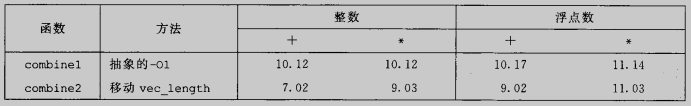
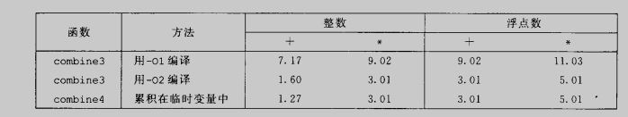

# 优化程序性能

程序运行的正确与快都是一个重要的考虑因素，高效的程序需要做到以下几点

* 编写出编译器能够有效转化成高效可执行的源代码

* 选择一组适当的算法和数据结构

实际上，程序员必须在实现和维护程序的简单性与他们的运行速度之间做出权衡

程序优化的第一步就是消除不必要的工作，让代码尽可能有效的执行所期望的任务，这包括消除不必要的函数调用、条件测试和内存引用

一种图形数据流表示法，可以使处理器对指令的执行形象化，我们还可以利用它预测程序的性能

利用处理器提供的指令级并行能力，同时执行多条指令

描述代码剖析程序的使用，代码剖析程序使测量程序各个部分性能的工具，这种分析能帮助我们找到代码中低效率的地方

  ## 5.1 优化编译器的能力和局限性

大多数编译器都有优化代码的能力，但是我们也需理解编译器的优化是由局限的，编译器必须假设不同的指针可能会指向内存中同一个位置，且无法判断一个函数调用是否有副作用，导致很多时候，编译器无法对代码进行优化

如果一个函数调用已经用内联函数替换优化过了，那么任何对这个调用进行追踪或设置断点的尝试都会失败

## 5.2 表示程序的性能

引入度量标准每元素的周期数（Cycles Per Element, CPE），作为一种表示程序性能并指导我们改进代码的方法

处理器活动的顺序使由时钟控制的，时钟提供了某个频率的规律信号，通常用千兆赫兹，即十亿周期每秒来表示。从程序员的角度看，用时钟周期来表示度量标准要比用纳秒或皮秒来表示有帮助的多。用时钟周期来表示，度量值表示的是执行了多少条命令，而不是时钟运行得有多快

对于较大得n值，运行时间就会主要由线性因子决定。这些项中的系数称为每元素的周期数(CPE)的有效值

## 5.3 程序示例

为了说明一个抽象的程序是如何被系统地转换成更有效的代码，我们使用一个基于下图的的向量数据结构，向量由两个内存块表示：头部和数据数组

~~~c
#ifndef __VEC_H__
#define __VEC_H__

typedef long data_t;

typedef struct
{
        long len;
        data_t *data;
}vec_rec, *vec_ptr;

#endif
~~~

以下代码是对向量的一些基本操作

~~~c
#include <stdio.h>
#include <stdlib.h>
#include "vec.h"

vec_ptr new_vec(long len)
{
        /* Allocate header structure*/
        vec_ptr result = (vec_ptr)malloc(sizeof(vec_rec));
        data_t *data = NULL;
        if(!result)
                return NULL;
        result->len = len;

        /* Allocate array*/
        if(len > 0)
        {
                data = (data_t *)calloc(len, sizeof(data_t));
                if(!data)
                {
                        free((void *)result);
                        return NULL;
                }
        }
        /* Data will either be NULL or allocated array */
        result->data = data;
        return result;
}

int get_vec_element(vec_ptr v, long index, data_t *dest)
{
        if(index < 0 || index >= v->len)
                return 0;
        *dest = v->data[index];
        return 1;
}

long vec_length(vec_ptr v)
{
        return v->len;
}

data_t *get_vec_start(vec_ptr v)
{
        return v->data;
}
~~~

我们观察一个优化示例，它使用某种运算，将一个向量中所有的元素合并成一个值，通过使用编译时常数IDENT和OP的不同定义，这段代码可以重编译成对数据执行不同的运算

~~~c
CLFAGS = -O1 -g -Wall -DIDENT=0 -DOP=+
CLFAGS = -O1 -g -Wall -DIDENT=1 -DOP=*
~~~

最初版本的优化目标函数如下

~~~c
void combine1(vec_ptr v, data_t *dest)
{
        long i;
        *dest = IDENT;

        for(i = 0; i < vec_length(v); i++)
        {
                data_t val;
                get_vec_element(v, i, &val);
                *dest = *dest OP val;
        }
}
~~~

我们先对比以下GCC使用优化编译和不用优化编译的差别

通常，养成至少使用-O1的优化级别是一个很好的习惯

### 5.4 消除循环的低效率

可以看到示例函数，每次循环迭代时必须对测试条件求值。另一方面，向量的长度并不会随着循环的进行而改变。那么只需要计算一次向量长度，在测试条件中都使用这个值

~~~c
void combine2(vec_ptr v, data_t *dest)
{
        long i;
        long length =  vec_length(v);
        *dest = IDENT;

        for(i = 0; i < length; i++)
        {
                data_t val;
                get_vec_element(v, i, &val);
                *dest = *dest OP val;
        }
}
~~~

这个优化是一类常见的优化，称为代码移动，这类优化包括识别要执行多次但是计算结果都不会改变的计算。因而可以将计算移动到循环前，就可以不被多次求值

## 5.5 减少过程调用

每次循环都会调用get_vec_element来获取下一个向量元素。对每个向量引用，这个函数要把向量索引i与循环边界条件做对比，很明显会造成低效率，于是我为数据类型添加一个函数get_vec_start，这个函数返回数组的起始地址，内循环中没有函数调用，而是直接访问数组。

~~~c
data_t *get_vec_start(vec_ptr v)
{
        return v->data;
}
~~~

一个纯粹主义者可能会说这严重损害了程序的模块性。原则上来说，向量抽象数据类型的使用者甚至不应该需要知道向量的内容是作为数组来存储的，而不是作为诸如链表之类的某种数据结构来存储。

比较实际的程序换会争论说这种变换是获得高性能结果的必要步骤

~~~c
void combine3(vec_ptr v, data_t *dest)
{
        long i;
        long length =  vec_length(v);
        data_t *data = get_vec_start(v);
        *dest = IDENT;

        for(i = 0; i < length; i++)
        {
                *dest = *dest OP data[i];
        }
}
~~~

不幸的是，似乎没有提升性能，而且针对整数加法，甚至有些性能降低。

显然，内循环中的其他操作形成了瓶颈，限制性能超过get_vec_element。我们还会再回到这个函数的，看看为什么combine2中反复检查边界不会让性能更差

## 5.6 消除不必要的内存引用

combine3的代码将合并运算计算的值累计在指针dest指定的位置。通过检查编译出来的为内循环产生的汇编代码，可以看出这个属性。在此我们给出数据类型为double，合并运算为乘法的x86-64代码

可以看到每次迭代时，累计变量的数值都要从内存读出再写入到内存。这样的读写很浪费，因为每次迭代开始时从dest读出的值就是上次迭代最后写入的值

我们能够消除这种不必要的内存读写，于是有了另一个改进版本，我们在combine4中引入一个临时变量acc，他在循环中用来累计计算出来的值。只有在循环完成之后结果在存放在dest中

~~~c
void combine4(vec_ptr v, data_t *dest)
{
        long i;
        long length =  vec_length(v);
        data_t *data = get_vec_start(v);
        data_t acc = IDENT;
        *dest = IDENT;

        for(i = 0; i < length; i++)
        {
                acc = acc OP data[i];
        }
        *dest = acc;
}
~~~

与combine3中循环相比，我们将每次迭代的内存操作从两次读和一次写减少到只读一次

我们尝试用-O2来对combine3进行优化

可见我们自己对函数的改进是可以超过编译器进行的优化的

## 5.7  理解现代处理器

到目前为止，我们运用的优化都不依赖于目标机器的任何特性。这些优化只是简单地降低了过程调用的开销，以及消除一些重大的“妨碍优化的因素”，这些因素会给优化编译器造成困难。随着试图进一步提高性能，必须考虑用处理器微体系结构的优化，也就是处理器用来执行指令的底层操作系统

实际的处理器中，是同时对多条指令求值的，这个现象称为指令级并行。现代处理器取到了不起功绩之一就是：他们采用复杂而奇异的微处理器结构，其中，多条指令可以并行执行，同时又呈现出一种简单的顺序执行指令的表象

当一系列操作必须按照严格顺序执行时，就会遇到延迟界限，因为再下一条指令开始之前，这条指令必须结束。当代码中的数据相关限制了处理器利用指令级并行的能力时，延迟界限能够限制程序性能。吞吐量界限刻画了处理器功能单元的原始计算能力。这个界限是程序性能的终极限制。

### 5.7.1 整体操作

现代处理器在每个时钟周期执行多个操作，而且是乱序的，意思就是指令的执行顺序不一定要与他们在机器级程序中顺序一致。整个设计又两个主要部分：指令控制单元（ICU）和执行单元（EU），前者负责从内存中读出指令序列，并根据这些指令序列生成一组针对程序数据的基本操作；后者执行这些操作。理解这句话是很关键的

指令高旭缓存是一个特殊的高速缓存器，它记录着最近访问的指令。通常，ICU会在当前正在执行的指令很早之前就取指，这样他才能又足够的是按对指令译码，并把操作发送到EU，

指令译码逻辑接受实际的程序指令，并将它们转为成一组基本操作，每个操作完成某个简单的计算任务，例如两个数相加，从内存中读数据，或是向内存中写数据。对于具有复杂指令的机器，一条指令可以被译码成多个操作。这种译码逻辑对指令进行分解，允许任务在一组专门的硬件单元之间进行分割。这些单元可以并行地执行多条指令的不同部分

EU接收来自取值单元的操作。通常，每个时钟周期会接收多个操作。这些操作会被分派到一组功能单元中，他们会执行实际的操作。

读写内存是由加载和存储单元实现的，分支预测是由分支单元实现的（不是确定分支该往哪里去，而是确定之间的分支预测是否正确，如果预测错误，EU会丢弃分支点之后计算出来的结果。他还会发信号给分支单元，说与测试错误的，并指出正确的分支目的）

实际中，不同的功能单元有时也会支持相同的功能，比如证书运算，加载，地址计算等。

我们可以看出功能单元的这种组合具有同时执行多个同类型操作的潜力

在ICU中，退役单元记录正在进行的处理，并确保它遵守机器级程序的顺序语义。指令译码时，关于指令的信息被放置在一个先进先出的队列中。这个信息会一直保持在队列中，直到发生以下两个结果中的一个。首先，一旦一条指令的操作完成了，而且所有引起这条指令的分支点也都被确认为预测正常，那么这条指令就可以退役了，所有对程序寄存器的更新都可以被实际执行了。另一方面，如果引起该指令的某个分支点预测错误，这条指令会被清空，丢弃所有计算出来的结果

### 5.7.2 功能单元的性能

下图提供了Intel Core i7 Haswall参考机的一些算数运算的性能。每个运算都是由以下这些数值来刻画的；一个是延迟，它表示完成运算所需要的总时间；一个是发射时间，他表示两个连续的同类型的运算之间需要的最小时钟周期数；还有一个是容量，他表示能够执行该运算的功能单元的数量。

我们可以看到，从整数运算到浮点运算，延迟是增加的。还可以看到加法和乘法运算的发射时间都是1·，意思是说在每个时钟周期，处理器都可以开始一条新的这样的运算。发射时间为1的功能单元被称为完全流水化的：每个时钟周期可以开始一个新的运算。出现容量大于1的运算是由于有多个功能单元

一个完全流水线化的功能单元有最大的吞吐量，每个时钟周期一个运算，而发射时间较大的功能单元的最大吞吐量比较小。具有多个功能单元可以进一步提高吞吐量。但芯片上只有有限的空间，所以CPU设计者必须小心地平衡功能单元的数量。设计者们评估许多不同的基准程序，将大多数资源用于最关键的操作

实际上，我们上文提到的“延迟”、“发射时间”、“容量”会一起影响combine函数的性能

延迟界限给出了任何必须按照严格顺序完成合并运算的函数所需要的最小CPE值。根据功能单元产生结果的最大速率，吞吐量界限给出了CPE的最小界限

### 5.7.3 处理器操作的抽象模型

作为分析在现代处理器上执行的机器级程序性能的一个工具，我们会使用程序的数据流表示，这是一种图形化的表示方法，展现了不同操作之间的数据相关是如何限制他们的执行顺序的。这些限制形成了图中的关键路劲，这是执行一组随机指令所需时钟周期数的一个下界

从机器级代码到数据流图

在我们假象的处理器设计中，指令译码器会把这4条指令扩展成为一系列的五步操作，最开始的乘法指令被扩展为一个load操作，从内存读出源操作数，和一个mul操作，执行乘法

在不断的循环过程中，就会形成一个关键路劲

接下来的任务就是重新调整操作的结构，增强指令级并行。我们想对程序做变换，使得唯一的限制变成吞吐量界限

## 5.8 循环展开

循环展开是一种程序变换，通过增加每次迭代计算的元素数量，减少循环的迭代次数。

~~~c
void combine5(vec_ptr v, data_t *dest)
{
        long i;
        long length = vec_length(v);
        long limit = length -1;
        data_t *data = get_vec_start(v);
        data_t acc = IDENT;

        /* Combine 2 element at a time */
        for(i = 0; i < limit; i+=2)
        {
                acc = (acc OP data[i]) OP data[i+1];
        }

        /* Finish any remaining elements */
        for(; i < length; i++)
        {
                acc = acc OP data[i];
        }
        *dest = acc;
}
~~~

我们看到对于整数加法，CPE有所改进，得到的延迟界限为1。会有这样的结果是得益于减少了循环开销。相对于计算向量和所需要的加法数量，降低开销操作的数量，此时，整数加法的一个周期的延迟成为了限制性能的因素。另一方面，其他情况并没有性能提高——他们已经到达了其延迟界限

事实上，编译器可以很容易地执行循环展开。只要优化级别高。用优化等级3或者更高等级调用GCC，他就会执行循环展开

## 5.9 提高并行性

我们将积累值放在一个单独的变量acc中。在前面的计算完成之前，都不能计算acc的新值，我们将由此限制来进行程序的优化

### 5.9.1 多个累积变量

对于一个可结合和可交换的合并运算来说，比如说整数加法或乘法，我们可以通过将一组合并运算分割成两个或更多的部分，并在最后合并结果来提高性能。

~~~c
/* 2 x 2 loop unrolling */
void combine6(vec_ptr v, data_t *dest)
{
        long i;
        long length = vec_length(v);
        long limit = length -1;
        data_t *data = get_vec_start(v);
        data_t acc0 = IDENT;
        data_t acc1 = IDENT;

        /* Combine 2 element at a time */
        for(i = 0; i < limit; i+=2)
        {
                acc0 = acc OP data[i];
                acc1 = acc1 OP data[i+1];
        }

        /* Finish any remaining elements */
        for(; i < length; i++)
        {
                acc = acc OP data[i];
        }
        *dest = acc0 OP acc1;
}
~~~

可以看到，所有运算都得到了明显的改进，最棒的是，我们打破了由延迟界限设下的限制。处理器不再需要延迟一个加法或乘法操作以待前一个操作完成了

### 5.9.2 重新结合变换

combine7与combine5的展开代码的唯一区别在于，内循环中元素合并的方式

~~~c
void combine7(vec_ptr v, data_t *dest)
{
        long i;
        long length = vec_length(v);
        long limit = length -1;
        data_t *data = get_vec_start(v);
        data_t acc = IDENT;

        /* Combine 2 element at a time */
        for(i = 0; i < limit; i+=2)
        {
                /* reassociation transformation */
                acc = acc OP (data[i] OP data[i+1]);
        }

        /* Finish any remaining elements */
        for(; i < length; i++)
        {
                acc = acc OP data[i];
        }
        *dest = acc;
}
~~~

我们发现这样也能极大优化性能，且突破了延迟界限的限制

总的来说，重新结合变换能够减少计算中关键路径上操作的数量，通过更好地利用功能单元的流水线能力得到更好的性能

## 5.10 优化combine代码的结果小结

使用多项优化技术，我们获得到CPE已经接近于0.5和1.0的吞吐量界限，只受限于功能单元的容量

## 5.11 一些限制因素

我们已近看到在一个程序的数据流图表示中，关键路径指明了执行程序所需时间的一个基本下界

本节中，我们会考虑一些制约程序在实际机器上性能的因素

### 5.11.1 寄存器溢出

循环并行的好处受汇编代码描述计算的能力限制。如果我们并行p超过了可用的寄存器数量，那么编译器会诉诸溢出，将某些临时值存放在内存中，通常是在运行时堆栈上分配空间

但这会使得CPE变高，性能变差了

### 5.11.2 分支预测及错误惩罚

一个C语言程序员怎么能够保证分支预测处罚不会阻碍程序运行的效率呢？没有简单的答案，但是以下原则是通用的。

#### 1 不要过分关心可预测的分支

#### 2 书写适合用条件传送实现的代码

对于本质上无法预测的情况，如果编译器能够产生使用条件数据传送而不是使用条件控制转移的代码，可以极大地提高程序的性能

我们发现GCC能够为以一种更“功能性的”风格书写的代码产生条件传送，在这种风格的代码中，我们用条件操作来计算值，然后用这些值来更新程序状态，这种风格对立于一种更“命令式的”风格，这种风格中，我们用条件语句来有选择地更新程序状态

我们通过两个例子，来理解这两种风格

* 命令式风格

~~~c
/* Rearrange two vectors so that for each i, b[i] >= a[i] */
void minmax1(long a[], long b[], long n)
{
        long i;

        for(i = 0; i < n; i++)
        {
                if(a[i] > b[i])
                {
                        long t = a[i];
                        a[i] = b[i];
                        b[i] = t;
                }
        }
}
~~~

* 功能性风格

~~~c
/* Rearrange two vectors so that for each i,  b[i] >= a[i]*/
void minmax2(long a[], long b[], long n)
{
        long i;

        for(i = 0; i < n; i++)
        {
                long min = a[i] < b[i] ? a[i] : b[i];
                long max = a[i] < b[i] ? b[i] : a[i];
                a[i] = min;
                b[i] = max;
        }
}
~~~

通过汇编代码，可以确认后者实现了条件传送

## 5.13 应用：性能提高技术

我们已近描述了很多优化程序性能的基本策略：

1）高级设计。为遇到的问题选择适当的算法和数据结构。要特别警觉，避免使用那些会渐进地产生糟糕性能的算法或编码技术

2）基本编码原则。避免限制优化的因素，这样编译器就能产生高效的代码

* 消除连续的函数调用。在可能时，将计算移到循环外。考虑有选择地妥协程序的模块性以获得更大的效率

* 消除不必要的内存引用。引入临时变量来保存中间结果。只有在最后的值计算出来时，才将结果存放到数组或全局变量中

3）低级优化。结构化代码以利用硬件功能

* 展开循环，降低开销，并且使得进一步的优化成为可能
* 通过使用例如多个累计变量和重新结合等技术，找到方法提高指令级并行
* 用功能性的风格重写条件操作，使得编译器采用条件数据传送

当然，一个重要的忠告——在提高效率重写程序时避免引入错误

## 5.14 确认和消除性能瓶颈

在处理大程序时，连知道应该优化什么地方都是很难的。本节描述如何使用代码剖析程序，这是在程序执行时收集性能的分析工具。

### 5.14.1 程序剖析

程序剖析运行程序的一个版本，其中插入了工具代码，以确定程序的各个部分需要多少时间。

Unix系统提供了一个剖析程序GPROF，这个程序产生两种形式的信息。首先，它确定程序中每个函数花费了多少CPU时间。其次，它计算每个函数被调用的次数，以执行调用的函数来分类

我们先看下如何使用GPROF剖析程序

~~~shell
zrf@ubuntu:~/opensource/demo/ComputerSystem/04$ gcc -Og -pg main.c mstore.c -o prog
zrf@ubuntu:~/opensource/demo/ComputerSystem/04$ ./prog file.txt
2 * 3 --> 6
zrf@ubuntu:~/opensource/demo/ComputerSystem/04$ gprof prog 
Flat profile:

Each sample counts as 0.01 seconds.
 no time accumulated

  %   cumulative   self              self     total           
 time   seconds   seconds    calls  Ts/call  Ts/call  name    
  0.00      0.00     0.00        1     0.00     0.00  mult2
  0.00      0.00     0.00        1     0.00     0.00  multstore

~~~

报告的第一部分列出了执行各个函数花费的时间，按照降序排列

GPROF的结果中通常不显示库函数的调用。库函数耗费的时间通常计算在调用他们的函数内。通过创建这个“包装函数”Strlen，我们可以可靠地跟踪对strlen的调用，表明它被调用了12511031次，但一共只需要0.3s

