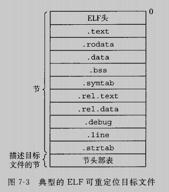
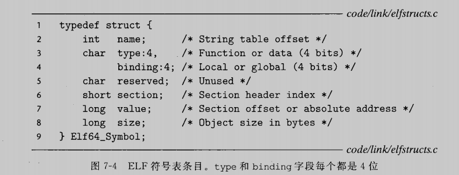
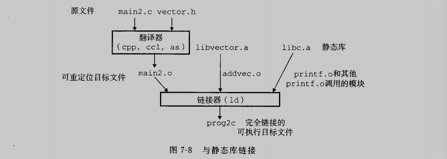
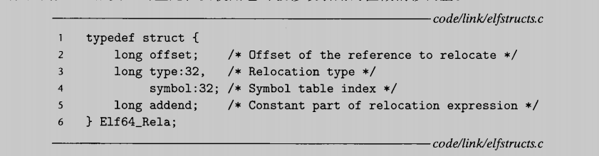
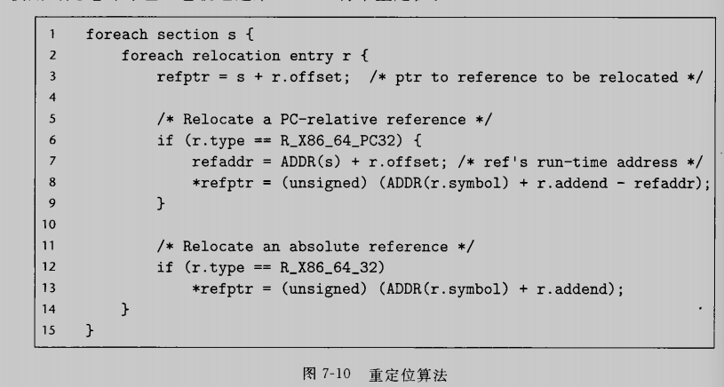
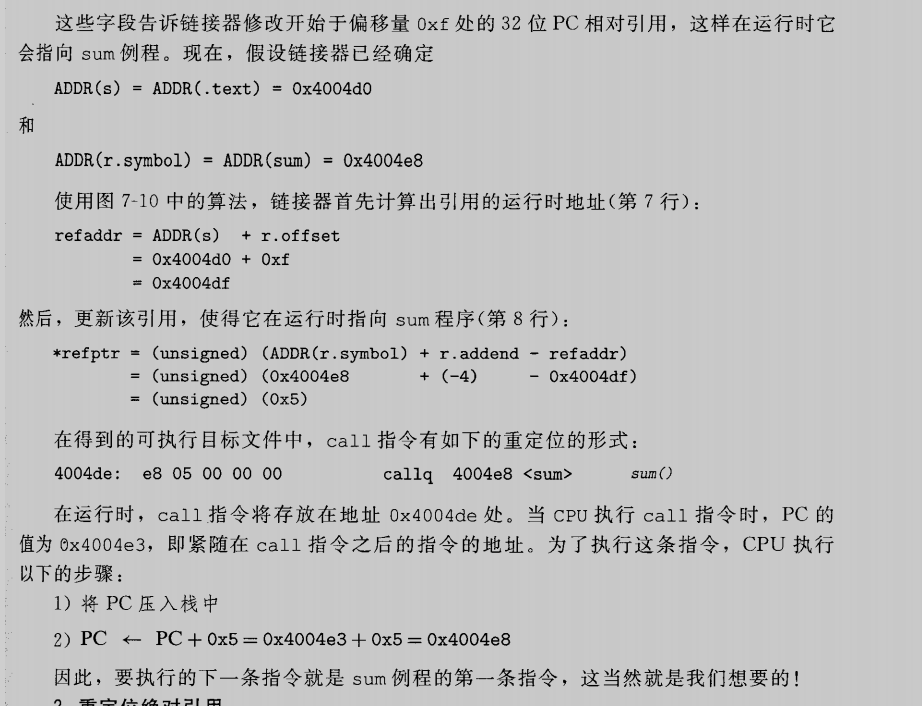
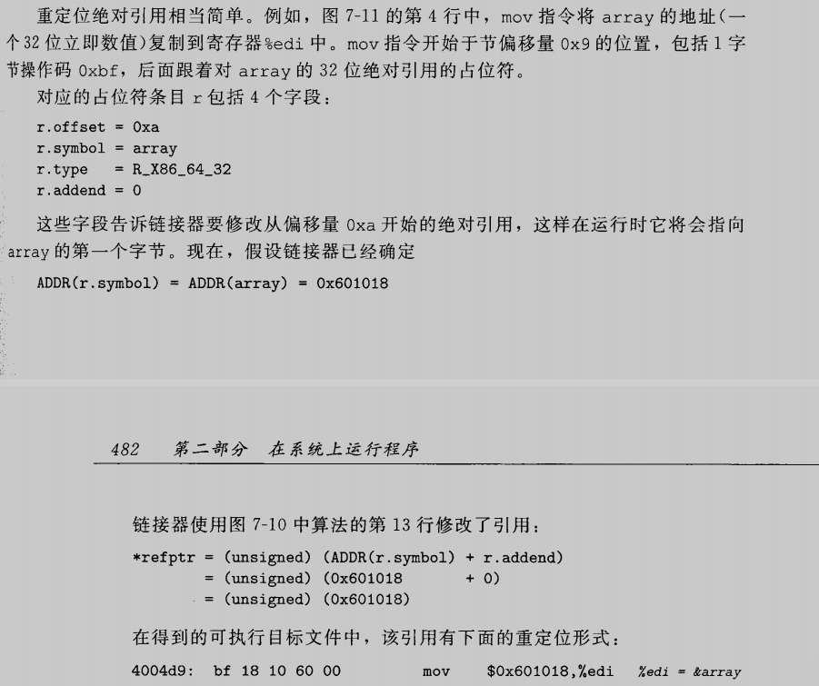
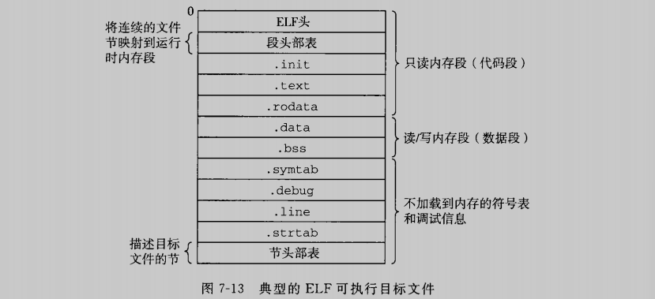
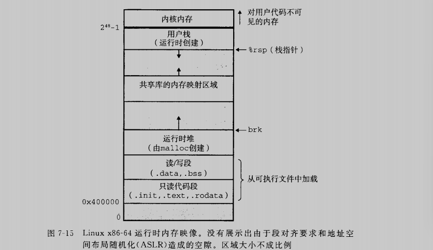
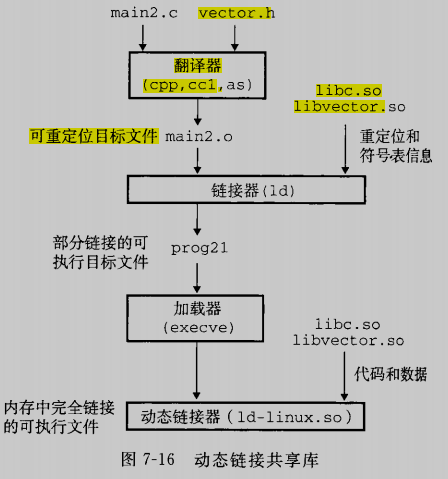

# 链接

链接是将各种代码和数据片段收集并组合成为一个单一文件的过程，这个文件可被加载（复制）到内存并执行。链接可以执行于编译时，也就是在源代码被翻译成机器代码时；可以执行于加载时，也就是在程序被加载器加载到内存并执行时；甚至执行于运行时，也就是由应用程序来执行。

* 理解链接器将帮助你构造大型程序
* 理解连接器将帮助你避免一些危险的编程错误
* 理解链接器将帮助你理解语言的作用域规则是如何实现的
* 理解链接器将帮助你理解其他重要的系统概念
* 理解链接器将使你能够利用共享库

这一章提供了关于链接各方面的全面讨论。从传统静态链接到加载时的共享库的动态链接，以及到运行时的共享库的动态链接。

## 7.1 编译器驱动程序

以下运行实例将贯穿本章，帮助我们说明关于链接器是如何工作的

~~~c
int sum(int *a, int n);

int array[2] = {1, 2};

int main()
{
        int val = sum(array, 2);
        return val;
}
~~~

~~~c
int sum(int *a, int n)
{
        int i, s = 0;
        for(i = 0; i < n; i++)
                s += a[i];

        return s;
}
~~~

驱动程序首先运行C预处理器，他将C的源程序main.c翻译成另一个ASCII码的中间文件main.i

~~~shell
cpp [other arguments] main.c /tmp/main.i
~~~

接下来，驱动程序运行C编译器，他将main.i翻译成一个ASCII汇编语言文件main.s

~~~c
cc1 /tmp/main.i -Og [other arguments] -o /tmp/main.s
~~~

然后，驱动程序运行汇编器as，他将main.s翻译成一个可重定位目标文件main.o

~~~ c
as [other arguments] -o /tmp/main.o /tmp/main.s
~~~

最后，它运行链接器程序ld，将main.o和sum.o以及一些必要的系统目标文件组合起来，创建一个可执行目标文件prog

~~~c
ld -o prog [system object files and args] /tmp/main.o /tmp/sum.o
~~~

要运行可执行文件prog，我们在linux shell的命令行上输入他的名字

~~~shell
linux> ./prog
~~~

shell调用操作系统中一个叫做加载器的函数，他将可执行文件prog中的代码和数据复制到内存，然后将控制转移到这个程序的开头

## 7.2 静态链接

像Linux LD程序这样的静态链接器以一组可重定位目标文件的命令行参数作为输入，生成一个完全链接的，可以加载和运行的可执行目标文件作为输出。输入的可重新定位目标文件由不同的代码和数据节组成，每一节都是一个连续的字节序列。指令在一节中，初始化了的全局变量在另一节中，而未初始化的变量又在另外一节中

为了构造可执行文件，链接器必须完成两个主要任务：

* 符号解析：

目标文件定义和引用符号，每个符号对应于一个函数，一个全局变量或一个静态变量。符号解析的目的是将每个符号引用正好和一个符号定义关联

* 重定位：

编译器和汇编器生成从地址0开始的代码和数据节。链接器通过把每个符号定义与一个内存位置关联起来，从而重定位这些节，然后修改所有对这些符号的引用，使得他们指向这个内存位置

在阅读后文时，要记住关于链接器的一些基本事实：目标文件纯粹是字节快的集合。这些块中，有些包含程序代码，有些包含程序数据，而其他的则包含引导链接器和加载器的数据结构。链接器将这些块连接起来，确定被连接块的运行时位置，并且修改代码和数据块中的各种位置

## 7.3 目标文件

目标文件有三种形式:

* 可重定位目标文件。包含二进制代码和数据，其形式可以在编译时与其他可重定位目标文件合并起来，创建一个可执行目标文件
* 可执行目标文件。包含二进制代码和数据，其形式可以被直接复制到内存并执行
* 共享目标文件。一种特殊类型的可重定位目标文件，可以在加载或者运行时被动态地加载进内存并链接

编译器和汇编器生成可重定位目标文件。链接器生成可执行目标文件。从技术上来说，一个目标模块就是一个字节序列，而一个目标文件就是一个以文件形式存放在磁盘中的目标模块，现在x86-64 Linux 和unix系统使用可执行可连接格式ELF

## 7.4 可重定位目标文件

ELF头以一个16字节的序列开始，这个序列描述了生成该文件的系统的系统的字的大小和字节顺序。ELF头剩下的部分包含帮助链接器语法分析和解释目标文件的信息。其中包括ELF头的大小，目标文件的类型（如可重定位，可执行或共享的），机器类型，节头部表的文件偏移，以及街头不表中条目的大小和数量。不同节的位置和大小是由节头部表表述的，其中目标文件中每个节都有一个固定大小的条目

夹在ELF头和节头部表之间的都是节。一个典型的ELF可重定位目标文件包括下面几个节：

* .text: 已编译程序的机器代码
* .rodata: 只读数据，比如printf语句中的格式串和开关语句的跳转表
* .data: 已初始化的全局和静态C变量。局部C变量在运行时被保存在栈中，既不出现在.data节中，也不出现在.bss节中
* .bss: 未初始化的全局和静态C变量，以及所有被初始化为0的全局或静态变量。在目标文件中这个节不占据实际的空间，它仅仅是一个占位符。目标文件格式区分已初始化和未初始化变量是为了空间效率：在目标文件中，未初始化变量不需要占据任何实际的磁盘空间。运行时，在内存中分配这些变量，初始值为0。
* .symtab: 一个符号表，它存放在程序中定义和引用的函数和全局变量的信息。一些人错误的以为必须通过-g选项来编译程序时，才能得到一张符号表（除非程序员特意用STRIP命令去掉它）。然后，和编译器中的符号表不同，.symtab符号表不包含局部变量的条目
* .rel.text: 一个.text节中位置的列表，当链接器把这个目标文件和其他文件组合时，需要修改这些位置。一般而言，任何调用外部函数或者引用全局变量的指令都需要修改。另一方面，调用本地函数的指令则不需要修改。注意，可执行目标文件中并不需要重定位信息，因此通常忽略，除非用户显示地指示链接器包含这些信息
* .rel.data: 被模块引用或定义的所有全局变量的重定位信息。一般而言，任何已初始化的全局变量，如果他的初始值是一个全局变量地址或外部定义函数的地址，都需要被修改。
* .debug: 一个调试符号表，其条目是程序中定义的局部变量和类型定义，程序中定义和引用的全局变量，以及原始的C源文件。已有以-g选项调用编译器驱动程序时，才会得到这张表。
* .line: 原始C源程序中的行号和.text节中机器指令之间的映射。只有以-g选项调用编译器驱动程序时，才会得到这张表
* .strtab: 一个字符串表，其内容包括.symtab和.debug节中的符号表，以及节头部中的节名字。字符串表就是以null结尾的字符串的序列

## 7.5 符号和符号表

每个可重定位目标模块m都有一个符号表，它包含m定义和引用的符号的信息。在链接器的三下文中，有三种不同的符号：

* 由模块m定义并能被其他模块引用的全局符号。全局链接器符号对应于非静态的C函数和全局变量
* 由其他模块定义并被模块m引用的全局符号。这些符号称为外部符号，对应于在其他模块中定义的非静态C函数和全局变量
* 只被模块m定义和引用的局部符号。他们对应于带static属性的C函数和全局变量。这些符号在模块m中任何位置都可见，但是不能被其他模块引用

认识到本地链接器符号和本地程序变量不同时非常重要的。.symtab中的符号表不包含对应于本地非静态程序变量的任何符号。这些符号在运行时在栈中被管理，链接器对此类符号不感兴趣

有趣的是，定义为带有C static属性的本地过程变量是不在栈中管理的。相反，编译器在.data 或.bss中为每个定义分配空间，并在符号表中创建一个有唯一名字的本地链接器符号。比如，假设在同一模块中的两个函数各自定义了一个静态局部变量x：

~~~c
int f()
{
    static int x = 0;
    return x;
}

int g()
{
    static int x = 1;
    return x;
}
~~~

这种情况下，编译器向汇编器输出两个不同名字的局部链接器符号。比如，它可以用x.1表示函数f中的定义，而用x.2表示函数g中的定义

符号表是由汇编器构造的，使用编译器输出到汇编语言.s文件中的符号。.symtab节中包含ELF符号表。这张符号表包含一个条目的数组。

name是字符串表中的字节偏移，指向符号的以null结尾的字符串名字。value是符号的地址。对于可重定位的模块来说，value是距定义目标的节的起始位置的偏移。对于可执行目标文件来说，该值是一个绝对运行时地址。size时目标的大小，type通常要么是数据，要么是函数。符号表还可以包含各个节的条目，以及对应原始源文件的路径名的条目。所以这些目标的类型也有所不同。binding字段表示符号是本地的还是全局的。

每个符号都被分配到目标文件的某个节，由section字段表示，该字段也是一个到节头部表的索引。有三个特殊的伪节，他们在节头部表中是没有条目的：ABS代表不该被重定位的符号；UNDEF代表未定义的符号，也就是在本目标模块中引用，但是却在其他地方定义的符号；COMMON表示还未被分配位置的未初始化的数据目标。只有可重定位目标文件中才有这些伪节，可执行目标文件中是没有的。

GNU READELF程序是一个查看目标文件内容的很方便的工具。

~~~shell
Symbol table '.symtab' contains 12 entries:
   Num:    Value          Size Type    Bind   Vis      Ndx Name
     0: 0000000000000000     0 NOTYPE  LOCAL  DEFAULT  UND 
     1: 0000000000000000     0 FILE    LOCAL  DEFAULT  ABS main.c
     2: 0000000000000000     0 SECTION LOCAL  DEFAULT    1 
     3: 0000000000000000     0 SECTION LOCAL  DEFAULT    3 
     4: 0000000000000000     0 SECTION LOCAL  DEFAULT    4 
     5: 0000000000000000     0 SECTION LOCAL  DEFAULT    6 
     6: 0000000000000000     0 SECTION LOCAL  DEFAULT    7 
     7: 0000000000000000     0 SECTION LOCAL  DEFAULT    5 
     8: 0000000000000000    26 FUNC    GLOBAL DEFAULT    1 main
     9: 0000000000000000     8 OBJECT  GLOBAL DEFAULT    3 array
    10: 0000000000000000     0 NOTYPE  GLOBAL DEFAULT  UND _GLOBAL_OFFSET_TABLE_
    11: 0000000000000000     0 NOTYPE  GLOBAL DEFAULT  UND sum
~~~

## 7.6 符号解析

链接器解析符号引用的方法是将每个引用与它输入的可重定位目标文件的符号表中的一个确定的符号定义关联起来。

不过，对全局符号的引用解析就棘手很多。当编译器遇到一个不是在当前模块中定义的符号（变量或者函数名）时，会假设该符号是在其他某个模块中定义的，生成一个链接器符号表条目，并把它交给链接器处理。

### 7.6.1 链接器如何解析多重定义的全局符号

链接器的输入是一组可重定位目标模块。每个模块定义一组符号，有些是局部的，有些事全局的。如果多个模块定义同名的全局符号，会怎么解决呢？

在编译时，编译器向汇编器输出每个全局符号，或者是强或者是弱，而汇编器把每个信息隐含地编码在可重定位目标文件地符号表里。函数和已初始化地全局变量是强符号，未初始化地全局变量是若符号

根据强弱符号地定义，linux链接器使用下面地规则来处理多重定义地符号名：

* 规则1：不允许有多个同名地强符号
* 规则2：如果有一个强符号和多个弱符号同名，那么选择强符号
* 规则3：如果有多个弱符号同名，那么从这些弱符号中任意选择一个

### 7.6.2 与静态库链接

迄今为止，我们都是假设链接器读取一组可重定位目标文件，并把它们连接起来，形成一个输出的可执行文件。实际上，所有的编译系统都提供一种机制，将所有相关的目标模块打包成一个单独的文件，称为静态库，它可以用作链接器的输入。当链接器构造一个输出的可执行文件时，他只复制静态库里被应用程序引用的目标模块。

如果不使用静态库，编译器开发人员会使用什么方法向用户提供一些标准函数。一种方法是让编译器辨认出对标准函数的调用，并直接生成相应的代码。这种方法对C而言是不合适的，因为C标准定义了大量的标准函数。这种方法将给编译器增加显著的复杂性，而且每次添加，删除或修改一个标准函数时，就需要一个新的编译器版本。

另一种方法是将所有标准C函数都放在一个单独的可重定位目标模块中，比如libc.o中，应用程序员可以把这个模块链接到他们的可执行文件中

~~~shell
linux> gcc main.c /usr/lib/libc.o
~~~

这种方法的优点是他将编译器的实现与标准函数分离，但是一个很大的缺点就是系统中每个可执行文件都包含着一份标准函数集合的完全副本，这对磁盘空间是很大的浪费。更糟的是，每个正在运行的程序都将他自己的这些函数的副本放在内存中，这对内存也是极大的浪费。另外一个大的缺点是，对任何标准函数的任何改变，无论多么小的改变，都需要库的开发人员重新编译整个源文件

我们可以通过为每个标准函数创建以恶个独立的可重定向文件，把他们存放在一个为大家都知道的目录中来解决一些其中的问题。然而，这种方法要求应用程序员显示地链接合适的目标模块到他们的可执行文件中，极易出错，且很耗时

~~~shell
linux> gcc main,c /usr/lib/printf.o /usr/lib/scanf.o ...
~~~

静态库的概念被提出来，以解决这些不同方法的缺点。相关的函数可以被编译为独立的目标模块，然后封装成一个单独的静态库文件。然后，应用程序可以通过在命令行上指定单独的文件名字来使用这些在库中定义的函数：

~~~shell
linux> gcc main.c /usr/lib/libm.a /usr/lib/libc.a
~~~

在链接时，链接器只复制被程序引用的目标模块，这就减少了可执行文件在磁盘和内存中的大小。另一方面，应用程序员只需要包含较少的库文件的名字（事实上，C编译器驱动程序总是传送libc.a给链接器，所以上一条命令行对libc.a的引用时不必要的）。

在linux中，静态库以一种称为存档的特殊文件格式存放在磁盘中。存档文件是一组连接起来的可重定位目标文件的集合，有一个头部用来描述每个成员目标文件的大小和位置。存档文件名由后缀.a标识

请看下例：

~~~shell
zrf@ubuntu:~/opensource/demo/ComputerSystem/07$ cat addvec.c 
int addcnt = 0;

void addvec(int *x, int *y, int *z, int n)
{
        int i;
        addcnt++;

        for(i = 0; i < n; i++)
                z[i] = x[i] + y[i];
}
~~~

~~~c
zrf@ubuntu:~/opensource/demo/ComputerSystem/07$ cat multvec.c 
int multcnt = 0;

void multvec(int *x, int *y, int *z, int n)
{
        int i;
        multcnt++;

        for(i = 0; i < n; i++)
                z[i] = x[i] * y[i];
}
~~~

我们可以如下编译库文件

~~~c
zrf@ubuntu:~/opensource/demo/ComputerSystem/07$ gcc -c addvec.c multvec.c 
zrf@ubuntu:~/opensource/demo/ComputerSystem/07$ ar rcs libvector.a addvec.o multvec.o
zrf@ubuntu:~/opensource/demo/ComputerSystem/07$ 
zrf@ubuntu:~/opensource/demo/ComputerSystem/07$ ls -al libvector.a
-rw-rw-r-- 1 zrf zrf 3238 Sep 16 23:16 libvector.a
zrf@ubuntu:~/opensource/demo/ComputerSystem/07$ 
~~~

为了使用这个库，我们写一个应用程序：

~~~shell
zrf@ubuntu:~/opensource/demo/ComputerSystem/07$ cat main2.c 
#include <stdio.h>
#include "vector.h"

int x[2] = {1, 2};
int y[2] = {3, 4};
int z[2];

int main()
{
        addvec(x, y, z, 2);
        printf("z = [%d %d]\n", z[0], z[1]);
        return 0;
}
~~~

使用以下命令行进行编译并执行

~~~shell
zrf@ubuntu:~/opensource/demo/ComputerSystem/07$ gcc -c main2.c 
zrf@ubuntu:~/opensource/demo/ComputerSystem/07$ gcc -static -o prog2c main2.o ./libvector.a zrf@ubuntu:~/opensource/demo/ComputerSystem/07$ gcc -static -o prog2c main2.o -L. -lvector
zrf@ubuntu:~/opensource/demo/ComputerSystem/07$ 
zrf@ubuntu:~/opensource/demo/ComputerSystem/07$ ./prog2c 
z = [4 6]
zrf@ubuntu:~/opensource/demo/ComputerSystem/07$ 
~~~

当链接器运行时，它判定main2.o引用了addvec.o定义的addvec符号，所以复制addvec.o到可执行文件。因为程序不引用任何由multvec.o定义的符号，所以链接器就不会复制这个模块到可执行文件。链接器还会复制libc.a中的printf.o模块，以及许多C运行时系统中的其他模块

### 7.6.3 链接器如何使用静态库来解析引用

在符号解析阶段，链接器从左到右按照他们在编译器驱动程序命令行上出现的顺序来扫描可重定位目标文件和存档文件。再扫描过程中，链接器维护一个可重定位目标文件的集合E，（这个集合中的文件会被合并起来形成可执行文件），一个未解析的符号（即引用了但是尚未定义的符号）集合U，以及一个在前面输入文件中已定义的符号集合D。初始时，三个集合均为空

* 对于命令行上的每个输入文件f，连机器会判断f是一个目标文件还是一个存档文件。如果f是一个目标文件，那么链接器把f添加到E，修改U和D来反应f中的符号定义和引用，并继续下一个输入文件
* 如果f是一个存档文件，那么链接器就尝试匹配U中未解析的符号和由存档文件成员定义的符号。如果某个存档文件成员m，定义了一个符号来解析U中的一个引用，那么久把m加到E中，并且链接器修改U和D来反应m中的符号定义和引用。对存档文件中所有的成员目标文件都依次执行这个过程，直到U和D都不再发生变化。此时，任何不包含在E中的成员目标文件都简单地被丢弃，而链接器将继续处理下一个输入文件
* 如果当链接器完成对命令行上输入文件的扫描后，U是非空的，那么链接器就会输出一个错误并终止。否则，他会合并和重定位E中的目标文件，构建输出的可执行文件

不幸的是，这种算法会导致一些令人困扰的链接时错误，因为命令行上的库和目标文件的顺序非常重要。在命令行中，如果一个定义符号的库，出现在了引用符号的目标文件之前，那么引用就不能被解析，链接会失败。

所以，关于库的一般准则是将他们放在命令行的结尾。但前提是各个库之间的成员是互相独立的（也就是说没有成员引用另一个成员定义的符号）。如果库不独立，那么必须排序，使得对于每个被存档文件的成员外部引用的符号s，在命令行中至少有一个s的定义是在对s的引用之后的。

如果需要满足依赖需求，可以在命令行上重复库。比如，假设foo.c调用libx.a中的函数，该库又调用liby.a中的函数，而liby.a又调用libx.a中的函数，那么libx.a必须在命令行上重复出现

~~~shell
linux> gcc foo.c libx.a liby.a libx.a
~~~

## 7.7 重定位

一旦链接器完成了符号解析这一步，就把代码中每个符号引用和正好一个符号定义关联起来了。此时，链接器就知道它的输入目标模块中的代码节和数据节的确切大小。现在就可以开始重定位步骤了，在这个步骤中，将合并输入模块，并为每个符号分配运行时地址。重定位由两步组成：

* 重定位节和符号定义。这一步中，链接器将所有相同类型的节合并为同一类型的新聚合节。例如，来自所有输入模块的.data节被全部合并成一个节，这个节成为输出的可执行目标文件的.data节。然后，链接器将运行时内存地址赋给新的聚合节，赋给输入模块定义的每个节，以及赋给输入模块定义的每个符号。当这一步完成时，程序中的每条指令和全局变量都有唯一的运行时内存地址了。
* 重定位节中的符号引用。在这一步中，链接器修改代码节和数据节中对每个符号的引用，使得他们指向正确的运行时地址。要执行这一步，链接器依赖于可重定位目标模块中称为重定位条目的数据结构

### 7.7.1 重定位条目

当汇编器生成一个目标模块时，它并不知道数据和代码最终放在内存中的什么位置。他也不知道这个模块引用的任何外部定义的函数或者全局变量的位置。所以，无论何时汇编器遇到对最终位置未知的目标引用。代码的重定位条目放在.rel.text中，已初始化数据的重定位条目放在.rel.data中

下图展示ELF重定位条目的格式。offset是需要被修改的引用的节偏移。symbol标识被修改引用应该指向的符号。type告知链接器如何修改新的引用。addend是一个有符号常数，一些类型的重定位要使用他对被修改引用的值做偏移调整

ELF定义了32种不同的重定位类型，有些相当隐秘，我们只关心其中两种最基本的重定位类型：

* R_X86_64_PC32
* R_X86_64_32

### 7.7.2 重定位符号引用

下图是链接器得重定位算法的伪代码

我们尝试用这个算法来重定位我们的示例程序中的引用

使用objdump -dx main.o 

~~~shell
zrf@ubuntu:~/opensource/demo/ComputerSystem/07$ objdump -dx main.o

main.o:     file format elf64-x86-64
main.o
architecture: i386:x86-64, flags 0x00000011:
HAS_RELOC, HAS_SYMS
start address 0x0000000000000000

Sections:
Idx Name          Size      VMA               LMA               File off  Algn
  0 .text         0000001a  0000000000000000  0000000000000000  00000040  2**0
                  CONTENTS, ALLOC, LOAD, RELOC, READONLY, CODE
  1 .data         00000008  0000000000000000  0000000000000000  00000060  2**3
                  CONTENTS, ALLOC, LOAD, DATA
  2 .bss          00000000  0000000000000000  0000000000000000  00000068  2**0
                  ALLOC
  3 .comment      0000002a  0000000000000000  0000000000000000  00000068  2**0
                  CONTENTS, READONLY
  4 .note.GNU-stack 00000000  0000000000000000  0000000000000000  00000092  2**0
                  CONTENTS, READONLY
  5 .eh_frame     00000030  0000000000000000  0000000000000000  00000098  2**3
                  CONTENTS, ALLOC, LOAD, RELOC, READONLY, DATA
SYMBOL TABLE:
0000000000000000 l    df *ABS*  0000000000000000 main.c
0000000000000000 l    d  .text  0000000000000000 .text
0000000000000000 l    d  .data  0000000000000000 .data
0000000000000000 l    d  .bss   0000000000000000 .bss
0000000000000000 l    d  .note.GNU-stack        0000000000000000 .note.GNU-stack
0000000000000000 l    d  .eh_frame      0000000000000000 .eh_frame
0000000000000000 l    d  .comment       0000000000000000 .comment
0000000000000000 g     F .text  000000000000001a main
0000000000000000 g     O .data  0000000000000008 array
0000000000000000         *UND*  0000000000000000 _GLOBAL_OFFSET_TABLE_
0000000000000000         *UND*  0000000000000000 sum

Disassembly of section .text:

0000000000000000 <main>:
   0:   48 83 ec 08             sub    $0x8,%rsp
   4:   be 02 00 00 00          mov    $0x2,%esi
   9:   48 8d 3d 00 00 00 00    lea    0x0(%rip),%rdi        # 10 <main+0x10>
                        c: R_X86_64_PC32        array-0x4
  10:   e8 00 00 00 00          callq  15 <main+0x15>
                        11: R_X86_64_PLT32      sum-0x4
  15:   48 83 c4 08             add    $0x8,%rsp
  19:   c3       
~~~

我们重点关注汇编

#### 1.重定位PC相对引用

假设sum的重定位条目如下：

~~~c
r.offset = 0xf
r.symbol = sum
r.type = R_X86_64_PLT32
r.addend = -4
~~~

#### 2.重定位绝对引用

## 7.8 可执行目标文件

我们已经看到链接器如何将多个文件合并成一个可执行目标文件。我们的示例C程序，开始时是一组ASCII文本文件，现在已经被转化为一个二进制文件，且这个二进制文件包含加载程序到内存并允许它所需要的所有信息。下图是一个典型的ELF可执行文件中的各类信息

ELF可执行文件被设计得很容易加载到内存，可执行文件的连续的片被映射到连续的内存段。程序头部表描述了这种映射关系

## 7.9 加载可执行目标文件

~~~shell
linux> ./prog
~~~

因为prog不是一个内置的shell命令，所以shell会认为prog是一个可执行目标文件，通过调用某个驻留在存储器中称为加载器的操作系统代码来运行它。任何linux程序都可以通过调用execve函数来调用加载器。加载器将可执行目标文件中的代码和数据从磁盘复制到内存中，然后通过跳转到程序的第一条指令或入口点来运行该程序。这个将程序复制到内存并运行的过程叫做加载

每个linux程序都有一个运行时内存映像，代码段总是从0x400000处开始，后面是数据段。运行时堆在数据段之后，通过调用malloc库往上增长。堆后面的区域是为共享模块保留的。用户栈总是从最大的合法用户地址2^48^-1开始，向较小内存地址增长。栈上的区域，从地址2^48^开始，以为内核中的代码和数据保留的，所谓内核就是操作系统驻留在内存的部分

为了简洁，我们把堆，数据和代码画的彼此相邻，并且把栈顶放在了最大的合法用户地址处。实际上由于.data段有对齐要求，所以代码段和数据段之间是有间隙的。同时，在分配栈，共享库和堆段运行时地址的时候，链接器会使用地址空间布局随机变化。虽然每次程序运行时这些区域的地址都会变，但是他们的相对位置是不变的。

当加载器运行时，它创建类似于上图的内存映像。在程序头部表的引导下，加载器将可执行文件的片复制到代码段和数据段。接下来，加载器跳转到程序的入口点，也就是_start函数的地址，它调用系统启动函数__libc_start_main，他初始化执行环境，调用用户层的main函数，处理main函数的返回值，并且在需要的时候把控制返回给内核

## 7.10 动态链接共享库

共享库时致力于解决静态库缺陷的一个现在创新产物。共享库是一个目标模块，在运行或加载时，可以加载到任意的内存地址，并和一个在内存中的程序链接起来。这个过程称为动态链接，是由一个叫做动态链接器的程序来执行的

首先，在任何给定的文件系统中，对于一个库只有一个.so文件。所有引用该库的可执行目标文件共享这个.so文件中的代码和数据，而不是像静态库的内容那样被复制和嵌入到引用他们的可执行的文件中。其次，在内存中，一个共享库的.text节的一个副本可以被不同的正在运行的进程共享。我们在学习虚拟内存时候，会更详细地讨论这个问题。

~~~shell
zrf@ubuntu:~/opensource/demo/ComputerSystem/07$ gcc -shared -fpic -o libvector.so addvec.c multvec.c 
zrf@ubuntu:~/opensource/demo/ComputerSystem/07$ gcc -o prog21 main2.c ./libvector.so 
zrf@ubuntu:~/opensource/demo/ComputerSystem/07$ 
zrf@ubuntu:~/opensource/demo/ComputerSystem/07$ ./prog21 
z = [4 6]
~~~

-fpic选项指示编译器生成与位置无关的代码，-shared选项指示链接器创建一个共享的目标文件。一旦创建了这个库，随后就要将它链接到示例程序中

可执行文件prog21的文件形式使得它在运行时可以和libvector.so链接。基本的思路时当创建可执行文件时，金泰执行一些链接，然后在程序加载时，动态完成链接。此时，没有任何libvector.so的代码和数据节真的被复制到可执行文件prog21中。反之，链接器复制了一些重定位和符号信息表，他们使得运行时可以解析对libvector.so中代码和数据的引用

当加载器加载和运行可执行文件prog21时，他利用7.9节中讨论过的技术，加载部分链接的可执行文件。接着，它注意到prog21包含一个.interp节，这一节包含动态链接器的路劲名，动态链接器本身就是一个共享目标。加载器不会像它通常所作地那样将控制传递给应用，而是加载和运行这个动态链接器。然后动态链接器通过执行下面的重定位完成链接任务

* 重定位libc.so的文本和数据到某个内存段
* 重定位libvector.so的文本和数据到另一个内存段
* 重定位prog21中所有对由libc.so和libvector.so定义的符号的引用

最后，动态链接器将控制传递给应用程序。从这个时刻开始，共享库的位置就固定了，并且在程序执行的过程中都不会改变

## 7.11 从应用程序中加载和链接共享库

到目前为止，我们已近讨论了在应用程序被加载后执行前时，动态连接器加载和链接共享库的情景。然而，应用程序还可能在它运行时要求动态链接器加载和链接某个共享库，而无需再编译时将那些库链接到应用中

其思路是将每个生成动态内容的函数打包在共享库中。当一个来自Web浏览器的请求到达时，服务器动态地加载和链接适当的函数，然后直接调用它，而不是使用fork()和execve在在子进程的上下文中运行函数。函数会一直缓存在服务器的地址空间中，所以只要一个简单的函数调用的开销，就可以处理随后的请求了。这对一个繁忙的网站来说是有很大影响的。更进一步说，在运行时无需停止服务器，就可以更新已存在的函数，以及添加新的函数

linux系统为动态链接器提供了一个简单的接口，允许应用程序在运行时加载和链接共享库

~~~c
#include <dlfcn.h>

/* 若成功则为指向句柄的指针，若出错则为NULL*/
void *dlopen(const char *filename, int flag);
~~~

dlopen函数加载和链接共享库filename。用已用带RTLD_GLOBAL选项打开了的库解析filename中的外部符号。如果当前可执行文件是带-rdynamic选项编译的，那么对符号解析而言，他的全局符号也是可用的。flag参数必须要么包含RTLD_NOW标志，该标志告诉链接器立即解析对外部符号的引用，要么包括RTLD_LAZY标志，该标志指示链接器推迟符号解析直到执行来自库中的代码。这两个值中的任意一个都可以和RTLD_GLOBAL标志取或。

~~~c
#include <dlfcn.h>

/* 若成功则为指向符号的指针，若出错则为NULL */
void *dlsym(void *handle, char *symbol);    
~~~

dlsym函数的输入是一个指向前面已打开了的共享库的句柄和一个symbol名字，如果该符号存在，就返回符号的地址，否则返回NULL

~~~c
#include <dlfcn.h>

/* 若成功则为0，若出错则为-1 */
int dlclose(void *handle);
~~~

如果没有其他共享库还在使用这个共享库，dlclose函数就卸载该共享库

~~~c
#include <dlfcn.h>

const char *dlerror(void);
~~~

dlerror()函数返回一个字符串，他描述的是调用dlopen，dlsym或者dlclose函数时发生的最近的错误，如果没有错误发生，就返回NULL

请详看以下示例程序

~~~c
#include <stdio.h>
#include <stdlib.h>
#include <dlfcn.h>

int x[2] = {1,2};
int y[2] = {3,4};
int z[2];

int main()
{
        void *handle;
        void (*addvec)(int *, int *, int *, int);
        char *error;

        /* Dynamically load the shared library containing addvec() */
        handle = dlopen("./libvector.so", RTLD_LAZY);
        if(!handle)
        {
                fprintf(stderr, "%s\n", dlerror());
                exit(1);
        }

        /* Get a pointer to the addvec() function we just loaded */
        addvec = dlsym(handle, "addvec");
        if((error = dlerror()) != NULL)
        {
                fprintf(stderr, "%s\n", error);
                exit(1);
        }

        /* Now we can call addvec() just like any other function */
        addvec(x, y, z, 2);
        printf("z = [%d %d]\n", z[0], z[1]);

        /*Unload the shared library */
        if(dlclose(handle) < 0)
        {
                fprintf(stderr, "%s\n", dlerror());
                exit(1);
        }

        return 0;
}
~~~

使用如下命令行进行编译

~~~c
linux> gcc -rdynamic -o prog2r dll.c -ldl
~~~

## 7.12 与位置无关的代码

## 7.13 库打桩机制

Linux链接器支持一个很强大的技术，称为库打桩，它允许你截获对共享库函数的调用，取而代之执行自己的代码。使用打桩机制，你可以追踪对某个特殊库函数的调用次数，验证和追踪它的输入和输出值，或者甚至把他替换成一个完全不同的实现。

给定一个需要打桩的目标函数，创建一个包装函数，它的原型与目标函数完全一样。使用某种特殊的打桩机制，你就可以欺骗系统调用包装函数而不是目标函数了。

我们先编写以下例程

~~~c
zrf@ubuntu:~/opensource/demo/ComputerSystem/07$ cat int.c 
#include <stdio.h>
#include <malloc.h>

int main()
{
        int *p = malloc(32);
        free(p);
        return 0;
}
~~~

~~~c
zrf@ubuntu:~/opensource/demo/ComputerSystem/07$ cat malloc.h 
#define malloc(size) mymalloc(size)
#define free(ptr) myfree(ptr)

void *mymalloc(size_t size);
void myfree(void *ptr);
~~~

### 7.13.1 编译时打桩

~~~c
#ifdef COMPILETIME
#include <stdio.h>
#include <malloc.h>

void *mymalloc(size_t size)
{
        void *ptr = malloc(size);
        printf("malloc(%d)=%p\n", (int)size, ptr);

        return ptr;
}

void myfree(void *ptr)
{
        free(ptr);
        printf("free(%p)\n", ptr);
}
#endif
~~~

mymalloc.c中的包装函数调用目标，打印追踪记录，并返回。本地的malloc.h头文件指示预处理器用对相应包装函数的调用替换掉对目标函数的调用。像下面这样编译和链接这个程序：

~~~c
zrf@ubuntu:~/opensource/demo/ComputerSystem/07$ gcc -DCOMPILETIME -c mymalloc.c 
zrf@ubuntu:~/opensource/demo/ComputerSystem/07$ gcc -I. -o intc int.c mymalloc.o 
~~~

由于有-I.参数，所以会进行打桩，他告诉C预处理器在搜索通常的系统目录之前，现在当前目录中查找malloc.h。注意，mymalloc.c中的包装函数是使用标准malloc.h头文件编译的。

运行这个程序会得到如下的追踪信息：

~~~shell
zrf@ubuntu:~/opensource/demo/ComputerSystem/07$ ./intc 
malloc(32)=0x555d1ea37260
free(0x555d1ea37260)
~~~

### 7.13.2 链接时打桩

Linux静态链接器支持用--wrap f标志进行链接时打桩。这个标识告诉链接器，把对符号f的引用解析成__wrap_f(前缀是两个下划线)，还要把对符号\__real_f(前缀是两个下划线)的引用解析为f。

~~~c
#ifdef LINKTIME
#include <stdio.h>

void *__real_malloc(size_t size);
void __real_free(void *ptr);

/* malloc wrapper function */
void *__wrap_malloc(size_t size)
{
        void *ptr = __real_malloc(size);/* call libc malloc */
        printf("malloc(%d) = %p\n", (int)size, ptr);
        return ptr;
}

/* free wrapper function */
void __wrap_free(void *ptr)
{
        __real_free(ptr);
        printf("free(%p)\n", ptr);
}
#endif
~~~

需要进行如下编译

~~~shell

rf@ubuntu:~/opensource/demo/ComputerSystem/07$ gcc -DLINKTIME -c mymalloc.c 
zrf@ubuntu:~/opensource/demo/ComputerSystem/07$ gcc -c int.c
zrf@ubuntu:~/opensource/demo/ComputerSystem/07$ gcc -Wl,--wrap,malloc -Wl,--wrap,free -o int1 int.o mymalloc.o
zrf@ubuntu:~/opensource/demo/ComputerSystem/07$ ./int1 
malloc(32) = 0x564e2397b260
free(0x564e2397b260)
~~~

### 7.13.3 运行时打桩

编译时打桩需要能够访问程序的源代码，链接时打桩需要能够访问程序的可重定位对象文件。不过，有一种机制能够在运行是打桩，它只需要能够访问可执行目标文件。这个很厉害的机制基于动态链接器的LD_PRELOAD环境变量。

如果LD_PRELOAD环境变量被设置为一个共享库路劲名的列表（以空格或分号分隔），那么当你加载和执行一个程序，需要解析未定义的引用时，动态链接器(LD-LINUX.SO)会先搜索LD_PRELOAD库，然后才搜索任何其他库

下面例程展示了malloc和free的包装函数，每个包装函数中，对dlsym的调用返回指向libc函数的指针。然后包装函数调用目标函数，打印追踪记录，再返回

~~~c
#ifdef RUNTIME
#define _GNU_SOURCE
#include <stdio.h>
#include <stdlib.h>
#include <dlfcn.h>

/* malloc weapper function */
void *malloc(size_t size)
{
        void *(*mallocp)(size_t size);
        char *error;

        mallocp = dlsym(RTLD_NEXT, "malloc");/* Get address if libc malloc */
        if((error = dlerror()) != NULL)
        {
                fputs(error,stderr);
                exit(1);
        }

        char *ptr = mallocp(size);/* Call libc malloc */
        printf("malloc(%d) = %p\n", (int)size, ptr);
        return ptr;
}

/* free wrapper function */
void free(void *ptr)
{
        void (*freep)(void *) = NULL;
        char *error;

        if(!ptr)
                return;

        freep = dlsym(RTLD_NEXT, "free");/* Get address if libc free */
        if((error = dlerror()) != NULL)
        {
                fputs(error,stderr);
                exit(1);
        }

        freep(ptr); /* Call libc free */
        printf("free(%p)\n", ptr);
}
#endif
~~~

我们正常编译

~~~shell
zrf@ubuntu:~/opensource/demo/ComputerSystem/07$ gcc -DRUNTIME -shared -fpic -o mymalloc.so mymalloc.c -ldl
zrf@ubuntu:~/opensource/demo/ComputerSystem/07$ gcc -o intr int.c 
zrf@ubuntu:~/opensource/demo/ComputerSystem/07$ ./intr 
zrf@ubuntu:~/opensource/demo/ComputerSystem/07$ 
~~~

直接执行intr是没有打印的，但是如果设置环境变量LD_PRELOAD后再运行intr，则会发现——堆栈了

~~~shell
zrf@ubuntu:~/opensource/demo/ComputerSystem/07$ LD_PRELOAD="./mymalloc.so" ./intr 
Segmentation fault
zrf@ubuntu:~/opensource/demo/ComputerSystem/07$
~~~

据网友回答，这是因为printf和malloc互相调用导致的栈溢出

## 7.14 处理目标文件的工具

* AR：创建静态库，插入，删除，列出和提取成员
* STRINGS：列出一个目标文件中所有可打印的字符串
* STRIP：从目标文件中删除符号信息
* NM：列出一个目标文件的符号表中定义的符号
* SIZE：列出目标文件中节的名字和大小
* READELF：显示一个目标文件的完整结构，包含ELF头中编码的所有信息。包含SIZE和NM的功能
* OBJDUMP：所有二进制工具之母。能够显示一个目标文件中所有的信息。它最大的作用就是反汇编.text节中的二进制指令
* LDD：列出一个可执行文件在运行时需要的共享库
