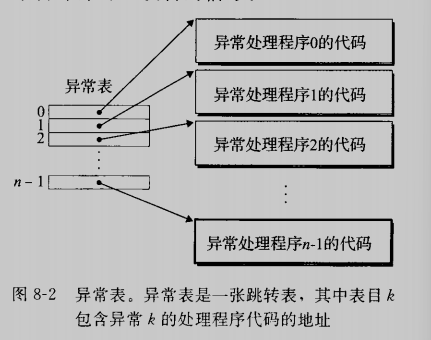

# 异常控制流

现代系统通过使控制流发生突变来对这些情况作出反应。一般而言，我们把这些突变称为异常控制流。异常控制流发生在计算机系统的各个层次。比如在硬件层，硬件检测到的事件会触发控制突然转移到异常处理程序。在操作系统层，内核通过上下文切换将控制从一个用户进程转移到另一个用户进程。在应用层，一个进程可以发送信号到另一个进程，而接收者会将控制突然转移到它的一个信号处理程序。一个程序可以通过回避通常的栈规则，并执行到其他函数中任意的非本地跳转来对错误做出反应

作为程序员，理解异常控制流非常重要，这有很多原因：

* 帮助我们理解重要的系统概念
* 帮助理解应用程序时如何与操作系统交互的
* 编写有趣的新应用程序
* 理解并发
* 理解软件异常如何工作

从异常开始，异常位于硬件和操作系统交界的部分。我们还会讨论系统调用，他们呢时为应用程序提供到操作系统入口点的异常。然后，我们会提升抽象的层次，描述进程和信号，他们位于应用和操作系统的交界处。最后讨论非本地跳转，这是异常控制流的一种应用层形式。

## 8.1 异常

异常是异常控制流的一种形式，他一部分由硬件实现，一部分由操作系统实现。

异常就是控制流中的突变，用来响应处理器状态中的某些变化。当处理器状态中发生一个重要的变化时，处理器正在执行某个当前指令I~curr~。在处理器中，状态被编码为不同的位和信号。状态变化称为事件。事件可能和当前指令的执行直接相关。另一方面，事件也可能和当前指令的执行没有关系。比如，一个系统定时器产生信号或者一个I/O请求完成。

在任何情况下，当处理器检测到有事件发生时，他就会通过一张叫做异常表的跳转表，进行一个间接过程调用，到一个专门涉及用来处理这类事件的操作系统子程序。

### 8.1.1 异常处理

异常可能会难以理解，因为处理异常需要硬件和软件紧密合作。

在系统启动的时候，操作系统分配和初始化一张称为异常表的跳转表，使得表目k包含异常k的处理程序的地址。

在运行时（当系统在执行某个程序时），处理器检测到发生了一个事件，并且确定了相应的异常号k。随后，处理器触发异常，方法是执行间接过程调用，通过异常表的表目k，转到相应的处理程序。

下图展示了处理器如何使用异常表来形成适当的异常处理程序的地址。异常号是到异常表中的索引，异常表的起始地址放在一个叫做异常表基址寄存器的特殊CPU寄存器里。

异常类似于过程调用

### 8.1.2 异常的类别

异常可以分为四类：中断，陷阱，故障和终止

#### 1. 中断

中断时异步发生的，时来自处理器外部的I/O设备的结果。硬件中断不是由任何一条专门的指令造成的，从这个意义上来说，他是异步的。硬件中断的异常处理程序常常称为中断处理程序

下图描述了一个中断的处理。I/O设备，例如网络适配器，磁盘控制器和定时器芯片，通过向处理器芯片上的一个引脚发起信号，并将异常号放到系统总线上，来触发中断，这个异常号标识了引起中断的设备。

当前指令完成执行之后，处理器注意到中断引脚的电压变高了，就从系统总线读取异常号，然后调用适当的中断处理程序。当处理程序返回时，他就将控制返回给下一条指令。结果是程序继续执行，就好像没有发生过中断一样

剩下的异常类型（陷阱，故障和终止）是同步发生的，是执行当前指令的结果。我们把这类指令叫做故障指令。

#### 2.陷阱和系统调用

陷阱是有意的异常，是执行一条指令的结果。就像中断处理程序一样，陷阱处理程序将控制返回到下一条指令。陷阱最重要的用途是在用户程序和内核之间提供一个像过程一样的接口，叫做系统调用

用户程序经常需要向内核请求服务，例如read,fork,execve,exit等。为了允许对这些内核服务的受控的访问，处理器提供了一条特殊的“syscall n"指令，当用户程序想要请求服务n时，可以执行这条指令。执行syscall指令会导致一个到异常处理程序的陷阱，这个处理程序解析参数，并调用适当的内核程序。

从程序员的角度看，系统调用和普通的函数调用时一样的。然而，他们的实现非常不同。普通的函数运行在用户模式中，用户模式限制了函数可以执行的指令的类型，而且他们只能访问与调用函数相关的栈。系统调用运行在内核模式中，内核模式允许系统调用执行特权指令，并访问定义在内核中的栈

#### 3. 故障

故障由错误情况引起，他可能能够被故障处理程序修正。当故障发生，处理器将控制转移给故障处理器，如果处理器能修正这个错误，他就将控制返回到引起故障的指令，重新执行它。否则，处理程序返回到内核中的abort例程，abort例程会终止引起故障的应用程序

一个典型的故障示例及时缺页异常

#### 4. 终止

终止时不可恢复的致命错误造成的结果，通常是一些硬件错误，比如DRAM或者SRAM位被损坏时发生的奇偶错误。终止处理程序从不将控制返回给应用程序

### 8.1.3 linux/x86-64系统中的异常

0\~21的号码是由Intel架构师定义的异常，32\~255的号码对应的操作系统定义的中断和陷阱

#### 1. linux/x86-64故障和终止

许多原因都会导致一般故障。通常是因为一个程序引用咯的一个未定义的虚拟内存区域，或者因为程序试图写一个只读的文本段。linux不会尝试恢复这类故障，而会报告“段故障（Segmentation fault）”

缺页实惠重新执行产生故障的指令的一个异常示例

#### 2.linux/x86-64系统调用

每个系统调用都哟一个唯一的整数号，对应于一个到内核中跳转表的偏移量（这个跳转表和异常表不一样）

标准C库提供了一组方便的包装函数。这些包装函数将参数打包在一起，以适当的系统调用指令陷入内核，然后将系统调用的返回状态传递回回调程序。本书中，我们将系统调用和他们相关的包装函数都称为系统级函数

系统调用是通过一条称为syscall的陷阱指令来提供的。所有到linux系统调用的参数都是通过通用寄存器而不是栈传递的

我们使用系统级调用write而非printf来向标准输出一个字符串

~~~c

int main()
{
        write(1, "hello, world\n", 13);
        _exit(0);
}
~~~

我们观察汇编代码

~~~shell
000000000000068a <main>:
 68a:   48 83 ec 08             sub    $0x8,%rsp
 68e:   ba 0d 00 00 00          mov    $0xd,%edx
 693:   48 8d 35 aa 00 00 00    lea    0xaa(%rip),%rsi        # 744 <_IO_stdin_used+0x4>
 69a:   bf 01 00 00 00          mov    $0x1,%edi
 69f:   b8 00 00 00 00          mov    $0x0,%eax
 6a4:   e8 b7 fe ff ff          callq  560 <write@plt>
 6a9:   bf 00 00 00 00          mov    $0x0,%edi
 6ae:   e8 9d fe ff ff          callq  550 <_exit@plt>
 6b3:   66 2e 0f 1f 84 00 00    nopw   %cs:0x0(%rax,%rax,1)
 6ba:   00 00 00 
 6bd:   0f 1f 00                nopl   (%rax)

~~~

emmm和书上展示的不太一样，我们没用到%rax寄存器尴尬，我们还是看看书上怎么说吧

## 8.2 进程

异常是允许操作系统内核提供进程概念的基本构造块，进程是计算机科学中最深刻，最成功的概念之一

在现代系统上运行一个程序时，我们会得到一个假象，就好像我们的程序是系统中当前运行的唯一的程序一样。我们的程序好像是独占地使用处理器和内存。处理器就好像是无间断地执行程序中的指令。最后，我们程序中的代码和数据好像是系统内存中唯一的对象。这些假象都是通过进程的概念提供给我们的

进程的经典定义就是一个执行中程序的实例。系统中的每个程序都运行在某个进程的上下文中。上下文是由程序正确运行所需状态组成的。这个状态包括存放在内存中的程序的代码和数据，他的栈、通用目的寄存器、程序计数器、环境变量以及打开文件描述符的集合。

关于操作系统如何实现进程的细节的讨论超出了本书的范围。反之，我们将关注进程提供给程序的关键抽象

* 一个独立的逻辑控制流
* 一个私有的空间

### 8.2.1 逻辑控制流

如果用调试器单步执行程序，就会看到一系列的程序计数器的值，这些值唯一地对应于包含在程序的可执行目标文件中的指令，或是包含在运行时动态链接到程序的共享对象中的指令。这个PC值得序列叫做逻辑控制流，简称逻辑流

上图的关键点在于进程是轮流使用处理器的。每个进程执行他的流的一部分，然后被抢占（暂时挂起），然后轮到其他进程

### 8.2.2 并发流

一个逻辑流的执行在时间上与另一个流重叠，称为并发流，这两个流被称为并发地运行

多个流并发地执行的一般现象称为并发。一个进程和其他进程轮流运行的概念称为多任务。一个进程执行它的控制流的一部分 的每一时间段叫做时间片

并发流的思想与流运行的处理器核数或计算机数无关。确认并行流是有很大帮助的，他们是并发流的一个真子集。如果两个流并发地在不同的处理器核或计算机上，那么我们称它为并行流。

### 8.2.3 私有空间

进程也为每个程序提供一种假象，好像在独占使用系统的地址空间，一般而言，和这个空间中某个地址相关联的那个内存字节是不能被其他进程读或者写的，从这个意义上说，这个地址空间是私有的

地址空间底部是保留给用户程序的，包括通常的代码、数据、堆和栈。地址空间的顶部总是保留给内核的。

### 8.2.4 用户模式和内核模式

为了使操作系统内核提供一个无懈可击的进程抽象，处理器必须提供一种机制，限制一个应用可以执行的指令以及它可以访问的地址空间范围

处理器通常是用某个控制寄存器中的一个模式位来提供这种功能，该寄存器描述了进程当前享有的特权。当设置了模式位时，进程就运行在内核模式。一个运行在内核模式的进程可以执行指令集中的任何指令，并且可以访问系统中任何内存位置

没有设置模式位时，进程就运行在用户模式。用户模式中的进程不允许执行特权指令，比如停止处理器，改变位模式，发起一个IO操作。也不允许用户模式中的进程直接引用地址空间中内核区的代码和数据。反之，用户程序必须通过系统调用接口间接地访问内核代码和数据

进程从用户模式变为内核模式的唯一方法是通过诸如中断、故障或者陷入系统调用这样的异常。当异常发生时，控制传递到异常处理程序，处理器将模式从用户模式变为内核模式。处理程序运行在内核模式中，当它返回到应用程序代码时，处理器就把模式从内核模式改回到用户模式

linux提供了一种叫做/proc文件系统，它允许用户模式进程访问内核数据结构的内容

### 8.2.5 上下文切换

内核为每个进程维持一个上下午。上下文就是内核重新启动一个被抢占的进程所需的状态。它由一些对象的值组成，这些对象包括通用目的寄存器、浮点寄存器、程序计数器、用户栈、状态寄存器、内核栈和各种内核数据结构，比如描述地址空间的页表、包含有关当前进程信息的进程表，以及包含进程已打开文件的信息的文件表

在进程执行的某些时刻，内核可以决定抢占当前进程，并重新开始一个先前被抢占了的进程。这种决策就叫做调度，是由内核中称为调度器的代码处理器的。当内核选择了一个新的进程运行时，我们说内核调度了这个进程。在内核调度了一个新的进行运行后，它就抢占当前进程，并使用一种称为上下文切换的机制来讲控制转移到新的进程，上下文切换：

* 保存当前进程的上下文
* 恢复某个先前被抢占的进程被保存的上下文
* 将控制传递给这个新恢复的进程

当内核代表用户执行系统调用的时候，可能进行上下文切换。如果系统调用因为等待某个事件发生而阻塞，那么内核可以让当前进程休眠，切换到另一个进程

中断也可能引发上下文切换，通常为每1毫秒或者10毫秒，定时器发生中断，内核就能判定当前进程已经运行了足够长的时间，并切换到一个新的进程

上图，进程A初始运行在用户态下，直到执行read陷入了内核，内核中的陷阱处理程序请求来自磁盘控制器的DMA传输，并安排在磁盘控制器完成从磁盘到内存的数据传输后，磁盘中断处理器。

但是磁盘取数据要用一段相对较长的时间，所以内核执行从A到B的上下文切换。切换前，内核正代表进程A在用户模式下执行指令。在切换的第一部分中，内核代表A在内核模式下执行指令。然后在某一时刻，他开始代表进程B执行指令（内核模式）。在切换之后，内核代表B在用户模式下执行指令

随后，进程B在用户模式下运行了一会，直到磁盘发出一个中断信号，表示数据已从磁盘到内存。内核判断B已经运行了足够长的时间了，于是执行进程B到A的上下文切换，将控制返回给进程A中紧随系统调用read之后的那条指令

## 8.3 系统调用错误处理

当Unix系统及函数遇到错误时，他们通常返回-1，并设置全局整数变量errno来表示出什么错了，通常为了使代码整洁，很多人进行了忽略，我们建议使用以下包装函数的方式，在包装函数中，对系统调用进行检查并返回errno

~~~c
void unix_error(char *msg)
{
 	fprintf(stderr, "%s: %s\n",msg, strerror(errrno));
    exit(0);
}

pid_t Fork(void)
{
    pid_t pid;
    
    if((pid = fork()) < 0)
        unix_error("Fork error");
    return pid;
}
~~~

对于一个给定的基本函数，定义一个具有相同参数的包装函数Foo，第一个字符大写，包装函数调用基本函数，检查错误，如果有任何问题就终止程序

## 8.4 进程控制

### 8.4.1 获取进程ID

每个进程都有一个唯一的正数（非零）进程ID（PID）。getpid函数返回调用进程的PID，getppid函数返回他的父进程的PID

~~~c
#include <sys/types.h>
#include <unistd.h>

pid_t getpid(void);
pid_t getppid(void);
~~~

linux系统上typedef pid_t int;

### 8.4.2 创建和终止进程

从程序员的角度，我们可以认为进程总是处于下面三种状态之一：

* 运行。进程要么在CPU上运行，要么在等待被执行且最终会被内核调度
* 停止。进程的执行被挂起，且不会调度。当收到SIGSTOP,SIGTSTP,SIGTTIN或者SIGTTOU信号时，进程就会停止，并且保持停止直到它收到一个SIGCONT信号，在这个时刻，进程再次开始运行
* 终止。进程永远地停止了。进程会因为三种原因终止：1）收到一个信号，该信号的默认行为是终止进程，2）从主程序返回，3）调用exit函数

~~~c
#include <stdlib.h>
void exit(int status);
~~~

exit函数以status退出状态来终止进程

父进程通过fork函数创建一个新的运行的子进程

~~~c
#include <sys/types.h>
#include <unistd.h>

pid_t fork(void);
~~~

新创建的子进程几乎但不完全与父进程相同。子进程得到与父进程用户级虚拟地址空间相同的（但是独立的）一份副本，包括代码和数据段、堆、共享库以及用户栈。子进程还获得与父进程任何打开文件描述符相同的副本，这就意味着当父进程调用fork时，子进程可以读写父进程中打开的任何文件。父进程和新创建的子进程之间最大的区别在于他们有不同的pid

fork函数是有趣的。他只被调用一次，但是却返回两次：一次是在调用进程（父进程中），一次是在新创建的子进程中。在父进程中，fork返回子进程的pid，在子进程中，fork返回0。返回值就提供一个明确的方法来分辨程序是在父进程还是子进程了

~~~c
#include "csapp.h"

int main()
{
        pid_t pid;
        int x = 1;

        pid = Fork();
        if(pid == 0)    /* Child */
        {
                printf("child : x = %d\n", ++x);
                exit(0);
        }

        /* Parent*/
        printf("parent : x = %d\n", --x);
        exit(0);
}
~~~

编译执行

~~~shell
zrf@ubuntu:~/opensource/demo/ComputerSystem/08$ ./fork 
parent : x = 0
child : x = 2
~~~

* 调用一次，返回两次。一次返回到主进程，一次返回到子进程
* 并发执行。父进程和子进程是并发运行的独立进程，我们无法假设输出的先后顺畅
* 相同但是独立的地址空间。当fork在返回时，本地变量x在父进程和子进程中都为1.然而父进程和子进程是独立的程序，他们有自己的私有地址，所以后续对x的修改会有不同
* 共享文件。可以看到父子进程都把输出输出到了显示器上。原因是子进程继承了父进程所打开的文件。当父进程fork时，stdout是打开的，并指向显示器，于是子进程也会将输出输出到显示器

### 8.4.3 回收子进程

当一个进程由于某种原因终止时，内核并不是立即把他从系统中清除，相反，进程被保持在一种已终止的状态中，直到被它的父进程回收。当父进程回收已终止的子进程时，内核将子进程的退出状态传递给父进程，然后抛弃已终止的进程，从此，该进程就不存在了。一个终止了但是未被回收的进程称为僵死进程

如果一个父进程终止了，内核会安排init进程成为它的孤儿进程的养父。init进程的PID为1，是在系统启动时由内核创建的，他不会终止，是所有进程的祖先。

一个进程可以通过调用waitpid函数来等待它的子进程的终止或者停止

~~~c
#include <sys/types.h>
#include <sys/wait.h>

pid_t waitpid(pid_t pid, int *status, int options);
~~~

waitpid挂起调用进程的执行，知道它的等待集合中的一个子进程终止。如果等待集合中的一个进程在刚调用的时刻就已近终止了，那么waitpid就立即返回。在这两种情况中，waitpid返回导致waitpid返回的已终止子进程的PID。此时，已终止的子进程已被回收，内核会从系统中删除掉他的所有痕迹

#### 1.判定等待集合的成员

如果pid>0，那么等待一个单独的子进程

如果pid=-1，那么等待集合就是由父进程的所有子进程的组成的

#### 2. 修改默认行为

WNOHANG:如果等待集合中的任何子进程都还没终止，立即返回

WUNTRACES:挂起调用进程的执行，直到等待集合中的一个进程变成已终止或者被停止

WCONTINUED:挂起调用进程的执行，直到等待集合中一个正在运行的进程终止或等待集合中一个被停止的进程收到SIGCONT信号重新开始执行

WNOHANG|WUNTRACED:立即返回，如果等待集合中的子进程没有被停止或终止，则返回0，如果有一个停止或终止，则返回该子进程的pid

#### 3. 检查已回收子进程的退出状态

#### 4. 错误条件

如果调用进程没有子进程，那么waitpid返回-1，并且设置errno为ECHILD。如果waitpid函数被一个信号中断，那么它返回-1，并设置errno为EINTR

#### 5. wait函数

wait函数是waitpid函数的简单版本

~~~c
#include <sys/types.h>
#inlcude <sys/wait.h>

pid_t wait(int *statusp);
~~~

调用wait(&status)等价于调用waitpid(-1, &status, 0)

#### 6. 使用waitpid的示例

使用waitpid，不按照特定的顺序等待它的所有N个子进程终止

~~~c
#include "csapp.h"
#define N 2

int main()
{
        int status, i;
        pid_t pid;

        /* Parent create N children */
        for(i = 0; i < N; i++)
                if((pid = Fork()) == 0) /* Child */
                        exit(100+i);

        /* Parent reaps N children in no particular order */
        while((pid = waitpid(-1, &status, 0)) > 0)
        {
                if(WIFEXITED(status))
                        printf("child %d terminated normally with exit status=%d\n",
                                                        pid, WEXITSTATUS(status));
                else
                        printf("child %d terminated abnormally\n", pid);
        }

        /* The only normal termination is if there are no more children */
        if(errno != ECHILD)
                unix_error("waitpid error");

        exit(0);
}
~~~

编译并允许

~~~shell
zrf@ubuntu:~/opensource/demo/ComputerSystem/08$ ./waitpid1 
child 27301 terminated normally with exit status=100
child 27302 terminated normally with exit status=101
~~~

程序不会按照特定的顺序回收子进程

我们做以下修改，显示地等待进程pid并完成回收，再去等待下一个子进程

~~~c
#include "csapp.h"
#define N 2

int main()
{
        int status, i;
        pid_t pid[N], retpid;

        /* Parent create N children */
        for(i = 0; i < N; i++)
                if((pid[i] = Fork()) == 0) /* Child */
                        exit(100+i);

        /* Parent reaps N children in order */
        i = 0;
        while((retpid = waitpid(pid[i++], &status, 0)) > 0)
        {
                if(WIFEXITED(status))
                        printf("child %d terminated normally with exit status=%d\n",
                                                        retpid, WEXITSTATUS(status));
                else
                        printf("child %d terminated abnormally\n", retpid);
        }

        /* The only normal termination is if there are no more children */
        if(errno != ECHILD)
                unix_error("waitpid error");

        exit(0);
}
~~~

编译并运行

~~~shell
zrf@ubuntu:~/opensource/demo/ComputerSystem/08$ ./waitpid2 
child 27313 terminated normally with exit status=100
child 27314 terminated normally with exit status=101
~~~

### 8.4.4 让进程休眠

sleep函数将一个进程挂起一段指定的时间

~~~c
#include <unistd.h>
unsigned int sleep(unsigned int secs);
~~~

如果请求的时间到了，sleep返回0，否则返回还要休眠的秒数，后一种情况是可能得，如果因为sleep函数被一个信号中断而过早的返回

pause函数，该函数让调用函数休眠，直到进程收到一个信号

~~~c
#include <unistd.h>
int pause(void);
~~~

### 8.4.5 加载并运行程序

execve函数在当前进程的上下文中加载并运行一个新程序

~~~c
#include <unistd.h>
int execve(const char *filename, const char *argv[], const char *envp[]);
~~~

execve函数加载并允许可执行目标文件filename，且带参数列表argv和环境变量列表envp。只有当出现错误时，例如找不到filename，execve才会返回到调用程序。所以，与fork返回两次不同，execve调用一次从不返回

在execve加载了filename之后，他调用启动代码。启动代码设置栈，并将控制传递给新程序的主函数，主函数原型如下：

~~~c
int main(int argc, char **argv, char **envp);
~~~

linux提供了几个函数操作环境数组

~~~c
#include <stdlib.h>

char *getenv(const char *name);
int setenv(const char *name, const char *newvalue, int overwrite);
void unsetenv(const char *name);
~~~

我们思考一下程序和进程的区别。程序是一堆代码和数据；程序可以作为目标文件存在于磁盘上，或者作为段存在于地址空间中。进程是执行中程序的一个具体的实例；程序总是运行在某个进程的上下文中。

fork函数在新的子进程中运行相同的程序，新的子进程是父进程的一个复制。execve函数在当前进程上下文中加载并运行一个新程序。他会覆盖当前进程的地址空间，但并没有创建新进程。新的程序仍然有相同的PID，并且继承了调用execve函数时已经打开的所有文件描述符

### 8.4.6 利用fork和execve运行程序

shell执行一系列的读/求值步骤，然后终止。读步骤读取来自用户的一个命令行。求值步骤解析命令行，并代表用户运行程序

我们写一个简单的shell程序，请注意，这个shell是有缺陷的，因为他不回收后台子进程，修改这个缺陷要求使用信号

~~~c
#include "csapp.h"
#define MAXARGS 128

/* Function prototypes */
void eval(char *cmdline);
int parseline(char *buf, char **argv);
int builtin_command(char **argv);

int main()
{
        char cmdline[MAXLINE];

        while(1)
        {
                /* Read */
                printf(">");
                Fgets(cmdline, MAXLINE, stdin);
                if(feof(stdin))
                        exit(0);

                /* Evaluate */
                eval(cmdline);
        }
}

void eval(char *cmdline)
{
        char *argv[MAXARGS];    /* Argument list execve() */
        char buf[MAXLINE];              /* Holds modified command line */
        int bg;                                                         /* Should the job run in bg or fg? */
        pid_t pid;                                              /* Process id */

        strcpy(buf, cmdline);
        bg = parseline(buf, argv);
        if(argv[0] == NULL)
                return;

        if(!builtin_command(argv))
        {
                if((pid = Fork()) == 0)/* Child runs user job */
                {
                        if(execve(argv[0], argv, environ) < 0)
                        {
                                printf("%s: Command not found.\n", argv[0]);
                                exit(0);
                        }
                }

                /* Parent waits for foreground job to terminate */
                if(!bg)
                {
                        int status;
                        if(waitpid(pid, &status, 0) < 0)
                                unix_error("waitfg: waitpid error");
                }
                else
                        printf("%d %s", pid, cmdline);
        }

        return;
}

/* If first arg is a builtin command, run it and return true */
int builtin_command(char **argv)
{
        if(!strcmp(argv[0],"quit"))     /* quit command*/
                exit(0);
        if(!strcmp(argv[0],"&"))                /* Ignore singleton & */
                return 1;

        return 0;                                                                               /* Not a builtin command */
}

/* parseline -Parse the command line and build the argv array */
int parseline(char *buf, char **argv)
{
        char *delim;                                            /* Points to first space delimiter */
        int argc;                                                               /* Number of args */
        int bg;                                                                 /* Background job ? */

        buf[strlen(buf)-1] = ' ';               /* Replace trailing '\n' with space */
        while(*buf && (*buf == ' '))/* Ignore leading spaces */
                buf++;

        /* Build the argv list */
        argc = 0;
        while((delim = strchr(buf, ' ')))
        {
                argv[argc++] = buf;
                *delim = '\0';
                buf = delim + 1;
                while(*buf && (*buf == ' '))
                        buf++;
        }

        argv[argc] = NULL;

        if(argc == 0)                                           /* Ignore black line */
                return 1;

        /* Should the job run in the background*/
        if((bg = (*argv[argc - 1] == '&')) != 0)
                argv[--argc] = NULL;

        return bg;
}
~~~

编译并运行

~~~shell
zrf@ubuntu:~/opensource/demo/ComputerSystem/08$ ./shellex
>
>waitpid1
child 27332 terminated normally with exit status=100
child 27333 terminated normally with exit status=101
>
>waitpid2
child 27335 terminated normally with exit status=100
child 27336 terminated normally with exit status=101
>
>quie
quie: Command not found.
>quit
zrf@ubuntu:~/opensource/demo/ComputerSystem/08$ 
~~~

## 8.5 信号

我们看到操作系统如何利用异常来支持进程上下文切换的异常控制流形式，本节，我们讲述一种更高层次的软件形式的异常——linux信号

一个信号就是一条小消息，他通知进程系统发生了一个某种类型的事件。每种信号类型都对应于某种系统事件

### 8.5.1 信号术语

传送一个信号到目的进程是由两个不同步骤组成的：

* 发送信号：一种情况是内核检测到一个系统事件；一种情况是显示地要求内核发送一个信号给目的进程

* 接受信号：当目的进程被内核强迫以某种方式对信号的发送做出反应时，他就接受了信号。进程可以忽略这个信号，终止或者通过执行一个成为信号处理程序的用户层函数捕获这个信号

  

一个发出而没有被接受的信号叫做待处理信号。在任何时候，一种类型至多只会有一个待处理信号。如果一个进程有一个类型为k的待处理信号，那么任何接下来发送到这个进程的类型为k的信号都不会排队而是会直接被丢弃。一个进程可以有选择的阻塞接受某种信号。当一种信号被阻塞时，他仍可以被发送，但是产生的待处理信号不会被接受，直到进程取消对这种信号的阻塞

一个待处理信号最多只能被接受一次。内核为每个进程在pending位向量中维护着待处理信号的集合，而在blocked位向量中维护者被阻塞的信号集合。只要传送了一个类型为k的信号，内核就会设置pending中的第k位，而只要接收了一个类型为k的信号，内核就会清除pending中的第k位

### 8.5.2 发送信号

unix系统提供了大量的发送信号机制，但是所有机制都是基于进程组的

#### 1. 进程组

每个进程都只属于一个进程组，进程组是由一个正整数进程组ID来标识的，getpgrp函数可以返回当前进程的进程组ID：

~~~c
#include <unistd.h>
pid_t getpgrp(void);
~~~

默认地，一个子进程和他的父进程同属一个进程组。一个进程可使用setpgid来改变自己或者其他进程的进程组

~~~c
#include <unistd.h>
int setpgid(pid_t pid, pid_t pgid);
~~~

如果pid为0，那么就使用当前进程的PID。如果pgid是0，那么就pid指定的进程的PID作为进程组ID，例如一个进程15213是调用进程，那么setpgid(0, 0)会创建一个新的进程组，其进程组ID为15213，并把进程15213加入到这个新的进程组中

#### 2.用/bin/kill程序发送信号

#### 3. 从键盘发送信号

Unix shell使用作业这个抽象概念来表示为对一条命令行求值而创建的进程，任何时刻，至多只有一个前台作业和0个或多个后台进程，例如键入ls | sort

~~~shell
zrf@ubuntu:~/opensource/demo/ComputerSystem/08$ ls | sort
~~~

这会创建一个由两个进程组成的前台作业，这两个进程通过unix管道连接

键盘上输入Ctrl+C会导致内核发送一个SIGINT信号到前台进程组中的每个进程。默认情况是终止前台作业，类似的Ctrl+Z会发送一个SIGTSTP信号到前台进程组中的每个进程

#### 4. 用kill函数发送信号

进程通过kill函数发送信号给其他进程

~~~c
#include <sys/types.h>
#include <signal.h>

int kill(pid_t pid, int sig);
~~~

如果pid大于零，那么kill函数发送信号号码sig给pid，否则就发送信号给自己所在的进程组，如果pid小于0，则发送信号给进程组|pid|所在的所有进程

~~~c
#include "csapp.h"

int main()
{
        pid_t pid;

        /* Child sleeps until SIGKILL signal received, then dies */
        if((pid = Fork()) == 0)
        {
                Pause();
                printf("control should never reach here\n");
                exit(0);
        }

        /* Parent sends a SIGKILL signal to a child */
        Kill(pid, SIGKILL);
        exit(0);
}
~~~

#### 5. alarm函数发送信号

进程可以通过调用alarm函数向自己发送SIGALRM信号

~~~c
#include <unistd.h>
unsigned int alarm(unsigned int secs);
~~~

alram函数安排内核在secs秒后发送一个SIGALRM信号给调用进程。如果secs为0，那么不会调度安排新的闹钟。在任何情况下，对alarm的调用都将取消任何待处理的pending闹钟，并且返回任何待处理的闹钟在被发送前还剩下的秒数，如果没有任何待处理的闹钟，就返回0

### 8.5.3 接受信号

当内核把进程p从内核模式切换到用户模式时（例如，从系统调用返回或是完成了一次上下文切换），他会检查进程p的未被阻塞的待处理信号的集合（pending&~blocked）。如果这个集合为空（通常情况下），那么内核将控制传递到p的逻辑控制流中的下一条指令。然而如果集合非空，那么内核选择集合中的某个信号k（通常是最小的k），并且强制p进程接受k信号。收到这个信号会触发进程采取某种行为。一旦进程完成了这个行为，那么控制就传递回p的逻辑控制流中的下一条指令

进程可以通过使用signal函数修改和信号相关的默认行为（SIGSTOP SIGKILLDE的默认行为是不能修改的）

~~~c
#include <signal.h>
typedef void (*sighandler_t)(int);

sighandler_t signal(int signum, sighandler_t handler);
~~~

signal函数可以通过下列三种方法之一来改变和信号signum相关联的行为

* 如果handler是SIG_IGN，那么忽略类型为signum的信号
* 如果handler是SIG_DFL，那么类型为signum的信号恢复为默认行为
* 否则，handler就是用户定义的函数的地址，这个函数被称为信号处理程序，只要进程接受一个类型为signum的信号，就会调用这个程序。通过把处理程序的地址传递到signal函数从而改变默认行为，这叫做设置信号默认处理程序。调用信号处理程序被称为捕获信号。执行信号处理程序被称为处理信号

下例展示了捕获用户输入的Ctrl+C时发送的SIGINT信号，他的默认行为是立即终止该进程，我们捕获他并输出一条信息然后再终止进程

~~~c
#include "csapp.h"

void sigint_handler(int sig)    /* SIGINT handler */
{
        printf("Caught SIGINT!\n");
        exit(0);
}

int main()
{
        /* Install the SIGINT handler */
        if(signal(SIGINT, sigint_handler) == SIG_ERR)
                unix_error("signal error");

        pause();/* Wait for the receipt of a signal */

        return 0;
}
~~~

编译并运行

~~~shell
zrf@ubuntu:~/opensource/demo/ComputerSystem/08$ ./mysigint
^CCaught SIGINT!
zrf@ubuntu:~/opensource/demo/ComputerSystem/08$ 
~~~

信号处理程序可以被其他信号处理程序中断

### 8.5.4 阻塞和接触阻塞信号

Linux提供阻塞信号的隐式和显示的机制

隐式阻塞机制。内核默认阻塞任何当前处理程序正在处理信号类型的待处理的信号。假设进程捕获了信号s，当前正在运行程序S。如果发送给该进程的另一个信号s，那么直到处理程序S返回，s会变成待处理而没有被接受

显示阻塞机制。应用程序可以使用sigprocmask函数和它的辅助函数，明确地阻塞和解除阻塞选定的信号

~~~c
#include <signal.h>

int sigprocmask(int how, const sigset_t *set, sigset_t *oldset);
int sigemptyset(sigset_t *set);
int siggillset(sigset_t *set);
int sigaddset(sigset_t *set, int signum);
int sigdelset(sigset_t *set, int signum);
int sigismember(const signset_t *set, int signum);
~~~

sigprocmask函数改变当前阻塞的信号集合。具体的行为依赖于how的值

SIG_BLOCK：把set中的信号添加到blocked中（blocked = blocked | set）

SIG_UNBLOCK：从blocked中删除set中的信号（blocked = blocked & ~set）

SIG_SETMASK：block = set

如果oldset非空，那么blocked位向量之前的值保存在oldset中

如果oldset非空，那么blocked位向量之前的值保存在oldset中

示例展示了如何使用sigprocmask来临时阻塞接收SIGINT信号

~~~c
  sigset_t mask, prev_mask;

  Sigemptyset(&mask);
  Sigaddset(&mask, SIGINT);

  /* Block SIGINT and save previous blocked set */
  Sigprocmask(SIG_BLOCK, &mask, &prev_mask);

  /* Code region that will not be interrupted by SIGINT */

  /* Restore previous blocked set, unblocking SIGINT */
  Sigprocmask(SIG_SETMASK, &prev_mask, NULL);
~~~

### 8.5.5 编写信号处理程序

信号处理是linux系统编程最棘手的一个问题：

* 处理程序与主程序并发运行，共享同样的全局变量
* 如何以及何时接收信号常常有违人的直觉
* 不同系统有不同的信号处理语句

#### 1. 信号的安全处理

信号处理程序和主程序以及其他信号处理程序并发运行

* G0. 处理程序尽可能简单
* G1. 在处理程序中只调用异步信号安全的函数。要么他可重入（只访问局部变量），要么不能被信号处理程序中断

信号处理程序中产生输出唯一安全的方法就是write，特别的，printf和sprintf都是不安全的

我们定义了一组安全函数

~~~c
#include "csapp.h"

ssize_t sio_putl(long v);
ssize_t sio_puts(char s[]);

void sio_error(char s[]);
~~~

* G2. 保存和恢复errno，在进入处理程序后保存errno，处理程序返回前回复
* G3. 阻塞所有的信号，保护对共享全局数据结构的访问。如果处理程序和主程序或其他处理程序公用一个全局数据结构，那么在访问数据结构时，处理程序和主程序应该暂时阻塞所有的信号
* G4. 用volatile类型限定符来定义一个变量，告诉编译器不要缓存这个变量，强迫每次代码引用变量时，都从内存中读取
* G5. 用sig_atomic_t声明标志。在常见的处理程序设计中，处理程序会在写全局标志来记录受到了信号。主程序周期性地读这个标志，响应信号，再清除该标志。对于通过这种方式来共享的标志，C提供了一种整形数据类型sig_atomic_t，对它的都和写保证会是原子的，因为可以用一条指令来实现他们：volatile sig_atomic_t flag;

#### 2. 正确的信号处理

信号的一个与直接不符的方面是未处理的信号是不排队的。因为pending位向量中的每种类型的信号只对应有一位，所以每种类型最多只能有一个未处理的信号。因为，如果两个类型k的信号发送给一个目的进程，而因为目的进程当前正在执行信号k的处理程序，所以信号k被阻塞了，那么第二个信号就简单地被丢弃了；他不会排队。关键思想是如果存在一个未处理的信号就表明至少有一个信号达到了

父进程必须回收子进程以避免在系统中留下僵死进程。但是我们还希望父进程能够在子进程运行时自由地去做其他工作，所以，我们决定用SIGCHLD处理程序来回收子进程，而不是显示地等待子进程终止（只要有一个子进程终止或停止，内核就会发送一个SIGCHLD信号给父进程）。

~~~c
#include "csapp.h"

void handler1(int sig)
{
        int olderrno = errno;

        if((waitpid(-1, NULL, 0)) < 0)
                sio_error("waitpid error");
        Sio_puts("Handler reaped child\n");
        Sleep(1);
        errno = olderrno;
}

void handler2(int sig)
{
        int olderrno = errno;

        while(waitpid(-1, NULL, 0) > 0)
        {
                Sio_puts("Handler reaped child\n");
        }
        if(errno != ECHILD)
                sio_error("waitpid error");

        Sleep(1);
        errno = olderrno;
}

int main()
{
        int i,n;
        char buf[MAXBUF];

        if(signal(SIGCHLD, handler2) == SIG_ERR)
                unix_error("signal error");

        /* Parent creates children */
        for(i = 0; i < 3; i++)
        {
                if(Fork() == 0)
                {
                        printf("Hello from child %d\n", (int)getpid());
                        exit(0);
                }
        }

        /* Parent waits for terminal input and then processes it */
        if(( n = read(STDIN_FILENO, buf, sizeof(buf))) < 0)
                unix_error("read");

        printf("Parent processing input\n");
        while(1);

        exit(0);
}
~~~

handler1的信号处理程序是有缺陷的，他假设信号是排队的，我们看到他只回收了两个进程

尽管我们发送了3个SIGCHLD信号给父进程，但是其中只有两个信号被接收

~~~shell
zrf@ubuntu:~/opensource/demo/ComputerSystem/08$ ./signal 
Hello from child 28348
Handler reaped child
Hello from child 28349
Hello from child 28350
Handler reaped child

Parent processing input
~~~

我们要做的就是在信号处理程序中尽可能多的回收子进程，请看如下信号处理进程

~~~c
void handler2(int sig)
{
        int olderrno = errno;

        while(waitpid(-1, NULL, 0) > 0)
        {
                Sio_puts("Handler reaped child\n");
        }
        if(errno != ECHILD)
                sio_error("waitpid error");

        Sleep(1);
        errno = olderrno;
}
~~~

编译并运行

~~~shell
zrf@ubuntu:~/opensource/demo/ComputerSystem/08$ ./signal 
Hello from child 28390
Handler reaped child
Hello from child 28391
Hello from child 28392
Handler reaped child
Handler reaped child
asd
Parent processing input
~~~

#### 3. 可移植的信号处理

* signal函数的语义各不相同
* 系统调用可能被中断

### 8.5.6 同步流以避免讨厌的并发错误

如何编写读写相同存储位置的并发流程序的问题，困扰着数代计算机科学家

~~~c
/* WARNING: This code is buggy! */
void handler(int sig)
{
        int olderrno = errno;
        sigset_t mask_all. prev_all;
        pid_t pid;

        Sigfillset(&mask_all);
        while((pid = waitpid(-1, NULL, 0)) > 0)/* Reap a zombie child */
        {
                Sigprocmask(SIG_BLOCK, &mask_all, &prev_all);
                deletejob(pid); /* Delete the child from the job list */
                Sigprocmask(SIG_SETMASK, &prev_all, NULL);
        }

        if(errno != ECHILD)
                Sio_error("waitpid error");
        errno = olderrno;
}

int main(int argc, char **argv)
{
        int pid;
        sigset_t mask_all, prev_all;

        Sigfillset(&mask_all);
        Signal(SIGCHLD, handler);
        initjobs();     /* Initialize the job list */

        while(1)
        {
                if((pid = Fork()) == 0)/* Child process */
                {
                        Execve("/bin/date", argv, NULL);
                }

                Sigprocmask(SIG_BLOCK, &mask_all, &prev_all);   /* Parent process */
                addjob(pid);            /* Add the child to the job list */
                Sigprocmask(SIG_SETMASK, &prev_all, NULL);
        }
        exit(0);
}
~~~

上面的程序是：当父进程创建一个新的子进程后，他就把这个子进程添加到作业列表中。当父进程在SIGCHLD处理程序中每回收一个终止子进程时，他就从作业列表中删除这个子进程

不幸的是，可能发生下面这样的事件序列：

* 父进程执行fork函数，内核调度创建新的子进程运行，而不是父进程
* 在父进程能够再次执行之前，子进程就终止，变成了一个僵死进程，使得内核传送一个SIGCHLD信号给父进程
* 后来父进程再次变成可运行但又在他执行之前，内核注意到有未处理的SIGCHLD信号，并通过在父进程中运行处理程序接收这个信号
* 信号处理程序回收终止的子进程，并调用deletejob，但此时父进程还未把该子进程添加到job表，什么都不做
* 在处理程序运行完毕后，内核运行父进程，父进程从fork返回，通过调用addjob错误的把一个不存在的子进程添加到作业列表中

因此，对于父进程的main程序和信号处理流的某些交错，可能会在addjob之前调用deletejob。这导致作业列表中出现一个不正确的条目，对应于一个不再存在且永远也不会被删除的作业

这是一个称为竞争的经典同步错误示例。这个情况下，main函数中调用addjob和处理程序中调用deletejob之间存在竞争，

我们可以在fork之前，阻塞SIGCHLD信号，在调用了addjob之后再取消阻塞，这样就可以保证在子进程被添加到作业列表之后回收子进程，请注意，这种对SIGCHLD信号的阻塞会继承给子进程，所以应该在调用execve前解除阻塞

~~~c
void handler(int sig)
{
        int olderrno = errno;
        sigset_t mask_all. prev_all;
        pid_t pid;

        Sigfillset(&mask_all);
        while((pid = waitpid(-1, NULL, 0)) > 0)/* Reap a zombie child */
        {
                Sigprocmask(SIG_BLOCK, &mask_all, &prev_all);
                deletejob(pid); /* Delete the child from the job list */
                Sigprocmask(SIG_SETMASK, &prev_all, NULL);
        }

        if(errno != ECHILD)
                Sio_error("waitpid error");
        errno = olderrno;
}

int main(int argc, char **argv)
{
        int pid;
        sigset_t mask_all, mask_one, prev_one;

        Sigfillset(&mask_all);
        Sigempty(&mask_one);
        Sigaddset(&mask_one, SIGCHLD);
        Signal(SIGCHLD, handler);
        initjobs();     /* Initialize the job list */

        while(1)
        {
                Sigprocmask(SIG_BLOCK, &mask_one, &prev_one)
                if((pid = Fork()) == 0)/* Child process */
                {
                        Sigprocmask(SIG_SETMASK, &prev_one, NULL);
                        Execve("/bin/date", argv, NULL);
                }

                Sigprocmask(SIG_BLOCK, &mask_all, NULL);        /* Parent process */
                addjob(pid);            /* Add the child to the job list */
                Sigprocmask(SIG_SETMASK, &prev_one, NULL);
        }
        exit(0);
}
~~~

### 8.5.7 显示地等待信号

有时候主程序需要显示地等待某个信号处理程序运行。例如当linux shell创建一个前台作业时，在接受下一条用户命令之前，它必须等待作业终止，被SIGCHLD处理程序回收。

下例程序是父进程设置SIGINT和SIGCHLD的处理程序，然后进入一个无限的循环。他阻塞了SIGCHLD信号，避免父子进程的竞争。创建了子进程后，把pid重置为0，取消阻塞SIGCHLD，然后以循环的方式等待pid变为非零。子进程终止后，处理程序回收它，把它非零的PID赋值给全局pid变量。这会导致循环的终止，父进程继续其他工作，然后开始下一次迭代

~~~c
#include "csapp.h"

volatile sig_atomic_t pid;

void sigchld_handler(int s)
{
        int olderrno = errno;
        pid = waitpid(-1, NULL, 0);
        errno = olderrno;
}

void sigint_handler(int s)
{

}

int main(int argc, char **argv)
{
        sigset_t mask, prev;

        Signal(SIGCHLD, sigchld_handler);
        Signal(SIGINT, sigint_handler);
        Sigemptyset(&mask);
        Sigaddset(&mask, SIGCHLD);

        while(1)
        {
                Sigprocmask(SIG_BLOCK, &mask, &prev);   /* Block SIGCHLD */
                if(Fork() == 0) /* Child */
                        exit(0);

                /* Parent */
                pid = 0;
                Sigprocmask(SIG_SETMASK, &prev, NULL);  /* Unblock SIGCHLD */

                /* Wait for SIGCHLD to be received (wasteful) */
                while(!pid)
                        ;

                /* Do some work after recviving SIGCHLD */
                printf(".");
        }

        exit(0);
}
~~~

当这段代码运行时，循环在浪费处理器资源

可以看到，cpu已经被拉满了

当我们换用pause时，再观察进程对cpu的占用，发现极大的优化了cpu资源，pause会挂起进程，但是收到信号后会继续运行进程，发现pid被置为非0后，则不再挂起进程，从而继续fork子进程

~~~c
    /* Wait for SIGCHLD to be received (wasteful) */
    while(!pid)
      pause();
~~~

不过这段代码有很严重的竞争条件：如果在while测试后和pause之前收到SIGCHLD信号，pause会永远睡眠

另一个选择是sleep替换pause：

~~~c
    /* Wait for SIGCHLD to be received (wasteful) */
    while(!pid)
      sleep(1);
~~~

当这段代码正确执行时，它太慢了。如果while之后pause之前收到信号，程序必须等待相当长的一段时间才会再次检擦循环的终止条件。

我们有一个矛盾，间隔太小，循环会十分浪费CPU，间隔太大，程序又太慢。一个合适的解决办法是使用sigsuspend

~~~c
#include <signal.h>

int sigsuspend(const sigset_t *mask);
~~~

sigsuspend函数暂时用mask替换当前的阻塞集合，然后挂起该进程，直到收到一个信号，其行为要么是允许一个处理程序，要么是终止该进程。如果是终止，那么该进程不从sigsuspend返回就直接终止。如果他的行为是运行一个处理程序，那么sigsuspend从处理程序返回，恢复调用sigsuspend时原有的阻塞集合

sigsuspend函数等价于下述代码的原子（不可中断）版本

~~~c
	sigprocmask(SIG_SETMASK, &mask, &prev);
	pause();
	sigprocmask(SIG_SETMASK, &prev, NULL);
~~~

原子属性消除了潜在的竞争，即在调用sigprocmask之后，但在调用pause之前收到一个信号

我们看修改后代码

~~~c
#include "csapp.h"

volatile sig_atomic_t pid;

void sigchld_handler(int s)
{
        int olderrno = errno;
        pid = waitpid(-1, NULL, 0);
        errno = olderrno;
}

void sigint_handler(int s)
{
}

int main(int argc, char **argv)
{
        sigset_t mask, prev;

        Signal(SIGCHLD, sigchld_handler);
        Signal(SIGINT, sigint_handler);
        Sigemptyset(&mask);
        Sigaddset(&mask, SIGCHLD);

        while(1)
        {
                Sigprocmask(SIG_BLOCK, &mask, &prev);   /* Block SIGCHLD */
                if(Fork() == 0) /* Child */
                {
                        printf("child pid is %d\n", getpid());
                        Signal(SIGINT, SIG_DFL);
                        //exit(0);
                }
                /* Parent */
                pid = 0;
                /* Wait for SIGCHLD to be received (wasteful) */
                while(!pid)
                        sigsuspend(&prev);

                /* Optionally unblock SIGCHLD */
                Sigprocmask(SIG_SETMASK, &prev, NULL);

                /* Do some work after recviving SIGCHLD */
                printf("child %d is killed, fork a new one\n", pid);
        }

        exit(0);
}
~~~

编译并运行

~~~shell
zrf@ubuntu:~/opensource/demo/ComputerSystem/08$ ./waitforsignal &
[1] 125103
zrf@ubuntu:~/opensource/demo/ComputerSystem/08$ child pid is 125104

zrf@ubuntu:~/opensource/demo/ComputerSystem/08$ kill -9 125104
zrf@ubuntu:~/opensource/demo/ComputerSystem/08$ child 125104 is killed, fork a new one
child pid is 125105

zrf@ubuntu:~/opensource/demo/ComputerSystem/08$ kill -9 125105
zrf@ubuntu:~/opensource/demo/ComputerSystem/08$ child 125105 is killed, fork a new one
child pid is 125153

zrf@ubuntu:~/opensource/demo/ComputerSystem/08$ kill -9 125153
zrf@ubuntu:~/opensource/demo/ComputerSystem/08$ child 125153 is killed, fork a new one
child pid is 125154
~~~

## 8.6 非本地跳转

C语言提供一种用户级异常控制流形式，称为非本地跳转，他将控制直接从一个函数转移到另一个当前正在执行的函数，非本地跳转是通过setjmp和longjmp函数来提供的

~~~c
#include <setjmp.h>

int setjmp(jmp_buf env);
int sigsetjmp(sigjmp_buf env, int savesigs);
~~~

setjmp函数在env缓冲区中保存当前调用环境，以供后面的longjmp使用，并返回0，调用环境包括程序计数器、栈指针和通用目的寄存器。出于某种超出本书描述范围的原因，setjmp返回的值不能赋值给变量，不过他可以安全地用在switch或条件判断语句中

~~~c
#include <setjmp.h>

void longjmp(jmp_buf env, int retval);
void siglongjmp(jmp_buf env, int retval);
~~~

longjmp从env缓冲区中恢复调用环境，然后触发一个从最近一次初始化env的setjmp调用的返回，ranhousetjmp返回，并带有非零的返回值retval

~~~c
#include "csapp.h"

jmp_buf buf;

int error1 = 0;
int error2 = 1;

void foo(void), bar(void);

int main()
{
        switch(setjmp(buf))
        {
                case 0:
                        foo();
                        break;
                case 1:
                        printf("Detected an error1 condition in foo\n");
                        break;
                case 2:
                        printf("Detected an error2 condition in foo\n");
                        break;
                default:
                        printf("Unknown error condition int foo\n");
        }

        exit(0);
}

/* Deeply nested function foo */
void foo(void)
{
        if(error1)
                longjmp(buf, 1);
        bar();
}

void bar(void)
{
        if(error2)
                longjmp(buf, 2);
}
~~~

longjmp允许他跳过中间调用的特性可能会产生意外的后果。例如，如果中间函数调用中分配了某些数据结构，本来预期在函数结尾处释放，那么这些释放的代码会被跳过，因而产生内存泄漏

非本地跳转的另一个重要应用是使一个信号处理程序分支跳到一个特殊的代码位置，而不是返回到被信号到达中断了的指令的位置，当用户在键盘上键入Ctrl+C时，这个程序用信号和非本地跳转来实现软重启

~~~c
#include "csapp.h"

sigjmp_buf buf;

void handler(int sig)
{
        siglongjmp(buf, 1);
}

int main()
{
        if(!sigsetjmp(buf,1 ))
        {
                Signal(SIGINT, handler);
                Sio_puts("starting\n");
        }
        else
                Sio_puts("restarting\n");

        while(1)
        {
                sleep(1);
                Sio_puts("processing...\n");
        }

        exit(0);
}
~~~

编译并运行

~~~shell
zrf@ubuntu:~/opensource/demo/ComputerSystem/08$ ./restart 
starting
processing...
processing...
^Crestarting
processing...
processing...
^Crestarting
processing...
~~~

