# 虚拟内存

一个系统中的进程是和其他进程共享CPU和主存资源的。然而，共享主存会形成一些特殊的挑战。随着对CPU需求的增长，进程以某种合理的平滑方式慢了下来。但是如果太多的进程需要太多的内存，那么他们中的一些就根本无法运行

为了更加有效地管理内存并少出错误，现代系统提供了一种对主存的抽象概念，叫做虚拟内存。虚拟内存是硬件异常、硬件地址翻译、主存、磁盘文件和内核软件的完美交互，他为每个进程提供了一个大的、一致的和私有的地址空间。虚拟内存提供了三个重要能力：

* 他将主存看成是一个存储在磁盘上的地址空间的高速缓存，在主存中只保存活动区域，并根据需要在磁盘和主存之间来回传送数据，通过这种方式，它高效地使用了主存
* 他为每个进程提供了一致的地址空间，从未简化了内存管理
* 它保护了每个进程的地址空间不被其他进程破坏

## 9.1 物理和虚拟寻址

计算器系统的主存被组织成一个由M个连续的字节大小的单元组成的数组。每字节都有一个唯一的物理地址。CPU访问内存最简单的方式就是使用物理地址

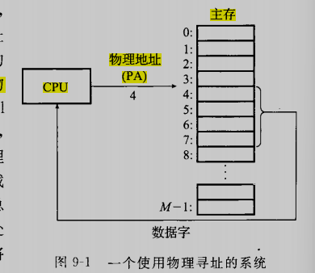

然而现在处理器使用一种称为虚拟寻址的寻址形式

使用虚拟寻址，CPU通过生成一个虚拟地址来访问主存，这个虚拟地址在被送到内存前先转换为适当的物理地址。将一个虚拟地址转换为物理地址的任务叫做地址翻译。就像异常处理一样，地址翻译需要CPU硬件和操作系统之间的紧密合作。CPU芯片上叫做内存管理单元（MMU）的专用硬件，利用存放在主存中的查询表来动态翻译虚拟地址，该表的内容由操作系统管理

## 9.2 地址空间

地址空间是一个非负整数地址的有序集合，我们假设地址空间中的整数是连续的，那么我们说他是一个线性地址空间。为了简化讨论，我们总是假设使用的是线性地址空间。在一个带虚拟内存的系统中，CPU从一个有N=2^n^个地址的地址空间中生成虚拟地址，这个地址空间称为虚拟地址空间

一个地址空间的大小是由表示最大地址所需要的位数来描述的。例如，一个包含N=2^n^个地址的虚拟空间就叫做一个n位地址空间。现在系统通常支持32位或者64位的虚拟地址空间

一个系统还有一个物理地址空间，对应系统中物理内存的M个字节

地址空间的概念很重要，因为它清楚地区分了数据对象和他们的属性。一旦认识到了这种区别，那么我们就可以将其推广，允许没个数据对象有多个独立的地址，其中每个地址都选自一个不同的地址空间。这就是虚拟内存的基本思想。主存中的每个字节都有一个选自虚拟地址空间的虚拟地址和一个选自物理地址空间的物理地址

## 9.3 虚拟内存作为缓存的工具

概念上说，虚拟内存被组织为一个由存放在磁盘上的N个连续的字节大小的单元组成的数组。每个字节都有一个唯一的虚拟地址，作为到数组的索引。磁盘上数组的内容被缓存在主存中。和存储器层次结构中其他缓存一样，磁盘上的数据被分割为块，这些块作为磁盘和主存之间的传输单元。

VM系统通过将虚拟内存分割为称为虚拟页（Virtual Page， VP）的大小固定的块来处理这个问题。每个虚拟页的大小为P=2^p^字节。类似的，物理内存被分割为物理页（physical Page， PP），大小也为P字节，物理页被称为页帧

在任意时刻，虚拟页面的集合都分为三个不相交的子集：

* 未分配的：VM系统还未分配的页。未分配的块没有任何数据和他们相关联，因此也就不占用任何磁盘空间
* 缓存的：当前已缓存在物理内存中的已分配页
* 未缓存的：未缓存在物理内存中的已分配页

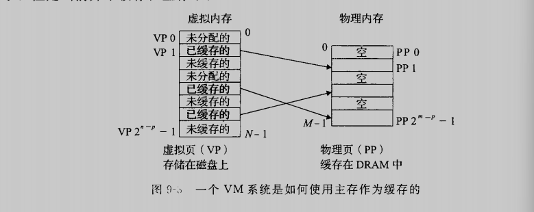

上图是一个8个虚拟页的小虚拟内存，虚拟页0和3还没有被分配，因此在磁盘上还不存在。虚拟页1、4、6被缓存在物理内存中，虚拟页2、5、7已近被分配了，但是当前还未缓存在主存中

### 9.3.1 DRAM缓存的组织结构

为了有助于清晰理解存储层次结构中不同的缓存概念，我们将使用术语SRAM缓存来表示位于CPU和主存之间的L1、L2、L3高速缓存，并用术语DRAM缓存表示虚拟内存系统的缓存，它在主存中缓存虚拟页

在存储层次结构中，DRAM缓存的位置对它的组织结构有很大影响。DRAM比SRAM要慢大约10倍，而此磁盘要比DRAM慢大约10000多倍。因此，DRAM缓存中的不命中比起SRAM缓存中的不命中要昂贵得多，这是因为DRAM缓存不命中要由磁盘来服务，而SRAM不命中通常是基于DRAM的主存来服务的。归根来说，DRAM缓存的组织结构完全是由巨大的不命中开销驱动的

### 9.3.2 页表

同任何缓存一样，虚拟内存系统必须有某种方法来判定一个虚拟页是否缓存在DRAM中的某个地方。如果是，系统还必须确定这个虚拟页存放在哪个物理页中。如果不命中，系统必须判断这个虚拟页存放在磁盘的哪个位置，在物理内存中选择一个牺牲页，并将虚拟页从磁盘复制到DRAM中，替换这个牺牲页

这些功能是由软硬件联合提供的，包括操作系统软件、MMU（内存管理单元）中的地址翻译硬件和一个存放在物理内存中叫做页表的数据结构，页表将虚拟页映射到物理页

页表就是一个页表条目（PTE）的数组。虚拟地址空间中的每个页在页表中一个固定偏移量处都有一个PTE。为了我们的目的，我们将假设每个PTE是由一个有效位和一个n位地址字段组成。有效位表明了该虚拟页当前是否被缓存在DRAM中，如果设置了有效位，那么地址字段就表示DRAM中相应的物理页的起始地址，这个物理页中缓存了该虚拟页。如果没有设置有效位，那么一个空地址表示这个虚拟页还未被分配。否则，这个地址就指向该虚拟页在磁盘上的起始位置

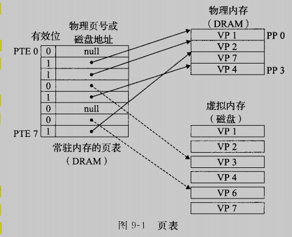

### 9.3.3 页命中

例如CPU想要读取包含在VP2 中的虚拟内存：地址翻译硬件将虚拟地址作为一个索引来定位PTE2，而PTE2设置了有效位，那么地址翻译硬件就知道了VP2是被缓存在内存中的。所以它使用PTE中的物理内存地址（该地址指向PP 1中缓存页的起始位置），构造出这个字的物理地址

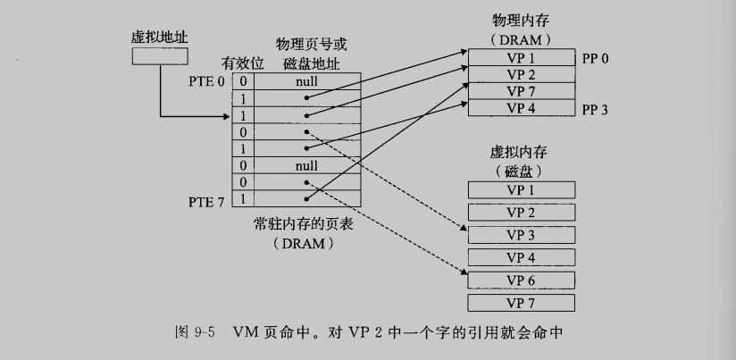

### 9.3.4 缺页

在虚拟内存的习惯说法中，DRAM缓存不命中称为缺页。假如CPU引用VP3中的一个字，而VP3并未缓存在DRAM中，地址翻译硬件从内存中读取PTE3，发现有效位位0，推断出VP 3未被缓存，并且触发缺页异常。缺页异常调用内核中的缺页异常处理程序，该程序会选择牺牲一个页面，在此例中牺牲了存放在PP3 中的VP4.如果VP4被修改过，那么内核就将它复制回磁盘，修改VP4的页表条目，反映出VP4不再缓存在主存中这一事实。

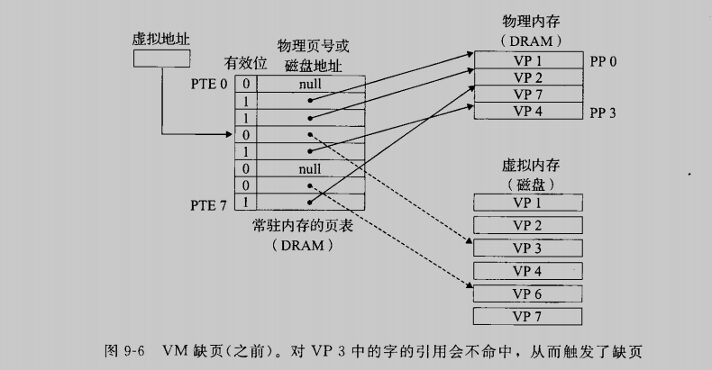接下来，内核从磁盘复制VP3到内存中的PP3，更新PTE3，随后返回。当缺页异常处理程序返回后，他会重新启动导致缺页的指令，该指令会把导致缺页的虚拟地址重发到地址翻译硬件。但是，现在VP3已经缓存在主存中了，那么页命中也能由地址翻译硬件正常处理了。

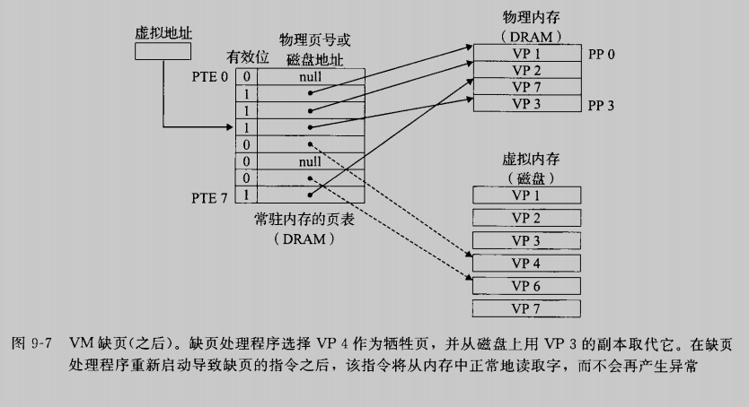

在虚拟内存得习惯说法中，块被称为页。在磁盘和内存之间传送页得活动叫做交换或者页面调度。页从磁盘换入DRAM和从DRAM换出磁盘。现代系统都使用的是按需页面调度的方式

### 9.3.5 分配页面

下图展示了当操作系统分配一个新的虚拟内存时对我们示例页表中的影响。

例如调用malloc，VP5的分配过程是在磁盘上创建空间并更新PTE5，使他指向磁盘上面这个新创建的页面

### 9.3.6 局部性

程序将趋向于在一个较小的活动页面集合上工作，这个集合叫做工作集。只要我们程序有好的时间局部性，虚拟内存系统就能工作的相当好

## 9.4 虚拟内存作为内存管理的工具

到目前为止，我们都假设有一个单独的页表，将一个虚拟地址空间映射到物理地址空间。实际上，操作系统为每个进程提供了一个独立的页表，因而也就是一个独立的虚拟地址空间，如下图，请注意，多个虚拟页面可以映射到同一个共享物理页面上

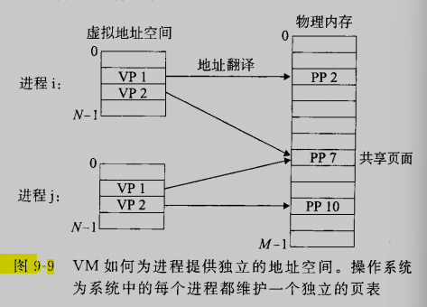

VM简化了链接地加载、代码和数据共享，以及应用程序的内存分配

* 简化链接：
* 简化加载：将一组连续的虚拟页映射到任意一个文件中的任意位置的表示法称作内存映射。linux提供一个叫mmap的系统调用，允许应用程序自己做内存映射
* 简化共享：
* 简化内存分配：

## 9.5 虚拟内存作为内存保护的工具

提供独立的地址空间使得区分不同进程的私有内存变得容易。但是，地址翻译机制可以以一种自然的方式扩展到提供更好的访问控制。因为每次CPU生成一个地址时，地址翻译硬件都会读一个PTE，所以通过在PTE上添加一些额外的许可位来控制对一个虚拟页面内容的访问十分简单，每个PTE中已经添加了三个许可位。SUP位表示进程是否必须运行在内核模式下才能访问该页，还有一个读写权限控制位。如果一条指令违反了这些许可条件，那么CPU就触发一个一般保护故障，将控制传递给一个内核中的异常处理程序。linux shell一般将这种异常报告为“段错误”

## 9.8 内存映射

Linux通过将一个虚拟内存区域与一个磁盘对象关联起来，以初始化这个虚拟内存区域的内容，这个过程称为内存映射（memory mapping）。虚拟内存区域可以映射到两种类型的对象中的一种：

1）linux文件系统中的普通文件：

2）匿名文件：由内核创建，包含的全是二进程零。

无论在哪种情况下，一旦一个虚拟页面被初始化了，他就在一个由内核维护的专门的交换文件之间换来换去。减缓文件也叫做交换空间或者交换区域。需要意识到的很重要的一点是，在任何时刻，交换空间都限制着当前运行着的进程能够分配的虚拟页面的总数

### 9.8.1 在看共享对象

内存映射的概念来源于一个聪明的发现：如果虚拟内存系统可以集成到传统的文件系统中，那么就能够提供一种简单而高效的把程序和数据加载到内存中的方法。内存映射给我们提供了一种清晰的机制，用来控制多个进程如何共享对象

一个对象可以被映射到内存的一个区域，要么作为共享对象，要么作为私有对象。如果一个进程将一个共享对象映射到它的虚拟地址空间的一个区域内，那么这个进程对这个区域的任何写操作，对于那些也把这个共享对象映射到他们虚拟内存的其他进程而言，也是可见的。而且，这些变化也会反映在磁盘上的原始对象中

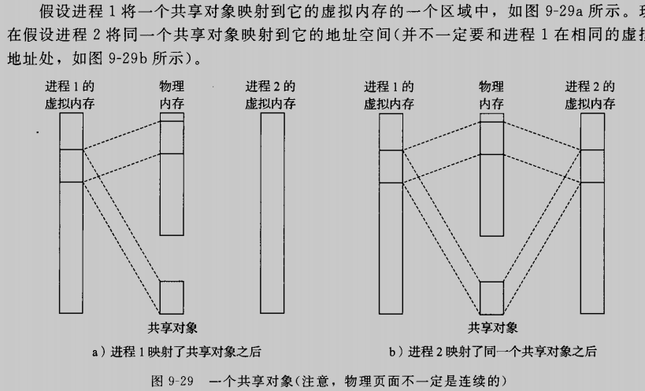

因为每个对象都有一个唯一的文件名，内核可以迅速地判定进程1已经映射了这个对象，而且可以使进程2中的页表条目指向相应的物理页面。关键点在于即使对象被映射到了多个共享区域，物理内存中也只需要存放共享对象的一个副本

另一方面，对于一个映射到私有对象的区域做改变，对于其他进程来说是不可见的。并且进程对这个区域所做的任何写操作都不会反应在磁盘上的对象中。

私有对象使用一种叫做写时复制的巧妙技术被映射到虚拟内存中。一个私有对象开始生命周期的方式基本上与共享对象一样，在物理内存中只保存有私有对象的一份副本。比如下图，其中两个进程将一个私有对象映射到他们虚拟内存的不同区域，但是共享共享这个对象的一个物理副本。对于每个映射私有对象的进程，相应私有区域的页表条目都被标记为只读，并且区域结构被标记为私有的写时复制。只要没有进程试图写它自己的私有区域，他们就可以继续共享物理内存中对象的一个单独副本。然后，只要有一个进程试图写私有区域内的某个页面，那么这个写操作就会触发一个保护故障

当故障处理程序注意到保护异常是由于进程试图写私有的写时复制区域中的一个页面引起时，他会在物理内存中创建这个页面的一个新副本，更新页表条目指向这个新的副本，恢复页面的写权限，当故障处理程序返回时，CPU重新执行写操作，由于开启了写权限，此时的写操作可以正常执行了

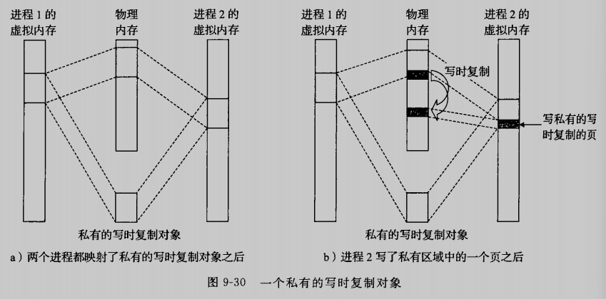

### 9.8.2 再看fork函数

当fork函数被当前进程调用时，内核为新进程创建各种数据结构，并分配给它一个唯一pid，为了给这个新进程创建虚拟内存，它创建了当前进程的mm_struct、区域结构和页表的原样副本。它将两个进程中的每个页面都标记为只读，并将两个进程中每个区域结构都标记为私有的写时复制

当fork在新进程中返回时，新进程现在的虚拟内存刚好和调用fork时存在的虚拟内存相同。当这两个进程中的任一个后来进行写操作时，写时复制机制就会创建新页面，因此，也就为每个进程保持了私有地址空间的抽象概念

### 9.8.3 再看execve函数

execve函数在当前进程中加载并运行包含在可执行目标文件a.out中的程序，用a.out程序有效地替代了当前程序。加载并允许a.out需要以下几个步骤：

* 删除已存在的用户区域。删除当前进程虚拟地址的用户部分中已存在的区域结构
* 映射私有区域。为新程序的代码、数据、bss和栈区域创建新的区域结构。所有这些新的区域都是私有的、写时复制的。代码和数据区域被映射为a.out文件中的.text和.data区。bss区域是请求二进制的，映射到匿名文件，其大小包含在a.out中。栈和堆区域也是请求二进制零的，初始长度为零
* 映射共享区域。动态链接libc.so等库，然后再映射到用户虚拟地址空间中的共享区域内
* 设置程序计数器PC。execve做的最后一件事情就是设置当前进程上下文中的程序计数器，使之只想代码区域的入口点

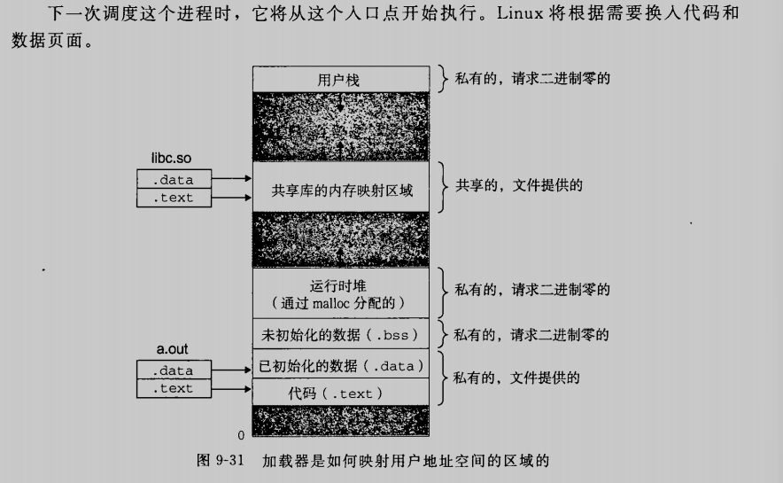

### 9.8.4 使用mmap函数的用户级内存映射

linux进程可以使用mmap函数创建新的虚拟内存区域，并将对象映射到这些区域中

~~~c
#include <unistd.h>
#include <sys/mman.h>

void *mmap(void *start, size_t length, int prot, int flag, int fd, off_t offset);
~~~

mmap函数要求内核创建一个新的虚拟内存区域，最好是从地址start开始的一个区域，并将文件描述符fd指定的对象的一个连续的片映射到这个新的区域。连续的对象片大小为length，从据文件开始处偏移量为offset字节的地方开始。start只是一个暗示，通常我们定义为NULL

munmap函数删除虚拟内存的区域

~~~c
#include <unistd.h>
#include <sys/mman.h>

int munmap(void *start, size_t length);
~~~

munmap函数删除从虚拟地址start开始的，由接下来length字节组成的区域，接下来对已删除区域的引用会导致段错误

## 9.9 动态内存分配

动态内存分配器维护着一个进程的虚拟内存区域，称为堆。对于某个进程，内核维护着一个变量brk，他指向堆的顶部。

分配器将堆视为一组不同大小的块的集合来维护。每个块就是一个连续的虚拟内存片，要么是以分配的，要么是空闲的。

分配器有两种不同的基本风格。两种风格都要求应用显示地分配块。他们的不同之处在于由哪个实体来负责释放已分配的块

* 显示分配器，要求应用显示地释放任何已分配的块，如malloc，new，对应的free和delete
* 隐式分配器，另一方面，要求分配器检测一个已分配块何时不再被程序所使用，那么久释放这个块。隐式分配器也叫做垃圾收集器，而自动释放未使用的已分配的块的过程叫做垃圾收集。

本节剩下的部分讨论的是显示分配器的设计和实现。在9.10节中讨论隐式分配器

### 9.9.1 malloc和free函数

C标准提供一个称为malloc程序包的显示分配器。程序通过调用malloc函数来从堆分配块

~~~c
#include <stdlib.h>
void *malloc(size_t size);
~~~

malloc函数返回一个指针，指向大小至少为size字节的内存块，这个块会为可能包含这个块内的任何数据对象类型做对齐。实际中，对齐依赖于编译代码在32位模式还是在64位模式中运行。在32位模式中，malloc返回的块的地址总线是8的倍数。在64位模式中，该地址总是16的倍数

如果malloc遇到问题，他就会返回NULL，并设置errno。malloc不初始化它返回的内存。那些想要已初始化的动态内存的应用程序可以使用calloc，calloc是一个基于malloc的瘦包装函数，他将分配的内存初始化为零。想要改变一个以前已分配块的大小，可以使用realloc函数

~~~c
#include <unistd.h>
void *sbrk(intptr_t incr);
~~~

sbrk函数通过将内核的brk指针增加incr来扩展和收缩堆。如果成功，他就返回brk的旧值，否则返回-1，并设置errno。用一个为负的incr来调用sbrk是合法的，而且很巧妙，因为返回值指向距新堆顶上abs（incr）字节处

~~~c
#include <stdlib.h>
void free(void *ptr);
~~~

ptr参数必须指向一个malloc，calloc，或者realloc获得的已分配块的起始位置。

下图展示了一个用malloc和free的实现是如何管理一个C程序的16字的小堆。每个方框代表一个4字节的字。初始时，堆是由一个大小为16个字的、双字节对齐的、空闲块组成的

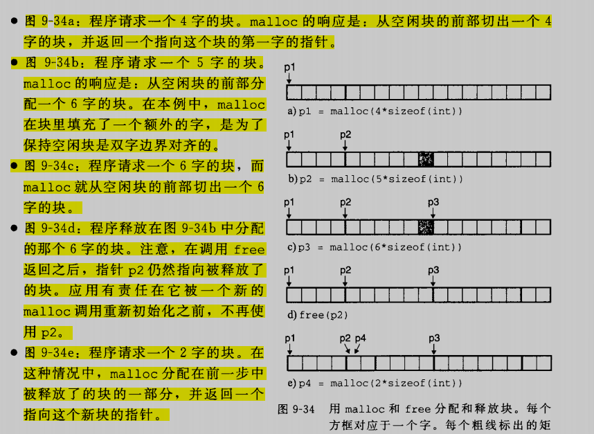

### 9.9.2 为什么使用动态内存分配

有时候一些空间大小是只有在运行时才会确定的，硬编码分配空间不是一个好的处理方法

### 9.9.3 分配器的要求和目标

* 处理任意请求序列。分配器不可以假设分配和释放请求的顺序
* 立即响应请求
* 只是用堆
* 对齐块
* 不修改已分配的块

目标：

* 最大化吞吐率
* 最大化内存利用率

### 9.9.4 碎片

造成堆利用率很低的主要原因是一种称为碎片的现象，当虽然有未使用的内存但不能用来满足分配请求时，就会发生这种现象。有两种形式的碎片：内部碎片和外部碎片

内部碎片时在一个已分配块比有效载荷大时发生的（比如为了对齐）。

外部碎片是当空闲内存合计起来足够满足一个分配请求，但是没有一个单独的空闲块足够大来处理这个请求。

外部碎片比内部碎片的量化要困难的多，因为它取决于将来请求的模式。外部碎片难以量化，且不可预测，所以分配器通常采用启发式策略来试图维持少量的大空闲块，而不是维持大量的小空闲块

### 9.9.5 实现问题

一个实际的分配器要在吞吐率和利用率之间把握好平衡，就必须考虑以下几个问题：

* 空闲块组织：我们如何记录空闲块
* 放置：如何选择一个合适的空闲块来放置一个新分配的块
* 分割：在将一个新分配的块放置到某个空闲块之后，我们如何处理这个空闲块的剩余部分
* 合并：如何处理一个刚刚被释放的块

### 9.9.6 隐式空闲链表

任何实际的分配器都需要一些数据结构，允许他来区别块边界，以及区别已分配块和空闲块。大多数分配器将这些信息嵌入到块本身

在这种情况下，一个块是由一个字的头部、有效载荷，以及可能的一些额外的填充组成的。头部编码了这个块的大小，以及这个块是已分配的还是空闲的

头部后面就是应用调用malloc时请求的有效载荷。有效载荷后面是一片不使用的填充块，其大小可以实任意的。填充快的存在有很多原因，比如可能是分配器策略的一部分，用来对付外部碎片，或者用来满足对齐要求

假设块的格式如上图，我们可以将堆组织为一个连续的已分配块和空闲块的序列，如下图

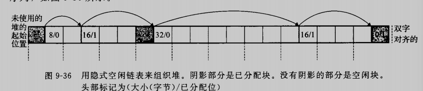

我们称这种结构为隐式空闲链表，是因为空闲块是通过头部中的大小字段隐含地连接着的。分配器可以通过遍历堆中所有的块，从而间接地遍历整个空闲块的集合

隐式空闲链表的优点是简单。显著的缺点是任何操作系统的开销，例如放置分配的块，要求对空闲链表进行搜索，该搜索所需要时间与堆中已分配块和空闲块的总数成线性关系

### 9.9.7 放置已分配的块

当一个引用请求一个块时，分配器搜索空闲链表，查找一个足够大的可以放置所有请求的空闲块。分配器执行这种搜索的方式是由放置策略决定的：

* 首次适配
* 下一次适配
* 最佳适配

他们都各有优缺

### 9.9.8 分割空闲块

一旦分配器找到一个匹配的空闲块，他就必须做另一个决定，分配这个空闲块中多少空间。一个是选择用整个空闲块。虽然这种方式简单而快捷，但是主要的缺点就是他会造成内部碎片。如果放置策略趋于产生好的匹配，那么额外的内部碎片也是可以接收的

然而，如果匹配不太好，那么分配器通常会选择将这个空闲块分割为两部分。第一部分为分配块，第二部分为新的空闲块

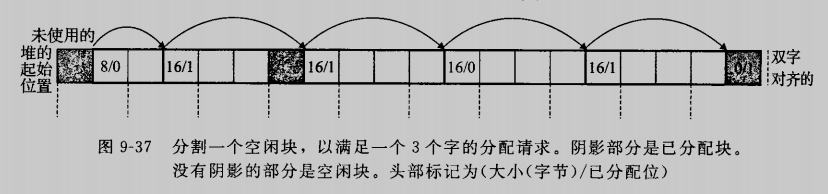

### 9.9.9 获取额外的堆内存

如果分配器不能为请求块找到合适的空闲块会发生什么？

一个选择是通过合并那些在内存中物理上相邻的空闲块来创建一个更大的空闲块。然而，如果这样还不能生成一个足够大的块。那么分配器就会调用sbrk函数，向内核请求额外的堆内存。分配器将额外的内存转化成一个大的空闲块，将这个块插入到空闲链表中，然后将被请求的块放置在这个新的空闲块中

### 9.9.10 合并空闲块

当分配器释放一个已分配的块时，有可能有其他空闲块与这个新释放的空闲块相邻，这些邻接的空闲块可能引起一种现象，叫做假碎片。这些假碎片如果不能合并起来，会导致明明空间够大，但是由于属于两个空闲块导致无法被分配

为了解决假碎片的问题，有两种方法：

* 立即合并：每次释放时，都对块进行合并检查，合并相邻的块（在反复分配和释放中容易造成抖动）
* 推迟合并：稍晚时在进行合并（快速的分配器通常选择某种形式的推迟合并）

### 9.9.11 带边界标记的合并

让我们称为想要释放的块为当前块

当前快的头部指向下一个块的头部，可以检查这个指针以判断下一个块是否空闲，如果是，就将它的大小简单地加到当前块，这两个块在常数时间内合并

但是如何合并前面的块呢？唯一的方式似乎是搜索整个链表

Knuth提出了一种聪明而通用的技术，叫做边界标记，允许在常数时间内进行对前面块的合并。在每个块的结尾处添加一个脚部（边界标记），其中脚部就是头部的一个副本，这个脚部总是在距当前块开始位置一个字的距离

### 9.9.12 实现一个简单的分配器

我们将基于隐式空闲链表，使用立即边界标记合并方法，从头至尾的实现一个简单的分配器

#### 1. 通用分配器设计

分配器使用memlib.c包所提供的内存系统模型。模型的目的在于允许我们在不干涉已存在的系统层malloc的情况下，运行自己的分配器，内存模型的代码如下所示：

~~~c
/* Private global variables */
static char *mem_heap;                                  /* Points to first byte of heap */
static char *mme_brk;                                           /* Points to last byte of heap plus 1 */
static char *mem_max_addr;                      /* Max legal heap addr plus 1 */

/* mem_init - Initialize the memory system model */
void mem_init(void)
{
        mem_heap = (char *)Malloc(MAX_HEAP);
        mem_brk = (char *)mem_heap;
        mem_max_addr = (char *)(mem_heap + MAX_HEAP);
}

/*
 *      mem_sbrk - Simple model of the sbrk function. Extends the heap
 *              by incr bytes and returns the start address of the new area. In
 *              this model, the heap cannot be shrunk.
 */
void *mem_sbrk(int incr)
{
        char *old_brk = mem_brk;

        if((incr < 0) || ((mem_brk + incr) > mem_max_addr))
        {
                errno = ENOMEM;
                fprintf(stderr, "ERROR: mem_sbrk failded. Ran out of memory...\n");
                return (void *)-1;
        }
        mem_brk += incr;
        return (void *)old_brk;
}
~~~

mem_init函数将对于堆来说可用的虚拟内存模型化为一个大的、双字节对齐的字节数组。在mem_heap和mem_brk之间的字节表示已分配的虚拟内存。mem_brk之后的字节表示未分配的虚拟内存。分配器通过调用mem_sbrk函数来请求额外的堆内存，但是这个接口拒绝收缩堆

分配器包含在一个叫做mm.c的源文件中，用户可以编译和链接这个源文件到他们的应用之中。分配器输出三个函数到应用程序

~~~c
extern int mm_init(void);
extern void *mm_malloc(size_t size);
extern void mm_free(void *ptr);
~~~

分配器使用下图所示的块结构，最小的块为16字节。空闲链表组成一个隐式空闲链表，具有下图结构

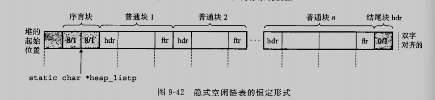

请注意序言块和结尾块

#### 2.操作空闲链表的基本常数和宏

下图是在分配器编码中将要使用的基本常数和宏

字的大小为4字节，双字大小为8字节

在空闲链表中操作头和脚可能是很麻烦的，因为需要大量使用强制类型转换和指针运算。因此，我们发现定义一组宏来访问和遍历空闲链表是很有帮助的，在学习分配器的实现前一定要认真看并理解这些个宏，他们至关重要

~~~c
/* Basic constants and macros */
#define WSIZE 4             /* Word and header/footer size (bytes) */
#define DSIZE 8             /* Double word size (bytes) */
#define CHUNKSIZE (1<<12)   /* Extend heap by this amount (bytes) */

#define MAX(x, y) ((x) > (y) ? (x) : (y))

/* Pack a size write and allocated bit into a word */
#define PACK(size, alloc) ((size) | (alloc))

/* Read and write a word at address p */
#define GET(p) (*(unsigned int *)(p))
#define PUT(p, val) (*(unsigned int *)(p) = (val))

/* Read the size and allocated fields from address p */
#define GET_SIZE(p) (GET(p) & ~0x7)
#define GET_ALLOC(p) (GET(p) & 0x1)

/* Given block ptr bp, compute address of its header and footer */
#define HDRP(bp) ((char *)(bp) - WSIZE)
#define FTRP(bp) ((char *)(bp) + GET_SIZE(HDRP(bp)) - DSIZE)

/* Given block ptr bp, compute address of next and previous blocks */
#define NEXT_BLKP(bp) ((char *)(bp) + GET_SIZE(((char *)(bp) - WSIZE)))
#define PREV_BLKP(bp) ((char *)(bp) - GET_SIZE(((char *)(bp) - DSIZE)))

~~~

#### 3. 创建初始空闲链表

我认为这一小节应该分为两部分，第一部分为创建一个空闲链表的最基本结构，一个没有可用空间的，仅有链表头，序言块和结尾块的内存空间；

~~~c

int mm_init(void)
{ 
  /* Create the initial empty heap */ 
  if(heap_listp = mem_sbrk(4 * WSIZE) == (void *)-1)
    return -1;
  
  PUT(heap_listp, 0); 
  PUT(heap_listp + (1 * WSIZE), PACK(DSIZE, 1));
  PUT(heap_listp + (2 * WSIZE), PACK(DSIZE, 1));
  PUT(heap_listp + (3 * WSIZE), PACK(0, 1));
  heap_listp += (2 * WSIZE);
  
  /* Extend the empty heap with a free block of CHUNKSIZE bytes */
  if(extend_heap(CHUNKSIZE/WSIZE) == NULL)
    return -1;
  
  return 0;
}
~~~

第二部分为扩展这个内存空间

~~~c
static void *extend_heap(size_t words)
{ 
  char *bp;
  size_t size;
  
  /* Allocate an even number of words to maintain alignment */
  size = (words % 2) ? (words + 1) * WSIZE : words * WSIZE;
  if((long)(bp = mem_sbrk(size)) == -1)
    return NULL;
  
  /* Initialize free block header/footer and the epilogue header */
  PUT(HDRP(bp), PACK(size, 0));           /* Free block header */
  PUT(FTRP(bp), PACK(size, 0));           /* Free block footer */
  PUT(HDRP(NEXT_BLKP(bp)), PACK(0, 1));   /* New epilogue header*/
  
  /* Coalesce if the previous block was free */
  return coalesce(bp);
}
~~~

#### 4. 释放和合并块

应用通过调用mm_free函数来释放一个已分配的块，释放后立即将之与临近的空闲块结合

~~~c
void mm_free(void *bp)
{
  size_t size = GET_SIZE(HDRP(bp));

  PUT(HDRP(bp), PACK(size, 0));
  PUT(FTRP(bp), PACK(size, 0));
  coalesce(bp);
}

static void *coalesce(void *bp)
{
  size_t prev_alloc = GET_ALLOC(FTRP(PREV_BLKP(bp)));
  size_t next_alloc = GET_ALLOC(HDRP(NEXT_BLKP(bp)));
  size_t size = GET_SIZE(HDRP(bp));

  if(prev_alloc && next_alloc)
  {
    return bp;
  }
  else if(prev_alloc && !next_alloc)
  {
    size += GET_SIZE(HDRP(NEXT_BLKP(bp)));
    PUT(HDRP(bp), PACK(size, 0));
    PUT(FTRP(bp), PACK(size, 0));
  }
  else if(!prev_alloc && next_alloc)
  {
    size += GET_SIZE(HDRP(PREV_BLKP(bp)));
    PUT(FTRP(bp), PACK(size, 0));
    PUT(HDRP(PREV_BLKP(bp), PACK(size, 0)));
    bp = PREV_BLKP(bp);
  }
  else
  {
    size += GET_SIZE(HDRP(PREV_BLKP(bp)));
    GET_SIZE(FTRP(NEXT_BLKP(bp)));
    PUT(HDRP(PREV_BLKP(bp)), PACK(size, 0));
    PUT(FTRP(NEXT_BLKP(bp)), PACK(size, 0));
    bp = PREV_BLKP(bp);
  }

  return bp;
}
~~~

#### 5. 分配块

一旦分配器调整了请求的大小，他就会搜索空闲链表，寻找一个合适的空闲块。如果有合适的，俺么就请求并返回这个块，分割出多余的部分。如果不能发现一个匹配的块，就用一个新的空闲块来扩展堆，把请求块放置在新的空闲块中

~~~c
static void place(void *bp, size_t asize)
{
  size_t csize = GET_SIZE(HDRP(bp));

  if((csize - asize) >= (2*DSIZE))
  {
    PUT(HDRP(bp), PACK(asize, 1));
    PUT(HDRP(bp), PACK(asize, 1));
    bp = NEXT_BLKP(bp);
    PUT(HDRP(bp), PACK(csize-asize, 0));
    PUT(FTRP(bp), PACK(csize-asize, 0));
  }
  else
  {
    PUT(HDRP(bp), PACK(csize, 1));
    PUT(FTRP(bp), PACK(csize, 1));
  }
}

static char *find_fit(size_t asize)
{ 
  /* First-fit search */
  void *bp;
  
  for(bp = heap_listp; GET_SIZE(DHRP(bp)) > 0; bp = NEXT_BLKP(bp))
  { 
    if(!GET_ALLOC(HDRP(bp)) && (asize <= GET_SIZE(HDRP(bp))))
      return bp;
  }
  return NULL;
}

void *mm_malloc(size_t size)
{
  size_t asize;         /* Adjust block size */
  size_t extendsize;    /* Amount to extend heap if no fit */
  char *bp;

  /* Ignore spurious requests */
  if(size == 0)
    return NULL;

  /* Adjust block size to include overhead and alignement reqs. */
  if(size < DSIZE)
    asize = 2 * DSIZE;
  else
    asize = DSIZE * ((size + (DSIZE) + (DSIZE - 1)) / DSIZE);

  /* Search the free list for a fit */
  if((bp = find_fit(asize)) != NULL)
  {
    place(bp, asize);
    return bp;
  }

  /* No fit found. Get more memory and place the block */
  extendsize = MAX(asize, CHUNKSIZE);
  if((bp = extend_heap(extendsize/WSIZE)) == NULL)
    return NULL;

  place(bp, asize);
  return bp;
}
~~~

## 9.11 C程序中常见的内存有关错误

### 9.11.1 间接引用坏指针

在进程的虚拟地址空间中有较大的洞，没有映射到任何有意义的数据。如果我们间接引用一个指向这些洞的指针，那么操作系统就会以段异常中止程序。而且，虚拟内存的某些区域是只读的。试图写这些区域将会以保护异常中止这个程序。

### 9.11.2 读未初始化的内存

bss内存位置总是被加载器初始化为零，但是对于堆内存却并不是这样的。堆内存是不会被初始化为零的

### 9.11.3 允许栈缓冲溢出

如果程序不检查输入串的大小就写入栈中的目标缓冲区，那么程序就可能会有缓冲区溢出错误

### 9.11.4 假设指针和它们指向的对象是相同大小的

与机器相关

### 9.11.5 造成错位错误

### 9.11.6 引用指针，而不是他所指向的对象

### 9.11.7 误解指针运算

### 9.11.8 引用不存在的变量

~~~c
int *stackref()
{
    int val;   
    return &val;
}
~~~

返回一个栈指针

### 9.11.9 引用空闲堆块中的数据

引用已经被释放了的堆块中的数据

### 9.11.10 引起内存泄漏

尤其是守护进程这种程序，内存泄漏十分严重

