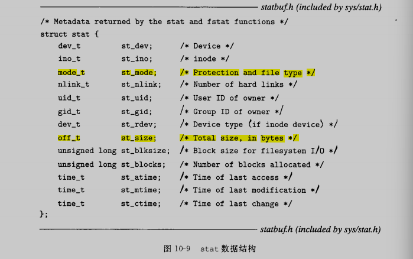
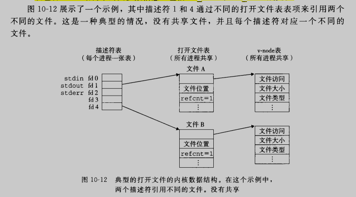
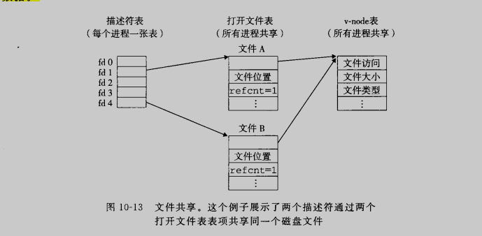
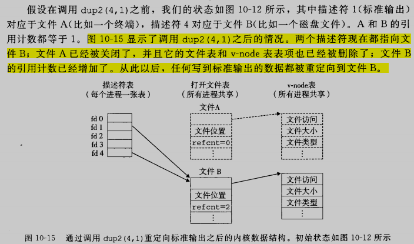

# 系统级I/O

## 10.1 Unix I/O

一个Linux文件就是一个m个字节的序列，所有的I/O设备都被模型化为文件，而所有的输入和输出都被当做对相应文件的读和写来执行。这种将设备优雅地映射为文件的方式，允许linux内核引出一个简单、低级的应用接口，称为Unix I/O，这使得所有的输入和输出都能以一种统一且一致的方式来执行

* 打开文件。一个应用程序通过要求内核打开相应的文件，来宣告它想要访问一个I/O设备。内核返回一个小的非负整数，叫做描述符，他在后续对此文件的所有操作中标识这个文件。内核记录有关这个打开文件的所有信息，应用程序只需要记住这个描述符
* Linux shell创建的每个进程开始时都有三个打开的文件：标准输入（描述符为0）、标准输出（描述符为1）、标准错误（描述符为2）.头文件<unistd.h>定义了常量STDIN_FILENO,STDOUT_FILENO,STDERR_FILENO，他们可以用来代替显示的描述符值
* 改变当前的文件位置。对于每个打开的文件，内核保持着一个文件位置k，初始为0，这个文件位置是从文件开头起始的字节偏移量。应用程序能够通过执行seek操作，显示地设置文件的当前位置k
* 读写文件。一个读操作就是从文件复制n>0个字节到内存，从当前文件位置k开始，然后将k增加到k+n。给定一个大小为m字节的文件，当k>=m时，执行读操作，会触发一个称为end of file的条件，应用程序能检测到这个条件。在文件结尾处并没有明确的EOF符号
* 关闭文件。当应用完成了对文件的访问之后，他就通知内核关闭这个文件。作为响应，内核释放文件打开时创建的数据结构，并将这个描述符恢复到可用的描述符池中。无论一个进程因为何种原因终止时，内核都会关闭所有打开的文件并释放他们的内存资源

## 10.2 文件

每个linux文件都有一个类型来表明他在系统中的角色：

* 普通文件包含任意数据
* 目录是包含一组链接得文件，每个链接都将一个文件名映射到一个文件
* 套接字是用来与另一个进程进行跨网段通信的文件

## 10.3 打开和关闭文件

进程是通过调用open函数打开一个已存在的文件或者创建一个新文件的

~~~c
#include <sys/types.h>
#include <sys/stat.h>
#include <fcntl.h>

int open(char *filename, int flags, mode_t mode);
~~~

open将filename转换为一个文件描述符

flag指明了进程打算如何访问这个文件：

* O_RDONLY：只读
* O_WRONLY：只写
* O_RDWR：可读写
* O_CREAT：不存在就创建一个截断的空文件
* O_TRUNC：如果文件已存在，就截断他
* O_APPEND：每次写操作前，设置文件位置到文件的结尾处

## 10.4 读和写文件

应用程序是通过分别调用read和write函数来执行输入和输出的

~~~c
#include <unistd.h>
ssize_t read(int fd, void *buf, size_t n);
ssize_t write(int fd, const void *buf, size_t n);
~~~

read函数从描述为fd的当前文件位置复制最多n个字节到内存位置buf。返回值-1表示一个错误，返回0表示到达EOF，否则返回实际传送的字节数量

write函数从内存位置buf复制至多n个字节到描述符fd的当前文件位置

## 10.5 调用RIO包健壮地读写

RIO提供了两类不同的函数：

* 无缓冲的输入输出函数。这些函数直接再内存和文件之间传送数据，没有应用级缓冲。他们对将二进制数据读写到网络和从网络读写二进制数据尤其有用
* 带缓冲的输入函数。这些函数允许你高效地从文件中读取文本行和二进制数据，这些文件的内容缓存在应用级缓冲区内，类似于为printf这样的标准IO提供的缓冲区。带缓冲的RIO输入函数是线程安全的，他在同一个描述符上可以被交错使用

### 10.5.1 RIO的无缓冲的输入输出函数

通过调用rio_readn和rio_writen函数，应用程序可以在内存和文件之间直接传输数据

~~~c
/*
 * rio_readn - Robustly read n bytes (unbuffered)
 */
/* $begin rio_readn */
ssize_t rio_readn(int fd, void *usrbuf, size_t n)
{
    size_t nleft = n;
    ssize_t nread;
    char *bufp = usrbuf;

    while (nleft > 0) {
  if ((nread = read(fd, bufp, nleft)) < 0) {
      if (errno == EINTR) /* Interrupted by sig handler return */
    nread = 0;      /* and call read() again */
      else
    return -1;      /* errno set by read() */
  }
  else if (nread == 0)
      break;              /* EOF */
  nleft -= nread;
  bufp += nread;
    }
    return (n - nleft);         /* Return >= 0 */
}
/* $end rio_readn */

/*
 * rio_writen - Robustly write n bytes (unbuffered)
 */
/* $begin rio_writen */
ssize_t rio_writen(int fd, void *usrbuf, size_t n)
{
    size_t nleft = n;
    ssize_t nwritten;
    char *bufp = usrbuf;

    while (nleft > 0) {
  if ((nwritten = write(fd, bufp, nleft)) <= 0) {
      if (errno == EINTR)  /* Interrupted by sig handler return */
    nwritten = 0;    /* and call write() again */
      else
    return -1;       /* errno set by write() */
  }
  nleft -= nwritten;
  bufp += nwritten;
    }
    return n;
}
/* $end rio_writen */
~~~

### 10.5.2 RIO的带缓冲的输入函数

假设我们要编写一个程序来计算文本文件中的文本行，该如何来实现呢？一种方法是用read函数来一次一个字节地从文件传送到用户内存，检查每个字节来查找换行符。这个方法的缺点是效率不高，每次读取文件中的一个字节都要求陷入内核

一种更好的方法是调用一个包装函数，它从一个内部读缓冲区复制一个文本行，当缓冲区变空时，会自动地调用read重新填满缓冲区。对于既包含文本行也包含二进制数据的文件，我们也提供了一个rio_readn带缓冲区的版本，叫做rio_readnb，它从和rio_readlineb一样的读缓冲区中传送原始字节

~~~c
#include "csapp.h"

void rio_readinitb(rio_t *rp, int fd);

ssize_t rio_readlineb(rio_t *rp, void *usrbuf, size_t maxlen);
ssize_t rio_readnb(rio_t *rp, void *usrbuf, size_t n);
~~~

每打开一个描述符，都会调用一次rio_readinitb函数。他将描述符fd和地址rp处的一个类型为rio_t的读缓冲区联系起来。rio_readlineb函数从文件rp读出下一个文本行，将他复制到内存位置usrbuf，并且用NULL字符来结束这个文本行。rio_readlineb函数最多读maxlen-1个字节，余下的字符留给结尾的NULL，超过maxlen-1的字节文本被截断，并用NULL字符结束

~~~c
ssize_t rio_readlineb(rio_t *rp, void *usrbuf, size_t maxlen)
{
    int n, rc;
    char c, *bufp = usrbuf;

    for (n = 1; n < maxlen; n++) {
        if ((rc = rio_read(rp, &c, 1)) == 1) {
      *bufp++ = c;
      if (c == '\n') {
                n++;
        break;
            }
  } else if (rc == 0) {
      if (n == 1)
    return 0; /* EOF, no data read */
      else
    break;    /* EOF, some data was read */
  } else
      return -1;    /* Error */
    }
    *bufp = 0;
    return n-1;
}
~~~

rio_readnb函数从文件rp最多读n个字节到内存位置usrbuf。

~~~c
/* $begin rio_readnb */
ssize_t rio_readnb(rio_t *rp, void *usrbuf, size_t n)
{
    size_t nleft = n;
    ssize_t nread;
    char *bufp = usrbuf;

    while (nleft > 0) {
  if ((nread = rio_read(rp, bufp, nleft)) < 0)
            return -1;          /* errno set by read() */
  else if (nread == 0)
      break;              /* EOF */
  nleft -= nread;
  bufp += nread;
    }
    return (n - nleft);         /* return >= 0 */
}
/* $end rio_readnb */
~~~

我们展示一个示例程序

~~~c
#include "csapp.h"

int main()
{
        int n;
        rio_t rio;
        char buf[MAXLINE];

        Rio_readinitb(&rio, STDIN_FILENO);
        while((n = Rio_readlineb(&rio, buf, MAXLINE)) != 0)
        {
                Rio_writen(STDOUT_FILENO, buf, n);
        }

        return 0;
}
~~~

下图展示了一个读缓冲区的格式，以及初始化它的rio_readinitb函数的代码。rio_readinitb函数创建了一个空的读缓冲区，并将一个打开的文件描述符和这个缓冲区关联

~~~c
/* Persistent state for the robust I/O (Rio) package */
/* $begin rio_t */
#define RIO_BUFSIZE 8192
typedef struct {
    int rio_fd;                /* Descriptor for this internal buf */
    int rio_cnt;               /* Unread bytes in internal buf */
    char *rio_bufptr;          /* Next unread byte in internal buf */
    char rio_buf[RIO_BUFSIZE]; /* Internal buffer */
} rio_t;
/* $end rio_t */
~~~

~~~c
/*
 * rio_readinitb - Associate a descriptor with a read buffer and reset buffer
 */
/* $begin rio_readinitb */
void rio_readinitb(rio_t *rp, int fd)
{
    rp->rio_fd = fd;
    rp->rio_cnt = 0;
    rp->rio_bufptr = rp->rio_buf;
}
/* $end rio_readinitb */

~~~

RIO读程序的核心是rio_read函数。rio_read函数是linux函数的带缓冲版本。当调用rio_read要求读取n个字节时，读缓冲区内有rp->rio_cnt个未读字节。如果缓冲区为空，那么会通过调用read再填满它。这个read调用收到一个不足值并不是错误，只不过读缓冲区是填充了一部分。一旦缓冲区非空，rio_read就从读缓冲区复制n和rp->rio_cnt中较小的值个字节到用户缓冲区，并返回复制的字节数

~~~c
/* 
 * rio_read - This is a wrapper for the Unix read() function that
 *    transfers min(n, rio_cnt) bytes from an internal buffer to a user
 *    buffer, where n is the number of bytes requested by the user and
 *    rio_cnt is the number of unread bytes in the internal buffer. On
 *    entry, rio_read() refills the internal buffer via a call to
 *    read() if the internal buffer is empty.
 */
/* $begin rio_read */
static ssize_t rio_read(rio_t *rp, char *usrbuf, size_t n)
{
    int cnt;

    while (rp->rio_cnt <= 0) {  /* Refill if buf is empty */
  rp->rio_cnt = read(rp->rio_fd, rp->rio_buf,
         sizeof(rp->rio_buf));
  if (rp->rio_cnt < 0) {
      if (errno != EINTR) /* Interrupted by sig handler return */
    return -1;
  }
  else if (rp->rio_cnt == 0)  /* EOF */
      return 0;
  else
      rp->rio_bufptr = rp->rio_buf; /* Reset buffer ptr */
    }

    /* Copy min(n, rp->rio_cnt) bytes from internal buf to user buf */
    cnt = n;
    if (rp->rio_cnt < n)
  cnt = rp->rio_cnt;
    memcpy(usrbuf, rp->rio_bufptr, cnt);
    rp->rio_bufptr += cnt;
    rp->rio_cnt -= cnt;
    return cnt;
}
/* $end rio_read */
~~~

## 10.6 读取文件元数据

应用程序能够通过调用stat和fstat函数，检索到关于文件的信息（文件的元数据）

~~~c
#include <unistd.h>
#include <sys/stat.h>

int stat(const char *filename, struct stat *buf);
int fstat(int fd, struct stat *buf);
~~~

stat以文件名作为输入，内部会填写stat数据结构中的各个成员

S_ISREG(m)：这是一个普通文件吗？

S_ISDIR(m)：这是一个目录文件吗？

S_ISSOCK(m)：这是一个网络套接字吗？

~~~c
#include "csapp.h"

int main(int argc, char **argv)
{
        struct stat stat;
        char *type, *readok;

        Stat(argv[1], &stat);
        if(S_ISREG(stat.st_mode))
                type = "regular";
        else if(S_ISDIR(stat.st_mode))
                type = "directory";
        else
                type = "other";

        if((stat.st_mode & S_IRUSR))
                readok = "yes";
        else
                readok = "no";

        printf("type : %s, read : %s\n", type, readok);

        exit(0);
}
~~~

## 10.7 读取文件目录

应用程序可以用readdir系列函数来读取目录的内容

~~~c
#include <sys/types.h>
#include <dirent.h>

DIR *opendir(const char *name);
struct dirent *readdir(DIR *dirp);
~~~

~~~c
struct dirent{
    ino_t d_ino;
    char d_name[256];
};
~~~

示例如下

~~~c
#include "csapp.h"

int main(int argc, char **argv)
{
        DIR *streamp;
        struct dirent *dep;

        streamp = Opendir(argv[1]);

        errno = 0;
        while((dep = readdir(streamp)) != NULL)
        {
                printf("Found file : %s\n", dep->d_name);
        }
        if(errno != 0)
                unix_error("readdir error");

        Closedir(streamp);
        exit(0);
}
~~~

## 10.8 共享文件

内核用三个相关的数据结构来表示打开的文件：

* 描述符表。每个进程有独立的描述符表
* 文件表。打开文件的集合，所有进程共享一张表。关闭一个描述符会减少相应文件表表项中的引用计数，内核不会删除这个文件表表项，直到它的引用计数为0
* v-node表。所有进程共享v-node表。每个表项包含stat结构中的大多数信息

多个文件描述也可以通过不同的文件表表项来应勇同一个文件，例如对同一个filename调用两次fopen。关键思想是每个描述符都有它自己的文件位置，所以不同描述符的读操作可以从文件的不同位置获取数据

## 10.9 IO重定向

当一个web服务器代表客户端运行CGI程序时，他就执行一种相似类型的重定向

~~~c
#include <unistd.h>
int dup2(int oldfd, int newfd);
~~~

dup2函数复制描述符表项oldfd到描述符表项newfd，覆盖描述符表项newfd以前的内容，如果newfd已经打开了，dup2会在复制oldfd之前关闭newfd

