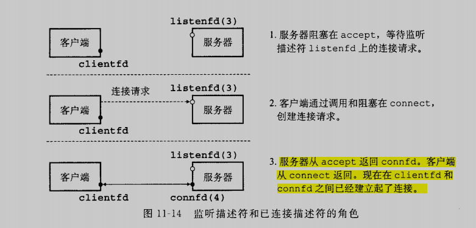
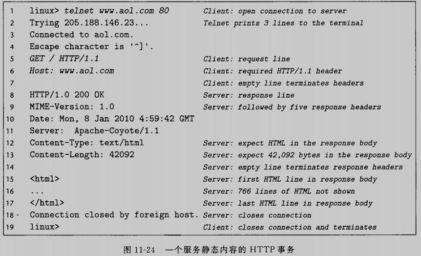

# 网络编程

## 11.4 套接字接口

下图是一个典型的客户端-服务器事务的上下文中的套接字接口概述

### 11.4.1 套接字地址结构

从Linux内核的角度看，一个套接字就是通信的一个端点。从Linux程序的角度来看，套接字就是一个有相应描述符的打开文件

因特网的套接字地址存放在下图所示的类型为sockaddr_in的16字节结构中。对于因特网应用，sin_family成员是AF_INET，sin_port成员是一个16位的端口号，而sin_addr成员就是一个32位的IP地址。IP地址和端口号总是网络字节顺序的。

~~~c
/* IP socket address structure */
struct sockaddr_in
{
    uint16_t		sin_family;
    uint16_t		sin_port;
    struct in_addr	sin_addr;
    unsigned char 	sin_zero[8];
    
};

/* Generic socket address structure (for connet, bind, and accept)*/
struct sockaddr
{
    uint16_t		sa_family;
    char 			sa_data[14];
};
~~~

_in后缀是指互联网络（internet）的缩写，并非input

为了在定义函数时，使之可以接收各种类型的套接字地址结构。于是函数要求一个指向通用sockaddr结构的指针，然后要求引用程序将与协议特定的指针强行转化为sockaddr结构。为了简化代码，有如下别名

~~~c
typedef struct sockaddr SA;
~~~

### 11.4.2 socket函数

客户端和服务器使用socket函数来创建一个套接字描述符

~~~c
#include <sys/types.h>
#include <sys/socket.h>

int socket(int domain, int type, int protocol);
~~~

如果想要使套接字成为连接的一个端点，就用如下硬编码的参数来调用socket函数

~~~c
clientfd = socket(AF_INET, SOCK_STREAM, 0);
~~~

AF_INET表明我们正在使用32位IP地址，而SOCK_STREAM表示这个套接字是连接的一个端点。

不过最好的方法是用getaddrinfo函数来自动生成这些参数，这样代码就与协议无关了。

socket返回的clientfd描述符仅是部分打开的，还不能用于读写。如何完成打开套接字的工作，取决于我们是客户端还是服务器

### 11.4.3 connect函数

客户端通过调用connect函数来建立和服务器的连接

~~~c
#include <sys/socket.h>

int connect(int clientfd, const struct sockaddr *addr, socklen_t addrlen);
~~~

connect函数试图与套接字地址为addr的服务器建立一个因特网连接，其中addrlen是sizeof(sockaddr_in)。connect函数会阻塞，一直到连接成功建立或是发生错误。如果成功，clientfd描述符现在就准备好可以读写了

### 11.4.4 bind函数

~~~c
#include <sys/socket.h>

int bind(int sockfd, const struct sockaddr *addr, socklen_t addrlen);
~~~

bind函数告诉内核将addr中的服务器套接字地址和套接字描述符sockfd联系起来

### 11.4.5 listen函数

客户端是发起连接请求的主动实体。服务器是等待来自客户端的连接请求的被动实体。默认情况下，内核认为socket函数创建的描述符对应于主动套接字，它存在于一个连接的客户端。服务器要调用listen函数告诉内核，描述符是被服务器而不是客户端使用的

~~~c
#include <sys/socket.h>

int listen(int sockfd, int backlog);
~~~

listen函数将sockfd从一个主动套接字转换为一个监听套接字，该套接字可以接收来自客户端的连接请求。

### 11.4.6 accept函数

服务器通过调用accept等待来自客户端的连接请求

~~~c
#include <sys/socket.h>
int accept(int listenfd, struct sockaddr *addr, int *addrlen);
~~~

accept函数等待来自客户端的连接请求到达侦听描述符listenfd，然后在addr中填写客户端的套接字地址，并返回一个已连接的描述符，这个描述符可被用来利用Unix I/O函数与客户端通信

监听描述符是作为客户端连接请求的一个端点。它通常被创建一次，并存在于服务器的整个生命周期。已连接描述符是客户端和服务器之间已经建立起来的连接的一个端点。服务器每次接受连接请求时都会创建一次，它只存在于服务器为一个客户端服务的过程中

在第一步中，服务器调用accep，等待连接请求到达监听描述符，第二步，客户端调用connect函数，发送一个连接请求到listenfd，第三步，accept函数打开一个新的已连接描述符connfd，在clientfd和connfd之间建立连接，并且随后返回connfd给应用程序。客户端也从connect返回，在这一点以后，客户端和服务器就可以分别通过读和写clientfd和connfd来回传送数据了

### 11.4.7 主机和服务的转换

Linux提供了一些功能强大的函数（称为getaddrinfo和getnameinfo）实现二进制套接字地址结构和主机名，主机地址，服务名和端口号的字符串表示之间的相互转化。当和套接字接口一起使用时，这些函数能使我们编写独立于任何特定版本的IP协议的网络程序

#### 1. getaddrinfo函数

getaddrinfo函数将主机名、主机地址、服务名和端口号的字符串表示转化成套接字地址结构

~~~c
#include <sys/types.h>
#include <sys/socket.h>
#include <netdb.h>

int getaddrinfo(const char *host, const char *service, 
                const struct addrinfo *hints, struct addrinfo **result);

void freeaddrinfo(struct addrinfo *result);
const char *gai_strerror(int errcode);
~~~

给定host和service（套接字地址的两个组成部分），getaddrinfo返回result，result是一个指向adddrinfo结构的链表，其中每个结构指向一个对应于host和service的套接字地址结构

~~~c
struct addrinfo{
    int 			ai_flags;
    int 			ai_family;
    int 			ai_socktype;
    int 			ai_protocol;
    char 			*ai_canonname;
    size_t 			ai_addrlen;
    struct sockaddr  *ai_addr;
    struct addrinfo  *ai_next;
};
~~~

客户端在调用了getaddrinfo之后，会遍历整个列表，依次尝试每个套接字地址，直到调用socket和connect成功。类似的，服务器会尝试遍历列表中的每个套接字地址，直到socket和bind成功，为了避免内存泄漏，应用程序必须调用freeaddrinfo释放链表，如果getaddrinfo返回非0的错误代码，可以用gai_strerror，将diamagnetic转换成消息字符串

getaddrinfo的参数名可以是域名，也可以是点分十进制的IP地址，service参数可以是服务名，如http，也可以是十进制端口号

可选的参数hints是一个addrinfo结构，他提供对getaddrinfo返回的套接字地址列表的更好控制。如果要传递hints，只能设置以下字段：ai_family,ai_socktype,ai_protocol和ai_flags字段。其他字段必须为0或NULL。实际中我们会memset整个清空后set某些字段：

* getaddrinfo默认可以返回IPv4和IPv6地套接字地址。ai_family设置为AF_INET会将列表限制为IPv4地址
* 对于host关联的每个地址，getaddrinfo函数默认最多返回三个addrinfo结构，每个的ad_socktype字段不同：一个是连接，一个是数据报，一个是原始套接字。ai_socktype设置为SOCK_STREAM将列表限制为对每个地址最多一个addrinfo结构，该结构的套接字地址可以作为连接的一个端点
* ai_flags字段是一个位掩码，可以进一步修改默认行为。

getaddrinfo一个很好的方面是addrinfo一个很好的方面是addrinfo结构中的字段是不透明的，即他们可以直接传递给套接字接口中的函数，例如ai_family,ai_socktype, ai_protocol可以直接传递给socket。类似的ai_addr和ai_addrlen可以直接传递给connect和bind

#### 2. getnameinfo函数

getnameinfo和getaddrinfo是相反的，将一个套接字地址结构转换成相应的主机和服务名字符串。

~~~c
#include <sys/socket.h>
#include <netdb.h>

int getnameinfo(const struct sockaddr *sa, socklen_t salen,
               char *host, size_t hostlen,
               char *service, size_t servlen, int flags);
~~~

参数sa指向大小为salen字节的套接字地址结构，host指向大小为hostlen字节的缓冲区，service指向大小为servlen字节的缓冲区。getnameinfo函数将套接字地址结构sa转换为对应的主机和服务名字符串

我们观察一个hostinfo，它使用getaddrinfo和getnameinfo展示出域名到和它相关联的IP地址之间的映射

~~~c
#include "csapp.h"

int main(int argc, char **argv)
{
        struct addrinfo *p, *listp, hints;
        char buf[MAXLINE];
        int rc, flags;

        if(argc != 2)
        {
                fprintf(stderr, "usage: %s <domain name>\n", argv[0]);
                exit(0);
        }

        /* Get a list of addrinfo records */
        memset(&hints, 0, sizeof(struct addrinfo));
        hints.ai_family = AF_INET;                              /* IPv4 only */
        hints.ai_socktype = SOCK_STREAM;        /* Connections only */
        if((rc = getaddrinfo(argv[1], NULL, &hints, &listp)) != 0)
        {
                fprintf(stderr, "getaddrinfo error: %s\n", gai_strerror(rc));
                exit(1);
        }

        /* Walk the list and display each IP address */
        flags = NI_NUMERICHOST;                         /* Display address string instead of domain name */
        for(p = listp; p; p = p->ai_next)
        {
                Getnameinfo(p->ai_addr, p->ai_addrlen, buf, MAXLINE, NULL, 0, flags);
                printf("%s\n", buf);
        }

        /* Clean up */
        Freeaddrinfo(listp);

        exit(0);
}
~~~

编译并运行

~~~shell
zrf@ubuntu:~/opensource/demo/ComputerSystem/11$ ./hostinfo baidu.com
39.156.66.10
110.242.68.66
~~~

### 11.4.8 套接字接口的辅助函数

#### 1.open_clientfd函数

客户端调用open_clientfd建立与服务器的连接

~~~c
#include "csapp.h"
int open_clientfd(char *hostname, char *port);
~~~

open_clientfd函数建立与服务器的连接，该服务器运行在主机hostname上，并且在端口号port上监听连接请求，它返回一个打开的套接字描述符，该描述符准备好了，可以直接用于Unix I/O输入输出函数

我们调用getaddrinfo，他返回addrigno结构列表，每个结构指向一个套接字地址结构，可用于建立于服务器的连接，然后遍历列表，依次尝试每个条目，直到调用socket和connect成功。如果connect失败，需要在尝试下一个条目之前，小心的关闭套接字描述符，如果connect成功，我们释放列表内存，并把套接字返回客户端

~~~c
/******************************** 
 * Client/server helper functions
 ********************************/
/*
 * open_clientfd - Open connection to server at <hostname, port> and
 *     return a socket descriptor ready for reading and writing. This
 *     function is reentrant and protocol-independent.
 *
 *     On error, returns: 
 *       -2 for getaddrinfo error
 *       -1 with errno set for other errors.
 */
/* $begin open_clientfd */
int open_clientfd(char *hostname, char *port) {
    int clientfd, rc;
    struct addrinfo hints, *listp, *p;

    /* Get a list of potential server addresses */
    memset(&hints, 0, sizeof(struct addrinfo));
    hints.ai_socktype = SOCK_STREAM;  /* Open a connection */
    hints.ai_flags = AI_NUMERICSERV;  /* ... using a numeric port arg. */
    hints.ai_flags |= AI_ADDRCONFIG;  /* Recommended for connections */
    if ((rc = getaddrinfo(hostname, port, &hints, &listp)) != 0) {
        fprintf(stderr, "getaddrinfo failed (%s:%s): %s\n", hostname, port, gai_strerror(rc));
        return -2;
    }

    /* Walk the list for one that we can successfully connect to */
    for (p = listp; p; p = p->ai_next) {
        /* Create a socket descriptor */
        if ((clientfd = socket(p->ai_family, p->ai_socktype, p->ai_protocol)) < 0)
            continue; /* Socket failed, try the next */

        /* Connect to the server */
        if (connect(clientfd, p->ai_addr, p->ai_addrlen) != -1)
           break; /* Success */
        if (close(clientfd) < 0) { /* Connect failed, try another */  //line:netp:openclientfd:cl
osefd   
            fprintf(stderr, "open_clientfd: close failed: %s\n", strerror(errno));
            return -1;
        }   
    }   
    
    /* Clean up */
    freeaddrinfo(listp);
    if (!p) /* All connects failed */
        return -1;
    else    /* The last connect succeeded */
        return clientfd;
}       
/* $end open_clientfd */
~~~

#### 2. open_listenfd函数

调用open_listenfd函数，服务器创建一个监听描述符，准备好接受连接请求

~~~c
/*  
 * open_listenfd - Open and return a listening socket on port. This
 *     function is reentrant and protocol-independent.
 *
 *     On error, returns: 
 *       -2 for getaddrinfo error
 *       -1 with errno set for other errors.
 */
/* $begin open_listenfd */
int open_listenfd(char *port) 
{
    struct addrinfo hints, *listp, *p;
    int listenfd, rc, optval=1;

    /* Get a list of potential server addresses */
    memset(&hints, 0, sizeof(struct addrinfo));
    hints.ai_socktype = SOCK_STREAM;             /* Accept connections */
    hints.ai_flags = AI_PASSIVE | AI_ADDRCONFIG; /* ... on any IP address */
    hints.ai_flags |= AI_NUMERICSERV;            /* ... using port number */
    if ((rc = getaddrinfo(NULL, port, &hints, &listp)) != 0) {
        fprintf(stderr, "getaddrinfo failed (port %s): %s\n", port, gai_strerror(rc));
        return -2;
    }

    /* Walk the list for one that we can bind to */
    for (p = listp; p; p = p->ai_next) {
        /* Create a socket descriptor */
        if ((listenfd = socket(p->ai_family, p->ai_socktype, p->ai_protocol)) < 0) 
            continue;  /* Socket failed, try the next */

        /* Eliminates "Address already in use" error from bind */
        setsockopt(listenfd, SOL_SOCKET, SO_REUSEADDR,    //line:netp:csapp:setsockopt
                   (const void *)&optval , sizeof(int));

        /* Bind the descriptor to the address */
        if (bind(listenfd, p->ai_addr, p->ai_addrlen) == 0)
            break; /* Success */
        if (close(listenfd) < 0) { /* Bind failed, try the next */
            fprintf(stderr, "open_listenfd close failed: %s\n", strerror(errno));
            return -1;
        }
    }

    /* Clean up */
    freeaddrinfo(listp);
    if (!p) /* No address worked */
        return -1;

    /* Make it a listening socket ready to accept connection requests */
    if (listen(listenfd, LISTENQ) < 0) {
        close(listenfd);
	return -1;
    }
    return listenfd;
}
/* $end open_listenfd */
~~~

open_listenfd的风格类似于open_clientfd。调用getaddrinfo，遍历列表，直到调用socket并bind成功。注意，我们使用setsockopt函数来配置服务器，使得服务器能够被终止、重启、和立即开始接受连接请求。

我们在调用getaddrinfo时，使用了AI_PASSIVE标志并将host参数设置为NULL，每个套接字地址结构中的地址字段会被设置为通配符地址，这告诉内核这个服务器会接收发送到本地主机所有IP地址的请求

### 11.4.9 echo迭代服务器和客户端示例程序

#### 1. server

~~~c
#include "csapp.h"

void echo(int connfd);

int main(int argc, char **argv)
{
	int listenfd, connfd;
	socklen_t clientlen;
	struct sockaddr_storage clientaddr;				/* Enough space for any address */
	char client_hostname[MAXLINE], client_port[MAXLINE];

	if(argc != 2)
	{
		fprintf(stderr, "usage: %s <port>\n", argv[0]);
		exit(0);
	}

	listenfd = Open_listenfd(argv[1]);
	while(1)
	{
		clientlen = sizeof(struct sockaddr_storage);
		connfd = Accept(listenfd, (SA *)&clientaddr, &clientlen);
		Getnameinfo((SA *)&clientaddr, clientlen, client_hostname, MAXLINE, client_port, MAXLINE, 0);
		printf("Connected to (%s, %s)\n", client_hostname, client_port);
		echo(connfd);
		Close(connfd);
	}
	exit(0);
}

~~~

#### 2. client

~~~c
#include "csapp.h"

int main(int argc, char **argv)
{
	int clientfd;
	char *host, *port, buf[MAXLINE];
	rio_t rio;

	if(argc != 3)
	{
		fprintf(stderr, "usage: %s <host> <port>\n", argv[0]);
		exit(0);
	}

	host = argv[1];
	port = argv[2];

	clientfd = Open_clientfd(host, port);
	Rio_readinitb(&rio, clientfd);

	while(Fgets(buf, MAXLINE, stdin) != NULL)
	{
		Rio_writen(clientfd, buf, strlen(buf));
		Rio_readlineb(&rio, buf, MAXLINE);
		Fputs(buf, stdout);
	}

	Close(clientfd);
	exit(0);
}

~~~

#### 3.echo

~~~c
#include "csapp.h"

void echo(int connfd)
{
	size_t n;
	char buf[MAXLINE];
	rio_t rio;

	Rio_readinitb(&rio, connfd);
	while((n = Rio_readlineb(&rio, buf, MAXLINE)) != 0)
	{
		printf("server received %d bytes \n", (int)n);
		Rio_writen(connfd, buf, n);
	}
}

~~~

## 11.5 Web服务器

### 11.5.1 Web基础

Web客户端和服务器之间的交互用的是一个基于文本的应用级协议，叫做HTTP

### 11.5.2 Web内容

Web服务器以两种不同的方式向客户端提供内容：

* 取一个磁盘文件，并将它的内容返回给客户端。磁盘文件称为静态内容，而返回给客户端的过程称为服务静态内容

* 运行一个可执行文件，并将他的输出返回给客户端。运行时可执行文件产生的输出称为动态内容，而运行程序并返回它的输出到客户端的过程称为服务动态内容

每条Web服务器返回的内容都是和它管理的某个文件相关联的。这些文件中每一个都有一个唯一的名字，叫做通用资源定位符（URL）

可执行文件的URL可以在文件名后包括程序参数。”？“字符分割文件名和参数，而且每个参数都用”&“字符分割。

### 11.5.3 HTTP事务

每次输入一个文本行，并键入回车键，TELNET会读取该行，在后面加上回车和换行符(\r\n)，并将这一行发送到服务器。这是和HTTP标准相符合的，HTTP标准要求每个文本行都由一对回车和换行符来结束

#### 1. HTTP请求

一个请求行的形式是：

~~~shell
method URI version
~~~

HTTP支持许多方法，如GET、POST、OPTIONS、HEAD、PUT、DELETE和TRACE等

GET方法指导服务器生成和返回URI（统一资源标识符）标识的内容。URI是相应的URL的后缀，包括文件名和可选参数，version标识HTTP的版本

请求报头为服务器提供了额外的信息

#### 2. HTTP响应

一个响应行的格式如下

~~~shell
version status-code status-message
~~~

第14行的终止响应报头的空文本行，其后跟随响应主体

### 11.5.4 服务动态内容

当我们的Web为客户端提供动态内容服务时，就不可避免的想到客户端参数如何传递到服务器，服务器如何将这些参数传递给它所创建的子进程？服务器如何将子进程生成内容所需要的其他信息传递给子进程，子进程将它的输出发送到哪里？

一个称为CGI的实际标准的出现解决了这个问题

#### 1. 客户端如何将程序参数传递给服务器

在URL中，一个“？”分割文件名和参数，每个参数用“&”字符隔开。参数不允许有空格

HTTP POST请求的参数是在请求主体中而不是在URL中传递的

#### 2. 服务器如何将参数传递给子进程

在服务器接收到一个如下请求后

~~~web
GET /cgi-bin/adder?123&456 HTTP/1.1
~~~

服务器调用fork创建一个子进程，并调用execve在进程的上下文中执行/cgi-bin/adder程序。像adder这样的程序，常常被称为CGI程序，因为他们遵守CGI的标准规则。在调用execve之前，子进程将CGI环境变量QUERY_STRING设置为“123&456”，adder程序在运行时可以用linux getenv函数来引用它

#### 3. 服务器如何将其他信息传递给子进程

#### 4. 子进程将它的输出发送到哪里

一个CGI程序将它的动态内容发送到标准输出。在子进程加载运行CGI之前，它使用Linux dup2函数将标准输出重定向到客户端相关联的已连接描述符。因此，任何CGI程序写到标准输出的东西都直接到达客户端

~~~c
	/* 服务端代码 */
	if(Fork() == 0)	/* Child */
	{
		/* Real server would set all CGI vars here */
		setenv("QUERY_STRING", cgiargs, 1);
		Dup2(fd, STDOUT_FILENO);			/* Redirect stdout to client */
		Execve(filename, emptylist, environ);	/* Run CGI program */
	}
~~~

注意有，因为父进程不知道子进程会生成内容和类型或大小，所以子进程就要负责生成Content-type 和Content-length响应报头，以及终止报头的空行

如下是一个cgi程序，他负责对两个数求和

~~~c
#include "csapp.h"

int main(void)
{
	char *buf, *p;
	char arg1[MAXLINE], arg2[MAXLINE], content[MAXLINE];
	int n1 = 0, n2 = 0;

	/* Extract the two arguments */
	if((buf = getenv("QUERY_STRING")) != NULL)
	{
		p = strchr(buf, '&');
		*p = '\0';
		strcpy(arg1, buf);
		strcpy(arg2, p+1);
		n1 = atoi(arg1);
		n2 = atoi(arg2);
	}

	/* Make the response body */
	sprintf(content, "QUERY_STRING=%s", buf);
	sprintf(content, "Welcome to add.com: ");
	sprintf(content, "%sThe Internet addition portal.\r\n
", content);
	sprintf(content, "%sThe answer is : %d + %d = %d\r\n
",
					content, n1, n2, n1 + n2);
	sprintf(content, "%sThanks for visiting!\r\n", content);

	/* Generate the HTTP response */
	printf("Connection: close\r\n");
	printf("Content-length: %d\r\n", (int)strlen(content));
	printf("Content-type: text/html\r\n\r\n");
	printf("%s", content);
	fflush(stdout);

	exit(0);
}

~~~

启动服务器，用telnet连接服务器

~~~shell
zrf@ubuntu:~//echoservert-pre$ telnet 127.0.0.1 8888
Trying 127.0.0.1...
Connected to 127.0.0.1.
Escape character is '^]'.
GET /cgi-bin/adder?123&456 HTTP1.0

HTTP/1.0 200 OK
Server: Tiny Web Server
Connection: close
Content-length: 112
Content-type: text/html

Welcome to add.com: The Internet addition portal.

The answer is : 123 + 456 = 579

Thanks for visiting!
Connection closed by foreign host.
~~~

## 11.6 综合：TINY Web服务器

我们通过开发一个虽小但功能齐全的称为TINY的web服务器，它虽然不够健壮，但是足够用来为实际的Web浏览器提供静态和动态内容

### 1.TINY的main程序

TINY是一个迭代服务器，监听在命令中传递来的端口上的连接请求，TINY执行典型的无线服务器循环，不断接受连接请求，执行事务，并关闭连接它的那一端

~~~c
int main(int argc, char **argv)
{
	int listenfd, connfd;
	socklen_t clientlen;
	struct sockaddr_storage clientaddr;
	char client_hostname[MAXLINE], client_port[MAXLINE];

	if(argc != 2)
	{
		fprintf(stderr, "usage: %s <port>\n", argv[0]);
		exit(1);
	}

	listenfd = Open_listenfd(argv[1]);
	while(1)
	{
		clientlen = sizeof(clientaddr);
		connfd = Accept(listenfd, (SA *)&clientaddr, &clientlen);
		Getnameinfo((SA *)&clientaddr, clientlen, client_hostname, MAXLINE, client_port, MAXLINE, 0);
		printf("Accepted connection from (%s, %s)\n", client_hostname, client_port);
		doit(connfd);
		Close(connfd);
	}
}
~~~

### 2. doit函数

在doit中处理HTTP事务，我们解析请求行（只支持GET），并设置一个表明请求是动态内容还是静态内容。如果是静态内容，我们确保文件存在且有权限，如果是动态内容，则确定存在可执行文件并有权限执行

~~~c
void doit(int fd)
{
	int is_static;
	struct stat sbuf;
	char buf[MAXLINE], method[MAXLINE], uri[MAXLINE], version[MAXLINE];
	char filename[MAXLINE], cgiargs[MAXLINE];
	rio_t rio;

	/* Read request line and headers */
	Rio_readinitb(&rio, fd);
	Rio_readlineb(&rio, buf, MAXLINE);
	printf("%s", buf);
	sscanf(buf, "%s %s %s", method, uri, version);
	if(strcasecmp(method, "GET"))
	{
		clienterror(fd, method, "501", "Not implemented", "Tiny does not implement this method");
		return;
	}
	read_requesthdrs(&rio);
		
	/* Parse URI from GET requset */
	is_static = parse_uri(uri, filename, cgiargs);
	if(stat(filename, &sbuf) < 0)
	{
		clienterror(fd, filename, "404", "Not found", "Tiny couldn't find this file");
		return ;
	}

	if(is_static)	/* Serve static content */
	{
		if(!(S_ISREG(sbuf.st_mode)) || !(S_IRUSR & sbuf.st_mode))
		{
			clienterror(fd, filename, "403", "Forbidden", "Tiny couldn't read the file");
			return;
		}
		serve_static(fd, filename, sbuf.st_size);
	}
	else					/* Serve dynamic content */
	{
		if(!(S_ISREG(sbuf.st_mode)) || !(S_IXUSR & sbuf.st_mode))
		{
			clienterror(fd, filename, "403", "Forbidden", "Tiny couldn't run the CGI program");
			return;
		}
		serve_dynamic(fd, filename, cgiargs);
	}
}
~~~

### 3.clienterror函数

clienterror函数发送一个HTTP响应到客户端，在响应行中包括响应的状态码和状态消息，响应主体中包含一个HTML文件，向浏览器解的用户解释这个错误

~~~c
void clienterror(int fd, char *cause, char *errnum, char *shortmsg, char *longmsg)
{
	char buf[MAXLINE], body[MAXBUF];

	/* Build the HTTP response body */
	sprintf(body, "<html><title>Tiny Error</title>");
	sprintf(body, "%s<body bgcolor=""ffffff"">\r\n", body);
	sprintf(body, "%s%s: %s\r\n", body, errnum, shortmsg);
	sprintf(body, "%s
%s: %s\r\n", body, longmsg, cause);
	sprintf(body, "%s
<em>The Tiny Web server</em>\r\n", body);

	/* Print the HTTP response */
	sprintf(buf, "HTTP/1.0 %s %s\r\n", errnum, shortmsg);
	Rio_writen(fd, buf, strlen(buf));
	sprintf(buf, "Content-type: text/html\r\n");
	Rio_writen(fd, buf, strlen(buf));
	sprintf(buf, "Content-length: %d\r\n\r\n", (int)strlen(body));
	Rio_writen(fd, buf, strlen(buf));
	Rio_writen(fd, body, strlen(body));
}
~~~

### 4. 函数

TINY不使用请求报文头中的任何消息，直接忽略，注意，终止请求报头的空文本行是由回车和换行符组成的

~~~c
void read_requesthdrs(rio_t *rp)
{
	char buf[MAXLINE];

	Rio_readlineb(rp, buf, MAXLINE);
	while(strcmp(buf, "\r\n"))
	{
		Rio_readlineb(rp, buf, MAXLINE);
		printf("%s", buf);
	}
	return;
}
~~~

### .pares_uri函数

他将uri解析为一个文件名和一个可选的CGI参数字符串

~~~c
int parse_uri(char *uri, char *filename, char *cgiargs)
{
	char *ptr;

	if(!strstr(uri, "cgi-bin"))	/* Static content */
	{
		strcpy(cgiargs, "");
		strcpy(filename, ".");
		strcat(filename, uri);
		if(uri[strlen(uri)-1] == '/')
			strcat(filename, "home.html");
		return 1;
	}
	else	/* Dynamic content */
	{
		ptr = index(uri, '?');
		if(ptr)
		{
			strcpy(cgiargs, ptr+1);
			*ptr = '\0';
		}
		else
			strcpy(cgiargs, "");
		strcpy(filename, ".");
		strcat(filename, uri);
		return 0;
	}
}
~~~

### 6. serve_static函数

TINY提供五种常见的静态内容：HTML、无格式的文本文件、以及编码为GIF、PNG、和JPG格式的图片

~~~c
void serve_static(int fd, char *filename, int filesize)
{
	int srcfd;
	char *srcp, filetype[MAXLINE], buf[MAXBUF];

	/* Send response hreaders to client */
	get_filetype(filename, filetype);
	sprintf(buf, "HTTP/1.0 200 OK\r\n");
	sprintf(buf, "%sServer: Tiny Web Server\r\n", buf);
	sprintf(buf, "%sConnection: close\r\n", buf);
	sprintf(buf, "%sContent-length: %d\r\n", buf, filesize);
	sprintf(buf, "%sContent-type: %s\r\n\r\n", buf, filetype);
	Rio_writen(fd, buf, strlen(buf));
	printf("Response headers:\n");
	printf("%s", buf);

	/* Send response body to client */
	srcfd = Open(filename, O_RDONLY, 0);
	srcp = Mmap(0, filesize, PROT_READ, MAP_PRIVATE, srcfd, 0);
	Close(srcfd);
	Rio_writen(fd, srcp, filesize);
	Munmap(srcp, filesize);
}

void get_filetype(char *filename, char *filetype)
{
	if(strstr(filename, ".html"))
		strcpy(filetype, "text/html");
	else if(strstr(filename, ".gif"))
		strcpy(filetype, "image/gif");
	else if(strstr(filename, ".png"))
		strcpy(filetype, "image/png");
	else if(strstr(filename, ".jpg"))
		strcpy(filetype, "image/jpeg");
	else
		strcpy(filetype, "text/plain");
}
~~~

我们将被请求文件的内容复制到已连接描述符fd来发送响应主体。这里的代码比较微妙。18行以读的方式打开文件filename， 并获得描述符。在19行，linux mmap函数被请求文件映射到一个虚拟内存空间。调用mmap将文件srcfd的前filesize个字节映射到一个从地址srcp开始的私有只读虚拟内存区域，一旦文件映射到内存，就不再需要描述符了，于是关闭描述符。rio_writen函数复制从srcp位置开始的filesize个字节（他们当然已经被映射到了所请求的文件）到客户端的已连接描述符，最后释放了映射的虚拟内存。

### 7. serve_dynamic函数

TINY派生子进程运行CGI程序，子进程用来自请求URI的CGI参数初始化环境变量

接下来，子进程重定向它的标准输出到已连接文件描述符，然后加载并运行CGI程序。因为CGI程序运行在子进程的上下文中，它能够访问所有在调用execve函数之前就打开的文件和环境变量，期间，父进程阻塞在wait调用中，等待子进程终止时，回收操作系统分配给子进程的资源
