# 并发编程

正如第八章所学，如果逻辑控制流在时间上重叠，那么他们就是并发的

使用应用级并发的应用程序称为并发程序。现代操作系统提供了三种基本的构造并发程序的方法：

* 进程。用这个方法，每个逻辑控制流都是一个进程，由内核来调度和维护。因为进程有独立的虚拟地址空间，想要和其他流通信，控制流必须使用某种显示的进程间通信机制
* IO多路复用。在这种形式的并发编程中，应用程序在一个进程的上下文中显示地调度他们自己的逻辑流。逻辑流被模型化为状态机，数据到达文件描述符后，主程序显示地从一个状态转换到另一个状态
* 线程。运行在单一进程的上下文中的逻辑流，由内核调度

## 12.1 基于进程的并发编程

使用大家熟悉的fork、exec和waitpid。一个构造并发服务器的自然方法是，在父进程中接受客户端连接请求，然后创建一个新的子进程来为每个新客户提供服务

假设有两个客户端和一个服务器，服务器正在监听一个监听描述符3上的连接请求。现在假如服务器收到了客户端1的连接请求，并返回一个已连接的描述符4，在接受连接请求之后，服务器派生一个子进程，这个子进程获得服务器描述符的完整副本。子进程关闭它的副本中的监听描述符3，而父进程关闭它的已连接描述符4的副本

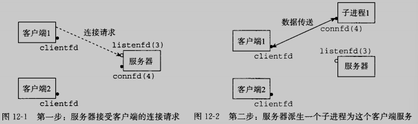

因为父子进程中的已连接描述符都指向同一个文件表表项，所以父进程关闭它的已连接描述符的副本是至关重要的，否则就永不会释放已连接的描述符4

现在假设父进程为客户端1创建了子进程之后，他接受一个新的客户端2的连接请求，并返回一个新的已连接描述符5，然后父进程又派生另一个子进程，这个子进程为已连接的描述符5提供服务

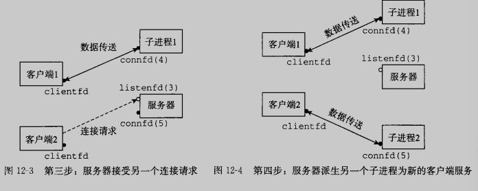

### 12.1.1 基于进程的并发服务器

关于这个服务器，我们有几点说明：

* 首先，通常服务器会运行很长时间，所以我们必须包括一个SIGCHLD处理程序来回收僵死子进程资源。因为SIGCHLD处理程序执行时，SIGCHLD信号是阻塞的，而linux信号不排队，所以SIGCHLD处理程序必须准备好回收多个僵死子进程的资源
* 其次，父子进程必须关闭他们各自的connfd
* 最后，因为套接字的问价表表项中的引用次数，直到父子进程中的connfd都关闭了，到客户端的连接才会终止

~~~c
#include "csapp.h"

void echo(int connfd);

void sigchild_handler(int sig)
{
	while(waitpid(-1, 0, WNOHANG) > 0);
	return;
}

int main(int argc, char **argv)
{
	int listenfd, connfd;
	socklen_t clientlen;
	struct sockaddr_storage clientaddr;

	if(argc != 2)
	{
		fprintf(stderr, "usage: %s <port>\n", argv[0]);
		exit(0);
	}

	Signal(SIGCHLD, sigchild_handler);
	listenfd = Open_listenfd(argv[1]);
	while(1)
	{
		clientlen = sizeof(struct sockaddr_storage);
		connfd = Accept(listenfd, (SA *)&clientaddr, &clientlen);
		if(Fork() == 0)
		{
			Close(listenfd);					/* Child closes its listening socket */
			echo(connfd);							/* Child services client */
			Close(connfd);						/* Child closes connection whit chient */
			exit(0);									/* Child exits*/
		}
		Close(connfd);							/* Parent closes connected socket (important!) */
	}
}

~~~

### 12.1.2 进程的优劣

对于在父子进程间共享状态信息，进程有一个非常清晰的模型：共享文件表，但是不共享用户地址空间。进程有独立的地址空间既有有点也有缺点。进程不可能不小心覆盖另一个进程的虚拟内存，这就消除了很多令人迷惑的错误，另一方面，独立的地址空间使得进程共享状态信息变得困难。

## 12.2 基于I/O多路复用的并发编程

IO多路复用技术的基本思路就是使用select函数，要求内核挂起进程，只有在一个或多个IO事件发生后，才将控制返回给应用程序，如下示例：

* 当集合{0， 4}中任意描述符准备好读时返回
* 当集合{1，2，7}中任意描述符准备好写时返回
* 如果等到一个IO事件发送时过了152.13秒，就超时

我们目前对select仅仅讨论第一种场景：等待一组描述可读

~~~c
#include <sys/select.h>
int select(int n, fd_set *fdset, NULL, NULL, NULL);

FD_ZERO(fd_set *fdset);
FD_CLR(int fd, fd_set *fdset);
FD_SET(int fd, fd_set *fdset);
FD_ISSET(int fd, fd_set *fdset);
~~~

代码如下

~~~c
#include "csapp.h"

void echo(int connfd);
void command(void);

int main(int argc, char **argv)
{
	int listenfd, connfd;
	socklen_t clientlen;
	struct sockaddr_storage clientaddr;
	fd_set read_set, ready_set;

	if(argc != 2)
	{
		fprintf(stderr, "usage: %s <port>\n", argv[0]);
		exit(0);
	}

	listenfd = Open_listenfd(argv[1]);

	FD_ZERO(&read_set);									/* Clear read set */
	FD_SET(STDIN_FILENO, &read_set);		/* Add stdin to read set */
	FD_SET(listenfd, &read_set);				/* Add listenfd to read set */

	while(1)
	{
		ready_set = read_set;
		Select(listenfd+1, &ready_set, NULL, NULL, NULL);
		if(FD_ISSET(STDIN_FILENO, &ready_set))
			command();		/* Read command line from stdin */
		if(FD_ISSET(listenfd, &ready_set))
		{
			clientlen = sizeof(struct sockaddr_storage);
			connfd = Accept(listenfd, (SA *)&clientaddr, &clientlen);
			echo(connfd);
			Close(connfd);
		}
	}
}

void command(void)
{
	char buf[MAXLINE];
	if(!Fgets(buf, MAXLINE, stdin))
		exit(0);		/* EOF */
	printf("%s", buf);			/* Process the input command */
}

~~~

虽然这个程序是使用select的一个很好的示例，但是他仍留下了一些问题待解决。问题是一旦它连接到某一个客户端，就会连续回送输入行，直到客户端关闭这个连接中它的那一端。因此直到服务器和客户端之间结束连接，我们键入到标准输入的命令则无法得到响应

一个更好的方法是更细粒度的多路复用，服务器每次循环（至多）回送一个文本行

### 12.2.1 基于IO多路复用的并发事件驱动服务器

IO多路复用可以用做并发事件驱动程序的基础，在事件驱动程序中，某些事件会导致流向前推进。一般的思路是将逻辑流模型化为状态机。不严格的说，一个状态机就是一组状态、输入事件和转移。其中转移是将状态和输入事件映射到状态。每个转移是将一个（输入状态、输入事件）对 映射到一个输出状态。自循环是同一输入和输出状态之间的转移。通常把状态机画成有向图，其中节点表示状态，有向弧表示转移，而弧上的标号表示输入事件。一个状态机从某种初始状态开始执行，每个输入事件都会引发一个从当前状态到下一状态的转移。

 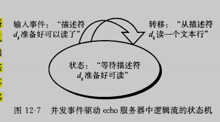

对于每个客户端k，基于IO多路复用的并发服务器会创建一个新的状态机s~k~，并将它和已连接描述符d~k~联系起来。每个状态机都有一个状态——等待描述符d~k~准备好可读、一i个输入事件——描述符d~k~准备好了和一个转移——从描述符d~k~读一个文本行

一个pool结构维护者活动客户端的集合，在调用init_pool初始化池，服务器进入一个无限循环。在循环的每次迭代中，服务器调用select函数来检测两种不同类型的输入事件：

* 来自一个新客户端的连接请求到达
* 一个已存在的客户端的已连接描述符准备好可读了

当一个连接请求到达时，服务器打开连接，并调用add_client函数，将该客户端添加到池子里。最后服务器调用check_clinets函数，把来自每个准备的已连接描述符的一个文本行回送回去

~~~c
#include "csapp.h"

typedef struct{/* Represents a pool of connected descriptors */
	int maxfd;											/* Largest descriptor in read_set */
	fd_set read_set;								/* Set of all active descriptors */
	fd_set ready_set;								/* Subset of descriptors ready for reading */
	int nready;											/* Number of ready descriptors from select */
	int maxi;												/* High water index into client array */
	int clientfd[FD_SETSIZE];				/* Set of active descriptors */
	rio_t clientrio[FD_SETSIZE];		/* Set of actice read buffers */
}pool;

int byte_cnt = 0;		/* Counts total bytes received by server */

void init_pool(int listenfd, pool *p);
void add_client(int connfd, pool *p);
void check_clients(pool *p);

int main(int argc, char **argv)
{
	int listenfd, connfd;
	socklen_t clientlen;
	struct sockaddr_storage clientaddr;
	static pool pool;

	if(argc != 2)
	{
		fprintf(stderr, "usage: %s <port>\n", argv[0]);
		exit(0);
	}

	listenfd = Open_listenfd(argv[1]);
	init_pool(listenfd, &pool);

	while(1)
	{
		/* Wait for listening/connected descriptor(s) to become ready */
		pool.ready_set = pool.read_set;
		pool.nready = Select(pool.maxfd + 1, &pool.ready_set, NULL, NULL, NULL);

		/* If listening descriptor ready, add new client to pool */
		if(FD_ISSET(listenfd, &pool.ready_set))
		{
			clientlen = sizeof(struct sockaddr_storage);
			connfd = Accept(listenfd, (SA *)&clientaddr, &clientlen);
			add_client(connfd, &pool);
		}

		/* Echo a text line from each ready connected descriptor */
		check_clients(&pool);
	}
}
~~~

init_pool函数初始化客户端池。clientfd数组表示已连接描述符的集合，其中-1表示一个可用的槽位。初始时，已连接描述符是空的，且监听描述符是select读集合中唯一的描述符

~~~c
void init_pool(int listenfd, pool *p)
{
	/* Initially, there are no connected descriptors */
	int i;
	p->maxi = -1;
	for(i = 0; i < FD_SETSIZE; i++)
		p->clientfd[i] = -1;

	/* Initially, listenfd is only member of select read set */
	p->maxfd = listenfd;
	FD_ZERO(&p->read_set);
	FD_SET(listenfd, &p->read_set);
}
~~~

add_clinet将新的已连接的客户端连接添加到池中

~~~c
void add_client(int connfd, pool *p)
{
	int i;
	p->nready--;
	for(i = 0; i < FD_SETSIZE; i++)	/* Find an available slot */
		if(p->clientfd[i] < 0)
		{
			/* Add connected descriptor to the pool */
			p->clientfd[i] = connfd;
			Rio_readinitb(&p->clientrio[i], connfd);

			/* Add the descriptor to descriptor set */
			FD_SET(connfd, &p->read_set);

			/* Update max descriptor and pool high water mark */
			if(connfd > p->maxfd)
				p->maxfd = connfd;
			if(i > p->maxi)
				p->maxi = i;
			break;
		}
	if(i == FD_SETSIZE)		/* Couldn't find an empty slot */
		app_error("add_client error: Too many clinets");
}
~~~

check_clinets函数回送来自每个准备好的已连接描述符的一个文本行，如果成功从描述符读取了一个文本行，那么就将该文本行回送到客户端。

select函数检测到输入事件，而add_clinet函数创建一个新的逻辑流（状态机）， check_clients函数回送输入行，从而执行状态转移，而且当客户端完成文本行发送时，他还需要删除这个状态机

~~~c
void check_clients(pool *p)
{
	int i, connfd, n;
	char buf[MAXLINE];
	rio_t rio;

	for(i = 0; (i <= p->maxi) && (p->nready > 0); i++)
	{
		connfd = p->clientfd[i];
		rio = p->clientrio[i];

		/* If the descriptor is ready, echo text line from it */
		if((connfd > 0) && (FD_ISSET(connfd, &p->ready_set)))
		{
			p->nready--;
			if((n = Rio_readlineb(&rio, buf, MAXLINE)) != 0)
			{
				byte_cnt += n;
				printf("Server received %d (%d total) bytes on fd %d\n", n, byte_cnt, connfd);
				Rio_writen(connfd, buf, n);
			}
			else{/* EOF detected, remove descriptor from pool */
				Close(connfd);
				FD_CLR(connfd, &p->read_set);
				p->clientfd[i] = -1;
			}
		}
	}	
}
~~~

### 12.2.2 IO多路复用技术的优劣

事件驱动设计的一个优点是——它比基于进程的设计给了程序员更多的对程序行为的控制。另外他比基于进程的设计要高效的多，因为他不需要进程上下文切换来调度新的流

事件驱动设计的一个明显的缺点就是编码复杂。我们的事件驱动的并发echo服务器需要的代码比基于进程的服务器多三倍，而且随着并发粒度的减少，复杂性还会上升。

## 12.3 基于线程的并发编程

到目前为止，我们已经看到了两种创建并发逻辑流的方法。在第一种方法中，我们为每个流使用了单独的进程。内核会自动调度每个进程，而每个进程都拥有他自己的私有地址空间，这使得流共享数据很困难。第二种方法我们创建自己的逻辑流，并利用IO多路复用来显示地调度流。因为只有一个进程，所有的流共享整个地址空间。这里将介绍第三种方法——基于线程，他是这两种方法的混合

线程由内核自动调度。每个线程都有自己得线程上下文，包括一个唯一的整数线程ID、栈、栈指针、程序计数器、通用目的寄存器和条件码。所有的运行在一个进程里的线程共享该进程的整个虚拟地址空间

基于线程的逻辑流结合了基于进程和基于IO多路复用的流的特性。多个线程运行在单一的进程的上下文中，因此共享整个进程虚拟地址空间的所有内容，它包括代码、数据、堆、共享库和打开的文件

### 12.3.1 线程执行模型

多线程的执行模型在某些方面和多进程的执行模型都是相似的。每个进程开始生命周期时都是单一线程，主线程创建一个对等线程（peer thread），从这个时间点开始，两个线程就并发的运行。最后，因为主线程执行一个慢速系统调用，例如read或者sleep，或者是因为被系统的间隔计时器中断，控制就会通过上下文切换传递到对等线程，对等线程执行一段时间之后，然后控制传递回主线程

在一些方面，线程执行是不同于进程的，线程的上下文比进程小得多，也就切换的更快；线程不像进程那般区分父子；每个对等线程都能读写相同的共享数据

### 13.3.2 Posix线程

Posix线程（Pthread）是在C程序中处理线程的一个标准接口

线程的代码和本地数据被封装在一个线程例程中，每个线程例程都以一个通用指针作为出入，并返回一个通用指针，如果想传递多个参数给线程例程，那么需要将参数放到一个结构中，返回亦如此

~~~c
#include "csapp.h"

void *thread(void *vargp);

int main()
{
	pthread_t tid;
	Pthread_create(&tid, NULL, thread, NULL);
	Pthread_join(tid, NULL);
	exit(0);
}

void *thread(void *vargp)
{
	printf("hello, world\n");
	return NULL;
}
~~~

主线程调用pthread_create函数创建一个新的对等线程，对pthread_create的调用返回时，主线程和新创建的线程同时运行，并且tid包含新线程的ID，在pthread_join，主线程等待对等线程终止，最后调用exit终止当时运行在这个进程中的所有线程

### 13.3.3 创建线程

线程通过调用pthread_create函数来创建其他线程

~~~c
#include <pthread.h>
typedef void *(func)(void *);

int pthread_create(pthread_t *tid, pthread_attr_t *attr,
                  	func *f, void *arg);
~~~

pthread_create函数创建一个新的线程，并带着一个输入变量arg，在新线程的上下文中运行线程例程f，能用attr参数来改变新创建线程的默认属性。

新线程可以用pthread_self函数来获得自己的线程ID

~~~c
#include <pthread.h>

pthread_t pthread_self(void);
~~~

### 12.3.4 终止线程

一个线程是以下列方式之一来终止的

* 当顶层的线程例程返回时，线程会隐式地终止
* 通过调用pthread_exit函数，线程会显示的终止。如果主线程调用pthread_exit，他会等待所有其他对等线程终止，然后再终止主线程和整个进程

~~~c
#include <pthread.h>
void pthread_exit(void *thread_return);
~~~

* 某个对等线程调用exit函数，该函数终止进程以及所有与进程相关的线程
* 另一个对等线程通过当前线程ID作为参数调用pthread_cancel函数来终止当前线程

~~~c
#include <pthread.h>
int pthread_cancel(pthread_t tid);
~~~

### 13.3.5 回收已终止线程的资源

线程通过调用pthread_join函数等待其他线程终止

~~~c
#include <pthread.h>
int pthread_join(pthread_t tid, void **thread_return);
~~~

pthread_join函数会阻塞，直到线程tid终止，将线程例程返回的通用（void *）指针赋值为thread_return指向的位置，然后回收已终止线程占用的所有内存资源

### 12.3.6 分离线程

在任何一个时间点上，线程是可结合的或者是分离的。一个可结合的线程能够被其他线程回收和杀死。在其被其他线程回收之前，它的内存资源是不释放的

默认情况下，线程被创建成可结合的，为了避免内存泄漏，每个可结合线程都应该要么被其他线程显示地收回，要么通过调用pthread_detach函数被分离

~~~c
#include <pthread.h>
int pthread_detach(pthread_t tid);
~~~

线程能够通过以pthread_self为参数的pthread_detach调用来分离他们自己

尽管我们的一些例子会使用可结合线程，但是在现实程序中，有很好的理由要使用分离的线程

### 12.3.7 初始化线程

~~~c
#include <pthread.h>
pthread_once_t once_control = PTHREAD_ONCE_INIT;
int pthread_once(pthread_once_t *once_control, void (*init_routine)(void));
~~~

once_contro变量是一个全局或者静态变量，总是被初始化为PTHREAD_ONCE_INIT。当你第一次用参数once_control调用pthread_once时，它调用init_routine，这是一个没有输入参数、也不返回什么的函数。接下来的以once_control为参数的pthread_once调用不做任何事情。无论何时，当你需要动态初始化多个线程共享的全局变量时，pthread_once函数是很有用的

### 12.3.8 基于线程的并发服务器

整体结构类似基于进程的设计。主线程不断地等待连接请求，然后创建一个对等线程处理该请求。但是这里有一个很容易忽略的点，如果我们在向pthread_create中的thread例程传递connfd时，这个connfd如果没有一个独立的地址空间，是容易引发竞争的，下面的版本使用malloc避免了这种竞争

~~~c
#include "csapp.h"

void echo(int connfd);
void *thread(void *vargp);

int main(int argc, char **argv)
{
	int listenfd, *connfdp;
	socklen_t clientlen;
	struct sockaddr_storage clientaddr;
	pthread_t tid;

	if(argc != 2)
	{
		fprintf(stderr, "usage: %s <port>\n", argv[0]);
		exit(0);
	}
	listenfd = Open_listenfd(argv[1]);

	while(1)
	{
		clientlen = sizeof(struct sockaddr_storage);
		connfdp = Malloc(sizeof(int));
		*connfdp = Accept(listenfd, (SA *)&clientaddr, &clientlen);
		Pthread_create(&tid, NULL, thread, connfdp);
	}
}

/* Thread routine */
void *thread(void *vargp)
{
	int connfd = *((int *)vargp);
	Pthread_detach(pthread_self());
	Free(vargp);
	echo(connfd);
	Close(connfd);
	return NULL;
}

~~~

另一个问题是，为了避免内存泄漏，需要在thread例程中适时地释放掉connfdp

## 12.4 多线程程序中的共享变量

从程序员的角度来看，线程很有吸引力的一个方面是多个线程很容易共享相同的程序变量。

示例程序由一个创建了两个对等线程的主线程组成。主线程传递一个唯一的ID给每个对等线程，每个对等线程利用这个ID输出一条个性化的信息，以及调用该线程例程的总次数

~~~c
#include "csapp.h"
#define N 2

void *thread(void *vargp);

char **ptr;

int main()
{
	int i;
	pthread_t tid;
	char *msgs[N] = {"Hello from foo", "Hello from bar"};

	ptr = msgs;
	for(i = 0; i < N; i++)
		Pthread_create(&tid, NULL, thread, (void *)i);
	Pthread_exit(NULL);
}

void *thread(void *vargp)
{
	int myid = (int)vargp;
	static int cnt = 0;
	printf("[%d]: %s (cnt=%d)\n", myid, ptr[myid], ++cnt);
	return NULL;
}

~~~

### 12.4.1 线程内存模型

一组并发线程运行在一个进程的上下文中。每个线程都有它自己独立的线程上下文，包括线程ID、栈、栈指针、程序计数器、条件码和通用目的寄存器值。每个线程和其他线程共享进程上下文的剩余部分。这包括整个用户虚拟地址空间，它是由只读文本、读/写数据、堆以及所有的共享库代码和数据区域组成的。线程也共享相同的打开文件的集合。寄存器是从不共享的，而虚拟内存总是共享的

各自独立的线程栈的内存模型不是那么相对整齐清楚的。这些栈被保存在虚拟地址空间的栈区域中，并且通常是被相应的线程独立的访问。我们说通常而不是总是，是因为不同的线程栈是不对其他线程设防的。所以，如果一个线程以某种方式得到一个指向其他线程栈的指针，那么他就可以读写这个栈的任何部分。上例中，对等线程通过全局变量ptr间接引用了主线程的栈内容

### 12.4.2 将变量映射到内存

多线程的C程序中变量根据他们的存储类型被映射到虚拟内存：

* 全局变量。全局变量是定义在函数之外的变量。在运行时，虚拟内存的读写区域只包含每个全局变量的一个实例，任何线程都可以引用
* 本地自动变量。本地自动变量就是定义在函数内部但是没有static属性的变量。在运行时，每个线程的栈都包含他自己的所有本地自动变量的实例。即使多个线程执行同一个线程例程时也如此。
* 本地静态变量。本地静态变量是定义在函数内部并有static属性的变量。和全局变量一样，虚拟内存的读写区域只包括在程序中声明的每个本地静态变量的一个实例

## 12.5 用信号量同步线程

共享变量是十分方便且危险的，它引入了同步错误的可能性。

如下例程创建两个线程，每个线程都对cnt累计增加niters，我们预计如果不出错，最终值应该是2*niters，事实上会发现，我们不仅会得到错误的答案，而且错的千奇百怪

~~~c
/* WARING: This code is buggy! */
#include "csapp.h"

void *thread(void *vargp);

/* Global shared variable */
volatile long cnt = 0;

int main(int argc, char **argv)
{
	long niters;
	pthread_t tid1, tid2;

	/* Check input argument */
	if(argc != 2)
	{
		printf("usage: %s  <niters>\n", argv[0]);
		exit(0);
	}

	niters = atoi(argv[1]);

	/* Create threads and wait for them to finish */
	Pthread_create(&tid1, NULL, thread, &niters);
	Pthread_create(&tid2, NULL, thread, &niters);
	Pthread_join(tid1, NULL);
	Pthread_join(tid2, NULL);

	/* Check result */
	if(cnt != (2 * niters))
		printf("BOOM! cnt = %ld\n", cnt);
	else
		printf("OK cnt = %ld\n", cnt);

	exit(0);
}

void *thread(void *vargp)
{
	long i, niters = *((long *)vargp);

	for(i = 0; i < niters; i++)
		cnt++;

	return NULL;
}

~~~

为了分析原因，我们在汇编代码的层级将这种运算分为5步骤

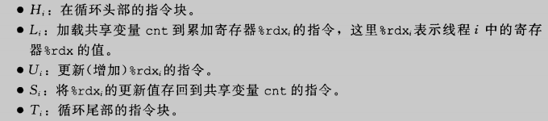

事实上，如果两个线程没有按照一个特定的顺序执行，极容易造成错误

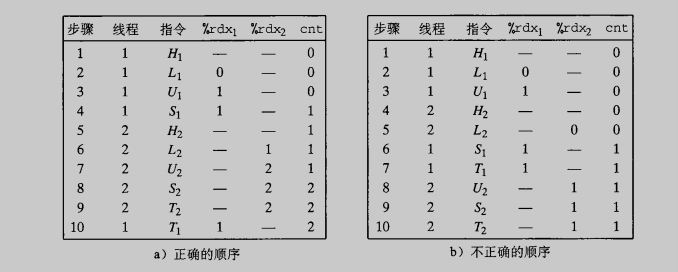

### 12.5.1 进度图

进度图将n个并发线程的执行模型化为一条n维笛卡尔空间中的轨迹线。每条k轴对应于线程k的进度

进度图将指令执行模型化为一种状态到另一种状态的转换。转换被表示为一条从一点到相邻点的有向边。合法的转换是向右或向上

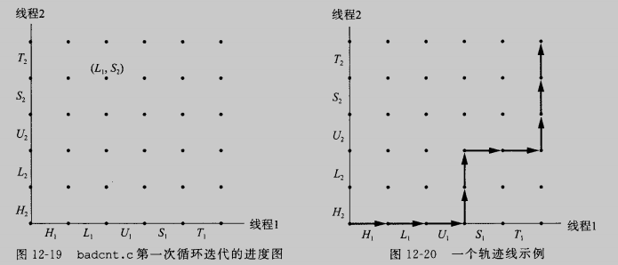

对于线程i，操作贡献变量cnt内容的指令LUS构成了一个临界区，这个临界区不应该和其他进程的临界区交替执行。换句话说，我们想要确保每个线程在执行它的临界区中的指令时，拥有对共享变量的互斥访问。

两个临界区的交集形成的状态空间区域称为不安全区。任何安全轨迹都将正确地更新共享计数器，为了保证线程化程序示例正确执行，我们必须以某种方式同步线程，使得他们总有一条安全轨迹。一个经典的方法是基于信号量的思想

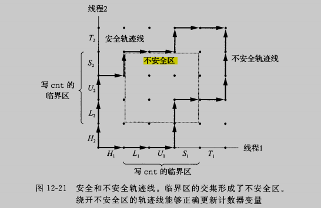

### 12.5.2 信号量

信号量s是具有非负整数值的全局变量，只能由两种特殊的操作来处理，这两种操作称为PV

* P：如果s是非零的，那么P将s减一，并且立即返回。如果s为零，那么就挂起这个线程，直到s变为非零，而一个V操作会重启这个线程。在重启之后，P操作将s减一，并且将控制返回给调用者
* V：V操作将s加一，如果有任何线程阻塞在P操作等待s变成非零，那么V操作就重启这些线程中的一个，然后该线程将s减一，完成P操作

PV的定义确保了一个正在运行的程序绝对不可能进入这样一种状态，也就是一个正确初始化了的信号量有一个负值。这个属性称为信号量不变性

~~~c
#include <semaphore.h>

int sem_init(sem_t *sem, 0, unsigned int value);
int sem_wait(sem_t *s);		/*P*/
int sem_post(sem_t *s);		/*V*/
~~~

sem_init函数将信号量sem初始化为value。每个信号量在使用前必须初始化。为了简便，我们使用PV包装函数

~~~c
#include "csapp.h"

void P(sem_t *s);		/* Wrapper function for sem_wait */
void V(sem_t *s);		/* Wrapper function for sem_post */
~~~

### 15.5.3 使用信号量来实现互斥

信号量提供了一种很方便的方法来确保对共享变量的互斥访问。基本思路是将每个共享变量与一个初始化为1的信号量联系起来，然后用PV操作将相应的临界区包围起来

以这种方式来保护共享变量的信号量叫二元信号量，因为它的值总是0或者1.以提供互斥为目的的二元信号量常常也称为互斥锁。在一个互斥锁上执行P操作成为对互斥锁加锁，V操作称为解锁。对一个互斥锁枷锁了但是还没有解锁的线程称为占用这个互斥锁。一个被用作一组可用资源的计数器的信号量被称为计数信号量

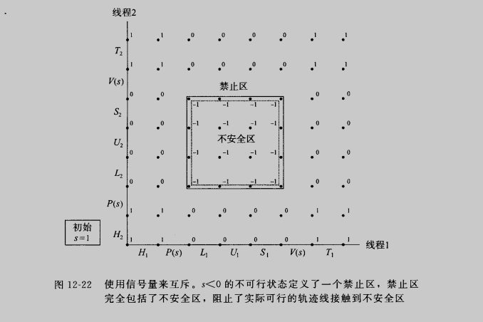

禁止区中的s都是小于零的。但因为信号量的不变性，没有实际可行的轨迹线能够包含禁止区中的状态，由此，信号量操作确保了对临界区的互斥访问

~~~c
/* WARING: This code is buggy! */
#include "csapp.h"

void *thread(void *vargp);

/* Global shared variable */
volatile long cnt = 0;
/* Semaphore that protects counter */
sem_t mutex;	

int main(int argc, char **argv)
{
	long niters;
	pthread_t tid1, tid2;
	/* mutex = 1 */
	Sem_init(&mutex, 0, 1);

	/* Check input argument */
	if(argc != 2)
	{
		printf("usage: %s  <niters>\n", argv[0]);
		exit(0);
	}

	niters = atoi(argv[1]);

	/* Create threads and wait for them to finish */
	Pthread_create(&tid1, NULL, thread, &niters);
	Pthread_create(&tid2, NULL, thread, &niters);
	Pthread_join(tid1, NULL);
	Pthread_join(tid2, NULL);

	/* Check result */
	if(cnt != (2 * niters))
		printf("BOOM! cnt = %ld\n", cnt);
	else
		printf("OK cnt = %ld\n", cnt);

	exit(0);
}

void *thread(void *vargp)
{
	long i, niters = *((long *)vargp);

	for(i = 0; i < niters; i++)
	{
		P(&mutex);
		cnt++;
		V(&mutex);
	}
	return NULL;
}

~~~

### 15.5.4 利用信号量来调度共享资源

除了提供互斥之外，信号量的另一个重要作用是调度对共享资源的访问。这种场景中，一个线程用信号量操作来通知另一个线程，程序状态中的某个条件为真了。两个经典而有用的例子是生产者-消费者和读者-写者的例子

#### 1.生产者-消费者问题

生产者和消费者共享一个有n个槽的有限缓冲区。生产者线程反复地生成新的项目，并把他们插入到缓冲区中。消费者线程不断地从缓冲区取出这些项目，然后消费他们。

因为插入和取出项目都涉及更新共享变量，所以我们必须保证对缓冲区的访问是互斥的。但是仅仅保持互斥还不够，我们还需要调度对缓冲区的访问。如果缓冲区是满的，生产者就就必须等待直到有一个槽位变为可用。与之相似，如果缓冲区内是空的，消费者就必须等待直到有一个项目变为可用

我们做个简单的叫做SBUF的包，用来构造生产者-消费者程序

SBUF操作类型为sbuf_t的有限缓冲区。项目存放在一个动态分配的n项整数数组中。front和rear索引值记录该数组中的第一项和最后一项。三个信号量同步对缓冲区的访问：

* mutex信号量提供互斥的缓冲区访问
* slots记录空槽位
* items记录可用项目

~~~c
#ifndef __SBUF_H__
#define __SBUF_H__
typedef struct{
	int *buf;								/* Buffer array */
	int n;									/* Maximum number of slots */
	int front;							/* buf[(front+1)%n] is first item */
	int rear;								/* buf[rear%n] is last item */
	sem_t mutex;						/* Protects accesses to buf */
	sem_t slots;						/* Counts available slots */
	sem_t items; 						/* Counts available items */
}sbuf_t;
#endif

~~~

sbuf_init函数为缓冲区分配堆内存，设置front和rear表示一个空的缓冲区，并未三个信号量赋初值

sbuf_deinit函数是当应用程序使用完缓冲区时，释放缓冲区的

sbuf_insert函数等待一个可用的槽位，对互斥锁加锁，添加项目，对互斥锁解锁，然后宣布一个新项目可用

sbuf_remove在等待一个可用的缓冲区项目之后，对互斥锁加锁，从缓冲区前面取出该项目，对互斥锁解锁，然后宣告有一个新的槽位可用

~~~c
#include "csapp.h"
#include "sbuf.h"

/* Create an empty, bounded, shared FIFO buffer with n slots */
void subf_init(sbuf_t *sp, int n)
{
	sp->buf = Calloc(n, sizeof(int));		
	sp->n = n;													/* Buffer holds max of n items */
	sp->front = sp->rear = 0;						/* Empty buffer iff front == rear */
	Sem_init(&sp->mutex, 0, 1);					/* Binary semaphore for locking */
	Sem_init(&sp->slots, 0, n);					/* Initially, buf has n empty slots */
	Sem_init(&sp->items, 0, 0);					/* Initially, buf has zero data items */
}

/* Clean up buffer sp */
void sbuf_deinit(sbuf_t *sp)
{
	Free(sp->buf);
}

/* Insert item onto the rear of shared buffer sp */
void sbuf_insert(sbuf_t *sp, int item)
{
	P(&sp->slots);													/* Wait for available solt */						
	P(&sp->mutex);													/* Lock the buffer */
	sp->buf[(++sp->rear)%(sp->n)] = item;		/* Insert the item */
	printf("insert %d to buffer\n", item);
	V(&sp->mutex);													/* Unlock the buffer */
	V(&sp->items);													/* Announce available item */
}

/* Remove and return the first item from buffer sp */
int sbuf_remove(sbuf_t *sp)
{
	int item;
	P(&sp->items);													/* Wait for available item */
	P(&sp->mutex);													/* Lock the buffer */
	item = sp->buf[(++sp->front)%(sp->n)];	/* remove the item */
	printf("remove %d from buffer\n", item);
	V(&sp->mutex); 													/* Unlock the buffer */
	V(&sp->slots);													/* Announce available solt */
	return item;
}
~~~

#### 2. 读者-写者问题

这是一个互斥问题的概括，写着必须拥有对对象的独占访问，读者可以和无限多个其他的读者共享对象。一般来说，有无限多个并发的读者和写者

基于读者和写者的优先级，分为：

* 读者优先
* 写着优先

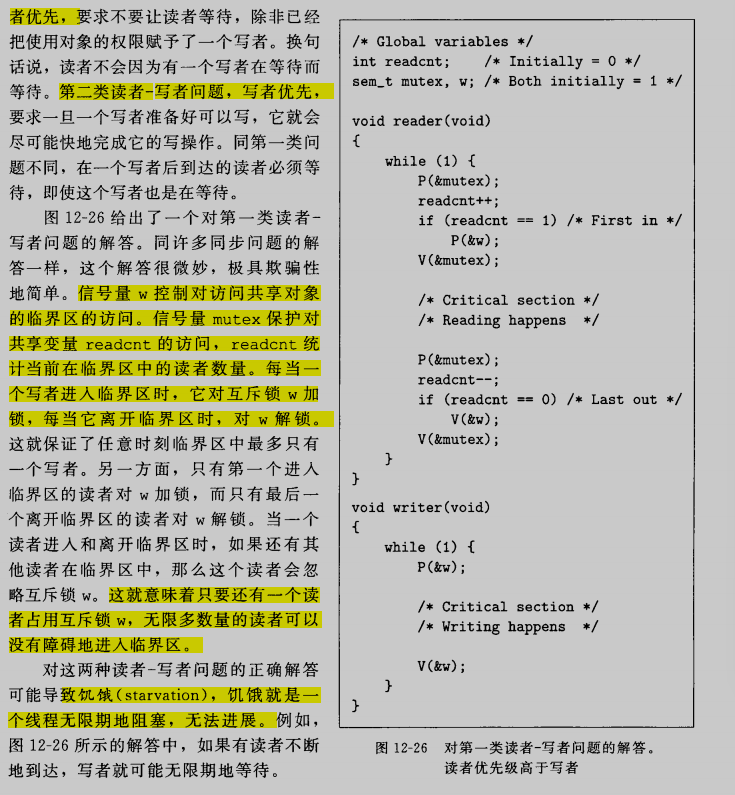

### 12.5.5 基于预线程化的并发服务器

我们已经知道了如何使用信号量来访问共享变量和调度对共享资源的访问，我们将它运用在一个基于称为预线程化技术的并发服务器上

之前基于多线程的并发服务器我们为每一个客户端创建一个新线程，代价比较大。一个基于预线程化的服务器使用使用生产者-消费者模型来降低这种开销。服务器是由一个主线程和一组工作者线程构成的。主线程不断地接受来自客户端的连接请求，并将得到的连接描述符放在一个有限缓冲区中。每一个工作者线程反复从共享缓冲区中取出描述符，为客户端服务，然后等待下一个描述符

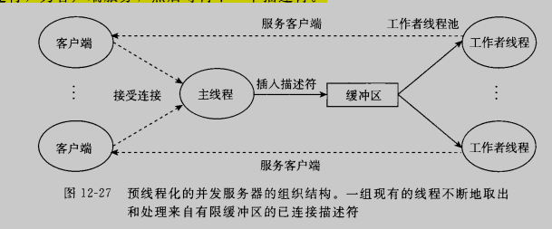

~~~c
#include "csapp.h"
#include "sbuf.h"
#define NTHREADS 4
#define SBUFSIZE 16

void echo_cnt(int connfd);
void *thread(void *vargp);

/* Shared buffer of connected descriptors */
sbuf_t sbuf;

int main(int argc, char **argv)
{
	int i, listenfd, connfd;
	socklen_t clientlen;
	struct sockaddr_storage clientaddr;
	pthread_t tid;

	if(argc != 2)
	{
		fprintf(stderr, "usage: %s <port>\n", argv[0]);
		exit(0);
	}
	listenfd = Open_listenfd(argv[1]);

	sbuf_init(&sbuf, SBUFSIZE);
	for(i = 0; i < NTHREADS; i++)		/* Create worker threads */
		Pthread_create(&tid, NULL, thread, NULL);

	while(1)
	{
		clientlen = sizeof(struct sockaddr_storage);
		connfd = Accept(listenfd, (SA *)&clientaddr, &clientlen);
		sbuf_insert(&sbuf, connfd);		/* Insert connfd in buffer */
	}
}

void *thread(void *vargp)
{
	Pthread_detach(pthread_self());
	while(1)
	{
		int connfd = sbuf_remove(&sbuf);		/* Remove connfd from buffer */
		echo_cnt(connfd);										/* Servive client */
		Close(connfd);
	}
}

~~~

echo_cnt函数是很有趣的，当第一次有线程调用它时，使用pthread_once去调用初始化函数。这个方法的优点是它使得程序包的使用更加灵活

~~~c
#include "csapp.h"

static int byte_cnt;				/* Byte counter */
static sem_t mutex;					/* add the mutex that protects it */

static void init_echo_cnt(void)
{
	Sem_init(&mutex, 0, 1);
	byte_cnt = 0;
}

void echo_cnt(int connfd)
{
	int n;
	char buf[MAXLINE];
	rio_t rio;
	static pthread_once_t once = PTHREAD_ONCE_INIT;

	Pthread_once(&once, init_echo_cnt);
	Rio_readinitb(&rio, connfd);

	while((n = Rio_readlineb(&rio, buf, MAXLINE)) != 0)
	{
		P(&mutex);
		byte_cnt += n;
		printf("server received %d (%d total) bytes on fd %d\n", n, byte_cnt, connfd);
		V(&mutex);
		Rio_writen(connfd, buf, n);
	}
}

~~~

## 12.6 使用线程提高并行性

考虑对0到n-1的求和

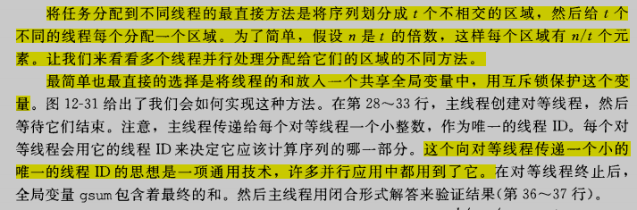

~~~c
#include "csapp.h"
#define MAXTHREADS 32

void *sum_mutex(void *vargp);				/* Thread routine */

/* Global shared variables */
long gsum = 0;											/* Global sum */
long nelems_per_thread;							/* Number of elements to sum */
sem_t mutex;												/* Mutex to protect global sum */

int main(int argc, char **argv)
{
	long i, nelems, log_nelems, nthreads, myid[MAXTHREADS];
	pthread_t tid[MAXTHREADS];

	/* Get input arguments */
	if(argc != 3)
	{
		printf("Usage: %s <nthreads> <log_nelems>\n", argv[0]);
		exit(0);
	}
	nthreads = atoi(argv[1]);
	log_nelems = atoi(argv[2]);
	nelems = (1L << log_nelems);
	nelems_per_thread = nelems / nthreads;
	sem_init(&mutex, 0, 1);

	/* Create peer threads and wait for them to finish */
	for(i = 0; i < nthreads; i++)
	{
		myid[i] = i;
		Pthread_create(&tid[i], NULL, sum_mutex, &myid[i]);
	}
	for(i = 0; i < nthreads; i++)
		Pthread_join(tid[i], NULL);

	/* Check final answer */
	if(gsum != (nelems * (nelems -1))/2)
		printf("Error: result=%ld\n", gsum);

	exit(0);
}

void *sum_mutex(void *vargp)
{
	long myid = *((long *)vargp);
	long start = myid * nelems_per_thread;
	long end = start +nelems_per_thread;
	long i;

	for(i = start; i < end; i++)
	{
		P(&mutex);
		gsum += i;
		V(&mutex);
	}
	return NULL;
}

~~~

